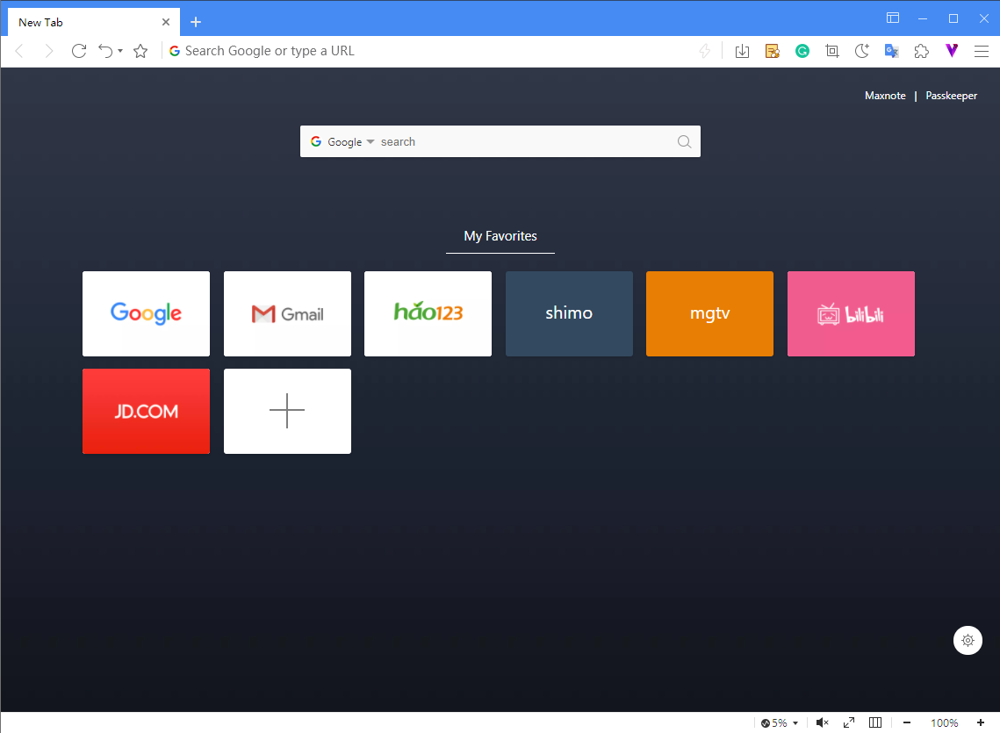
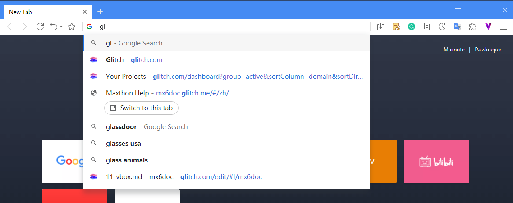
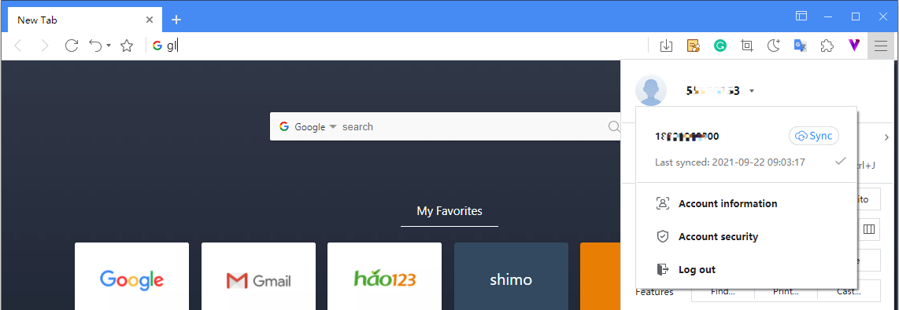
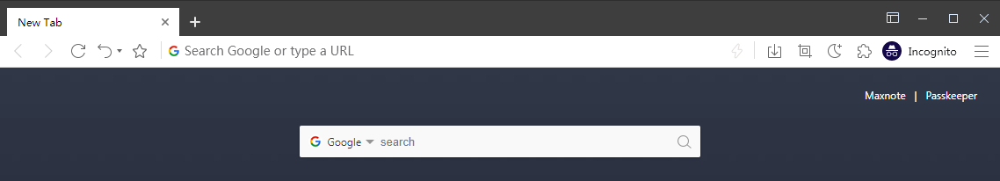
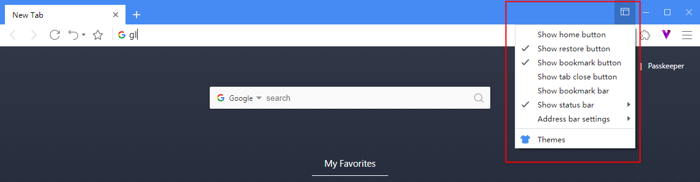
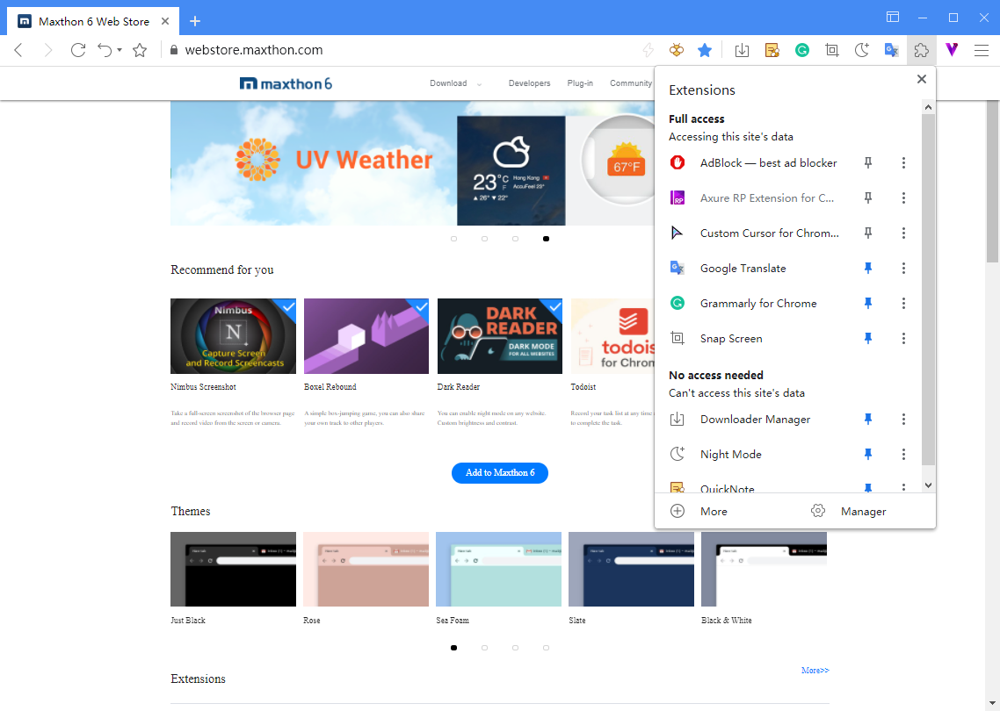
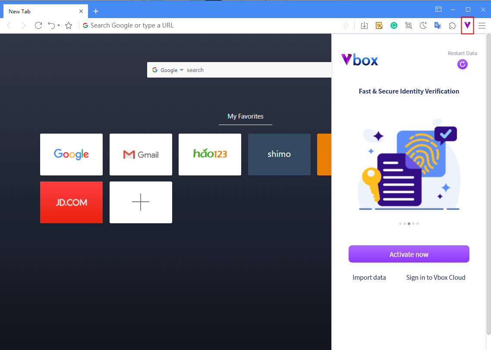

Maxthon# Start using maxthon 6

## New tab: Excitments within reach

Maxthon6 will preset some common links in the new tab, hover to modify/delete and drag to grouping/changing order;

[**folder**]: when an item is dragged to overlap with another item, releasing it will automatically create a folder for the two items; Folder - when you drag out or delete its items to 0, the folder is automatically deleted;

[**new item**]: click the plus sign at the end of the item to add a new item. The new item is added to the last by default

[**background**]: click the [setting] button in the lower right corner to replace the background of the new tab, or upload local pictures as the background.

## Search everything in the address bar

Whether it is a web address or a search keyword, the address bar is automatically matched. The address bar gives you matching suggestions according to existing bookmarks, tags, history, opened tabs, and search popularity. You can change the search engine in settings.

## Maxthon 6 cloud service synchronizes data to different devices.

Log in to your Maxthon account to sync data among multiple devices. Click the menu button in the upper right corner, click [log in Maxthon], and then create or log in to the account. You can also log in to multiple accounts locally.

## Incognito window, browsing with no trace

You can browse the Internet without leaving any information on your computer. Maxthon6 will also block attempts to track your activities on the Internet.

Click the main menu button, and then click [Incognito]

You can also right-click on the link and select "open in incognito window" or select "move tab to incognito window" on the tab's right-click menu.

## Customized interface

Click the custom interface button logo in the upper right corner to customize the UI and themes.

## Using Add-ons to extend functions

Click the puzzle piece button in the upper right corner to check the add-ons currently in use;

Click the cog button to enter the add-on management page, where you can deactivate/activate and delete add-ons;

Click "get more" to enter Maxthon 6 add-on library and install more;

All add-ons that support chrome can be installed to maxthon6 through an install file or directly from the chrome extension web store.

## Activate Vbox

Click the 'V' logo to open the Vbox. You can get your blockchain identity here. Apply for the NBdomain name for free, and explore more fun applets in Maxthon 6.
