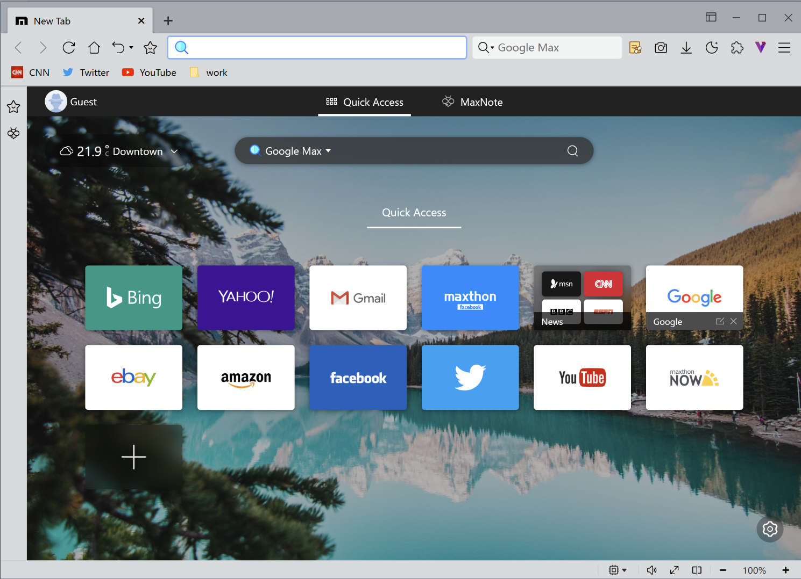
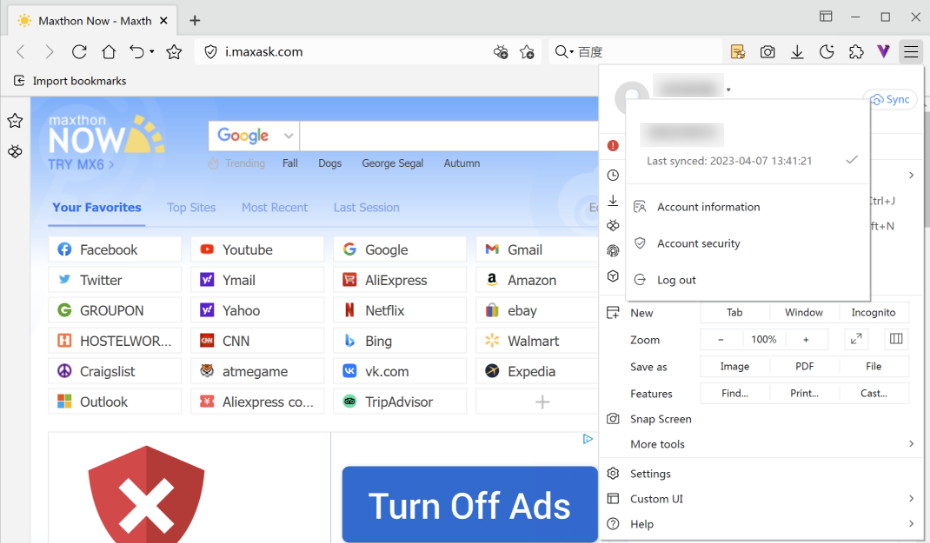
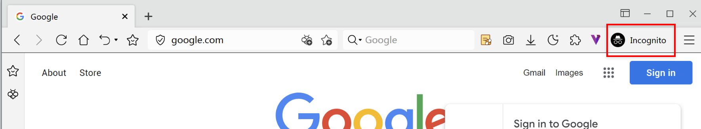
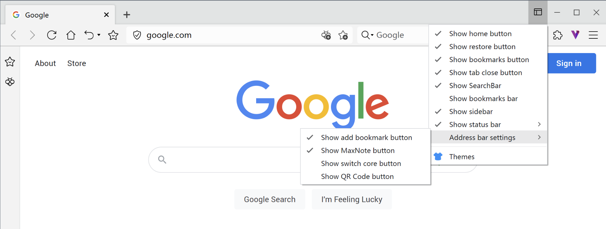
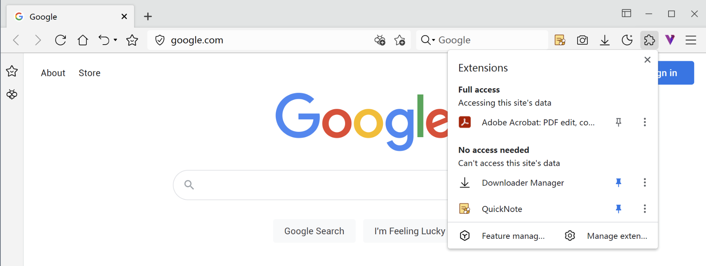
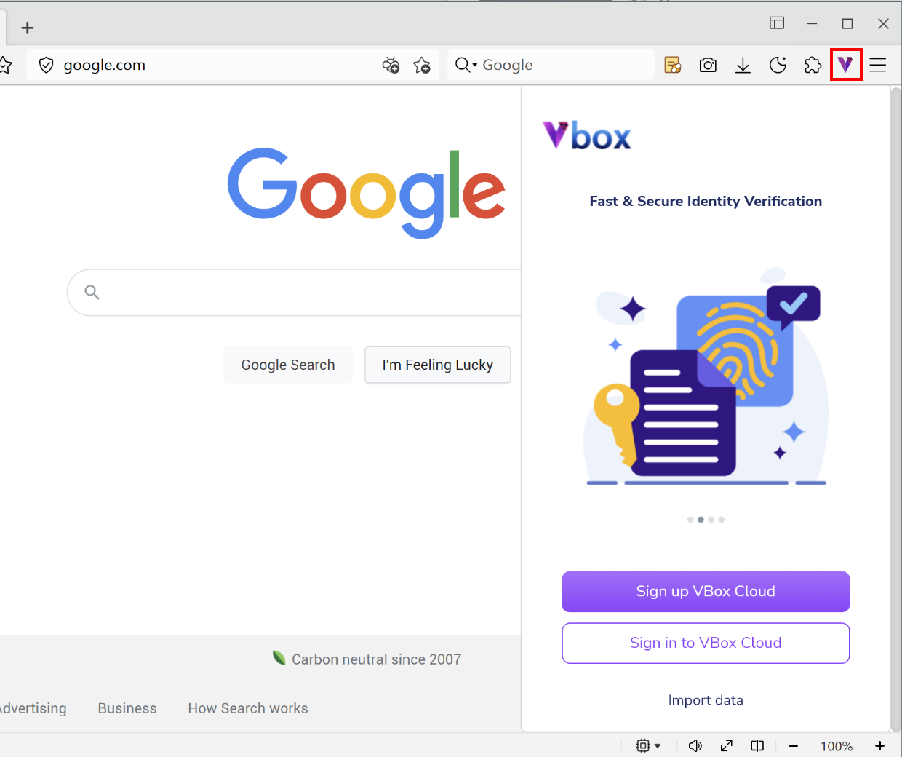
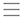
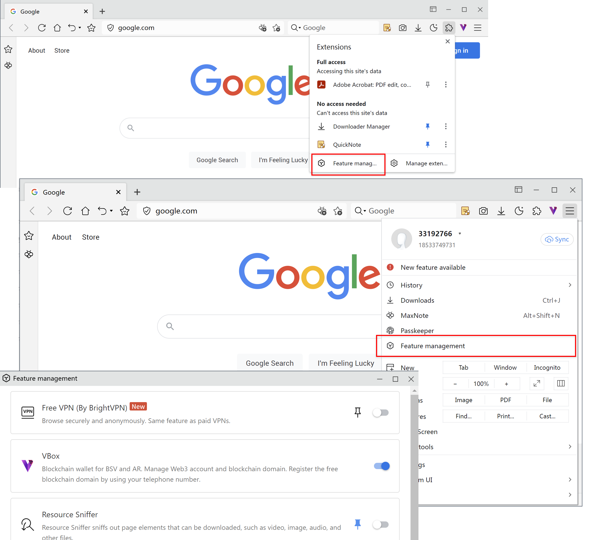

# Start using Maxthon

## New tab: Excitments within reach

Maxthon sets up some commonly used links in the new tab page, which can be modified or deleted by hovering the mouse over them. You can also group or rearrange the links by dragging them. In the new tab page, you can participate in check-in activities, search, check the weather, change the background, and customize the display style you like.

- [Folder]: When you drag a quick access icon and overlap it with another icon, a folder is automatically created for the two quick access icons. The folder will be automatically deleted when the last quick access icon is dragged out or deleted to 0 files. You can also set the name of the folder after it is opened.
- [New Quick Access]: Click the plus icon at the end of the tag to add a new quick access link, which will be added to the end by default.
- [Set New Tab Page]: Click the "Settings" button in the lower right corner to change the background of the new tab page or upload a local image as the background. You can customize the functional modules displayed in the new tab, the style of the search box, and the display style of the quick access icons, etc.

## Search Everything in the Address Bar

The address bar automatically matches and processes both URLs and search keywords. Maxthon's unified search and address bar can give you matching suggestions based on existing bookmarks, tags, history, open tabs, and search popularity. You can also change the default search engine by setting it or switch in the default search box in the new tab page.

## Log in to Maxthon to Sync Data on Different Devices

Log in to your Maxthon account so that you can share data between multiple devices.
Click the menu button in the upper right corner, log in to Maxthon, and then create or log in to your account according to the instructions. Log in on other devices to sync data between different devices. You can also log in to multiple accounts locally, set the account as the default login, but you need to verify the password according to your settings when switching accounts to protect your data security.

## Incognito Window, browsing with no trace

- You can browse the web without saving any browser information on your computer. Maxthon also intercepts attempts to track your web activity.
- Click the main menu button and then click [Incognito Window].
- You can also right-click on a link and select "Open link in incognito window," or right-click on a tab and select "Move tab to incognito window."

## Customized Interface, Quick and Simple

Click the custom interface button in the upper right corner  to customize the display and skin themes.

## Use extensions to Add Functionality to Maxthon

Click the puzzle piece button in the upper right corner  to show/hide the plugins currently in use:
- Click "Manage extensions" to enter the plugin management page where you can disable/enable or delete extensions.
- All extensions that support Chrome can be installed in Maxthon via an installation package.

## Activate Vbox to obtain blockchain identity
Click on  to open Vbox, create your identity, apply for a free NBdomain domain name, obtain a blockchain identity, and explore more fun and useful interactions.

## Customize the built-in features of the Maxthon Browser
Maxthon Browser integrates built-in features and applications in the feature management module. You can open the feature management page and turn on/off various built-in features in the following ways:
1. Click on the extension icon , and select the feature management in the lower left corner;
2. Click on the main menu icon in the upper right corner , and select the function management.

On the feature management page, you can turn on/off Vbox, screenshot, resource sniffer, night mode and other functions.

