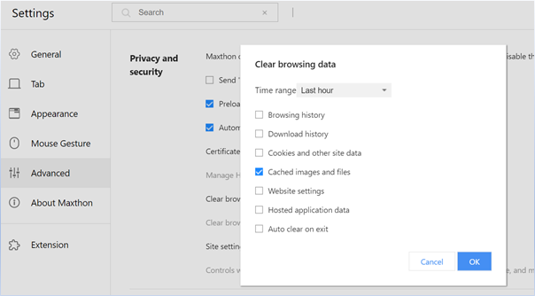
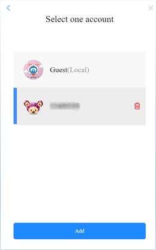
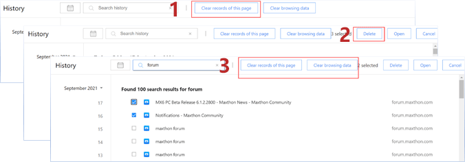
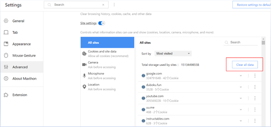
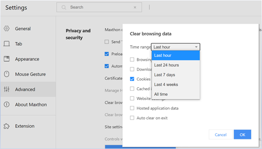
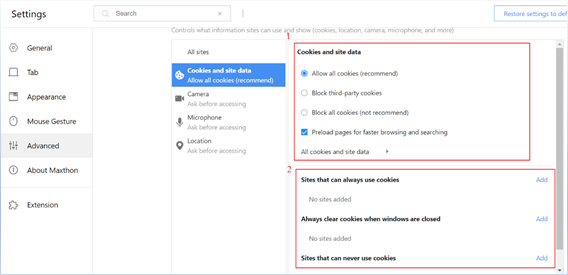
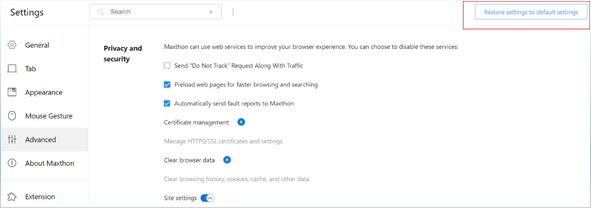

Maxthon# Clearing and Resetting Data

You are in total control of your browser data. You can clear all browsing histories and data or only for selected dates. You could also export the data for backups.

## Maxthon Data

#### **Data that can be deleted**

Data can be deleted by clicking **Clear Browser Data**

* Browsing data
    * Web addresses you have visited are removed from the history page
    * Shortcuts to those pages are removed from the New Tab page
    * Address bar predictions based on “browsing history” and “recently visited” websites
* Download history: The list of files you have downloaded using the Maxthon 6 download manager is deleted. Clearing this data will not cause the actual file to be deleted from the computer.
* Cookies and other site data
    * Cookies: Cookies are files created by websites you visit. They make your online experience easier by saving browsing information. For example, Cookies help to store and remember information if you set “auto sign-in for 1 month” for a particular website.
    * Website Data: HTML5-enabled storage types including application caches, internet stored data, internet SQL data, and database index.
    * Handlers: Maxthon 6 allows external applications and web services to open certain links. For example, certain links can open a site like Gmail or a program like iTunes. The default action you set for certain types of links will be deleted.
    * Media licensing: Licenses for HTML5 or Flash-protected content, like movies or music that you’ve played or downloaded, are deleted. (for example the song or movie you have downloaded)
* Cached images and files: Maxthon 6 remembers parts of pages to help them open faster during your next visit. Text and images from pages you've visited in Maxthon 6 are removed. After clearing this cache, re-downloading of the website is required when you visit the page again.
* Website settings: Settings and permissions you give to websites are deleted. For example, if a site can run JavaScript, use your camera, or know your location.
* Hosted application data: Data from the hosted extension is erased, like the local storage used by Gmail Offline.

#### -Data that doesn’t get deleted

* Stored Data: For example bookmarks, Maxnote, PassKeeper, Vbox, cannot be deleted directly. Deletion of data has to be executed in the app itself.
* Extensions: Extensions can store data on your computer. Extensions have to be removed to delete the data.
* Search history: Searches and other activity on the search engine are saved to your designated search engine account. Deleting of data has to be done separately. 

## Clear Browsing Data

Maxthon 6 provides a convenient one-click data deletion function.

1. Left-click on the customize and control button at the top right corner to show the main menu
2. Move the cursor to More Tools and click on Clear browsing data
3. You could select the deletion time range desired
4. Select the data you would like to delete
5. Click “OK” to confirm deletion
6. You could also go to [ **Settings > Advanced > Clear browser data** ] for this function

Note: If you have signed in to the Maxthon Cloud account, deleting of data will apply the local data as well as the data stored in the registered account and on other devices.

## Delete local cloud account data

If you have signed in to Maxthon Cloud account and wish to delete this account and all the data, you could use the deletion of local user data method:

* Left-click on the customize and control button  at the top right corner to show the main menu. Click on the pull-down menu beside your account and select [**Log out**]
* Upon confirming the closing of the browser, move the cursor and select the account for deletion and click on the  button in the pop-up menu to delete the local data stored under the account.

Note: This method can be used for the deletion of local data and will not affect the cloud account data.

## Delete your Maxthon browsing history

If you don’t want a record of web pages you’ve visited using Maxthon, you can delete all or some of your browsing history. If you delete your browsing history, it'll take effect on all devices where you’ve turned sync on and signed in to Maxthon.

Left-click on the top right-hand corner Delete all history records: Click [ **Clear records of this page** ] at the top and all local history data will be deleted.

Delete selected history records: Check the box next to each item that you want to remove from your history, click on [ **Delete** ], and the selected history record will be deleted.

Using search function to delete history records: To search for something specific, use the search bar at the top. Click [ **Clear records of this page** ] will delete those records that contain the words specified in the search. Other records will not be deleted.

## Managing cookies

You can choose to delete existing cookies, allow or block all cookies, and set preferences for certain websites. Do note that if you remove cookies, you'll be signed out of websites and your saved preferences could be deleted.

#### Clear all cookies

Go to [ **Settings > Advanced > Privacy and security** ]

Click on Site settings, select [ **Clear all data** ] under [ **All sites** ]

#### Delete selected cookies

1. Delete cookies from a site

In [ **Settings > Advanced > Privacy and security > Site settings** ], select [ **All sites** ], you could search for a specific website and click on the button, select [ **Clear data** ] and Cookies data for that website will be deleted.

2. Delete cookies within a specified time range

In [ **Settings > Advanced > Privacy and security** ], click [ **Clear browser data** ], select [ **Cookies and other site data** ],  select the time range, and click “OK” to confirm the deletion.

#### Change your cookie settings

You can allow or block cookies saved by websites. Do note that if you don't allow sites to save cookies, most sites that require you to sign in may not work.

In [ **Settings > Advanced > Privacy and security > Site settings** ], click [ **Cookies and site data** ] to change the cookies setting.

1. Allow or block all Cookies: You can block or allow all cookies by default. You can also allow cookies from a specific site while blocking third-party cookies in ads or images on that webpage. Note that if you block third-party cookies, all cookies and site data from other sites will be blocked, even if the site is allowed on your exceptions list.
2. Allow or block cookies for a specific site: You could add selected websites into [ **Sites that can always use cookies** ], [ **Always clear cookies when windows are closed** ], [ **Sites that can never use cookies** ]

## Reset Maxthon6 settings to default

You can restore your browser settings in Maxthon6 at any time. You might need to do this if apps or extensions you installed changed your settings without your knowledge. Your saved bookmarks and passwords won't be cleared or changed.

In [ **Settings** ], click [ **Restore settings to default settings** ] on the top right corner, and the system will reset to its default.

