# Browsing Webpage

## Search the Web on Maxthon 6

#### Universal search function

The address bar of the Maxthon 6 browser not only access URLs but can also search keywords. It will work using the default search engine.

1. Search suggestions

To help you search, maxthon will show search suggestions under the address bar. The suggestions are from your browsing history, bookmarks, and the search engine's reccommendations. Some of the suggestions can be deleted by deleting the browsing data.

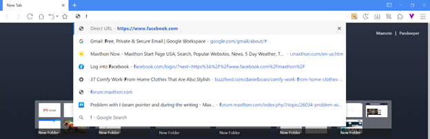

2. Customize the default search engine

You can change the default search engine or add a new search engine.

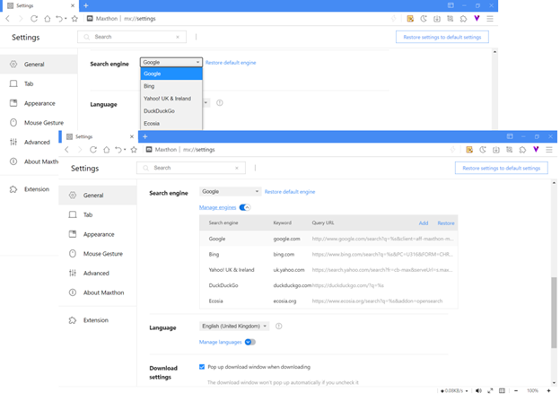

Go to **Settings**> **General**> **Search engine**, click the down arrow to change the default search engine. The new tab page and the selected text search function in right-click menu will use the default search engine.

Click **Manage engines** to add, edit or delete the search engines.

#### Search within a webpage

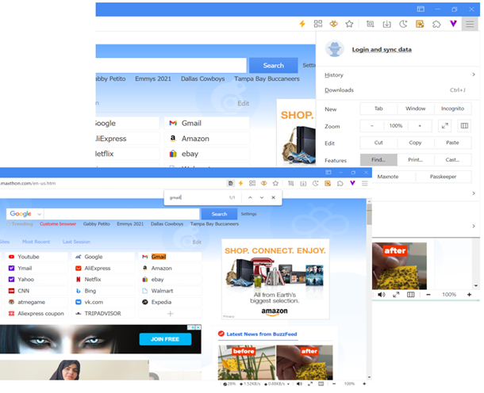

You can search the specific keyboard or phrase on the webpage:

1. At the top right, open menu, click **Find**, to open the search bar.

2. You can also use the keyboard shortcut **Ctrl + F** to find the search bar quickly.

Matches appear highlighted in yellow. You can see where all the matches are located on a webpage using the yellow markers on the scrollbar.

Tip: Copy the keyword, then press the keyboard shortcut Ctrl+F; the keyword will fill in the search bar and search automatically

#### Search selected words or phrases quickly

You can also search the words or phrases on the webpage

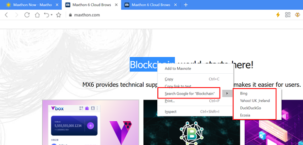

1. Highlight a word or phrase, then right-click on it to search for it with your default search engine.

2. You can also choose another search engine from the sub-menu.

## Mute Webpage

Sometimes you may not want to hear the sound from a webpage. You can **Mute** the webpage.

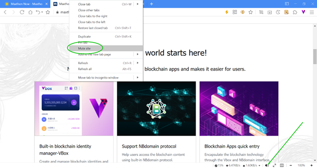

1. Right-click on the tab and choose Mute site; all sites belonging to the root domain will be muted.

The mute state of the site is saved. It won’t be cancelled by restarting the browser or closing the site unless you right-click on the tab to unmute it or cancel it by the global mute.

2. Click the global mute button on the status bar to switch the mute status.

The global mute setting is working on the whole browser. If you enable the global mute, all tabs will be muted, and it only can be canceled by disabling the global mute manually.

## Refresh Page

Maxthon 6 supports the following refresh methods:

1. Shortcut: **Ctrl+R**

2. Click the refresh button  on the left side of the address bar

3. Right-click on the tab to choose Refresh

- Refresh: the current page refresh once time
- Refresh all: refresh all tabs of the current window
- Auto-refresh: customize the refresh frequency. The page can auto-refresh every “x seconds” to refresh automatically

## Zoom the webpage, Go Full Screen, Split Screen

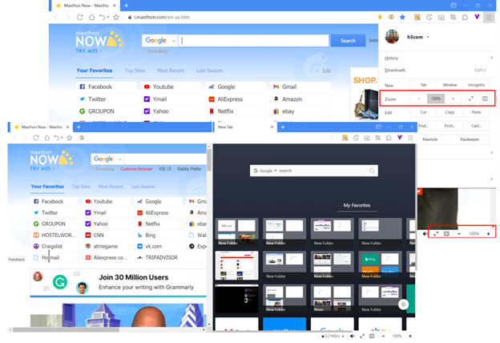

- You can zoom in/out on the page, go full/split the screen when browsing the webpage.
  - Press the shortcut“Ctrl and +” to zoom in
  - Press the shortcut “Ctrl and –“ to zoom out
  - Press the shortcut “Ctrl+0” to restore the page to 100%
  - F10: Split screen
  - F11: Fullscreen
- At the top right, open the browser menu, then choose the zoom in/ out: 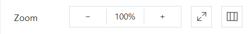
- Zoom in/out on the status bar:

## Share Webpage with QR Code

At the top right, click the customize UI button, Address bar settings > Show QR code, then the address bar will display the QR code icon. Click this icon to view the webpage QR code.

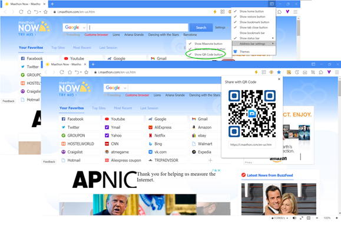

## Mouse Gesture

On the settings page, Mouse Gesture > More mouse gestures to customize.

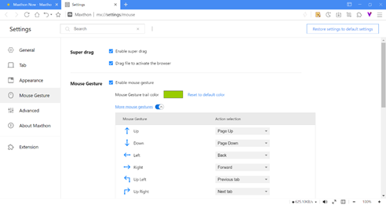

## Customize shortcuts

On the settings page, open Mouse Gesture > Shortcut Management > More shortcuts to customize.

You can customize Boss key and Lock Maxthon here:

- Boss key: When pressing the boss key shortcut, the browser will hide, the video and audio will pause automatically.
- Lock Maxthon: This function is available after signing in to your browser account. If you press the shortcut to lock Maxthon, you must enter the browser account password to unlock it.

### Maxthon6 Defult Shotcuts
|Command|Shortcut|
|----|----|
|Boss key|Ctlr + ·|
|New tab|Ctrl + T|
|Copy tab|Ctrl + Shift + K|
|Next tab|Ctrl + Tab Ctrl + →  Ctrl + PgDn|
|Previous tab|Ctrl + Shift + Tab Ctrl + ←  Ctrl + PgUp|
|Go to Tab 1 to 8|Ctrl + 1 to Ctrl + 8|
|Go to Last Tab|Ctrl + 9|
|Close current tab|Ctrl + W Ctrl + F4|
|Close other tabs|Ctrl + Shift + W|
|Restore last closed page|Ctrl + Shift + T|
|Close all tabs|No default value|
|Close tabs to the right|No default value|
|Close tabs to the left|No default value|
|Copy title and URL|No default value|
|Paste and Open//Search|Ctrl + Shift + N|
|Open in new background tab|Ctrl+Left-click with mouse Middle-click with mouse|
|Complete .com address and open|Ctrl + Enter|
|Open address or search in new background tab|Alt + Enter|
|Lock tab|No default value|
|Mute current tab|Alt + M|
|Back|Alt + ← Backspace|
|Forward|Alt + →
|Refresh|Ctrl + R F5|
|Stop|Esc|
|Stop all tabs|No default value|
|Force refresh|Ctrl + F5|
|Refresh all|Alt + F5|
|Split screen|F10|
|Full screen|F11|
|Focus on address bar|Ctrl + L Alt + D F6|
|Search with the address bar|Ctrl + K Ctrl + E|
|Home page|Alt + Home|
|New window|Ctrl + N|
|New incognito window|No default value|
|Close this window|No default value|
|Switch window|No default value|
|Exit Maxthon|Alt + F4|
|Exit Maxthon|No default value|
|Minmize current window|Alt + Space + n|
|Maxmize current window|Alt + Space + x|
|Save form data|No default value|
|File form automaticly|No default value|
|Snap region|Ctrl + F1|
|Snap whole page|Ctrl + F2|
|Save as…|Ctrl + S|
|Find in page…|Ctrl + F|
|Find next|F3|
|Find previous |Shift + F3 Ctrl +Shift +G|
|Translate this page|No default value|
|Developer tools|Ctrl + Shift + I F12|
|Developer tools console|Ctrl + Shift +J|
|Page Source|Ctrl + U|
|Toggle context menu|Shift + F10|
|Open file|Ctrl + O|
|Focus tool bar|Shift + Alt + T|
|Focus main menu|Alt|
|Open main menu|Alt + F|
|Open personal center|Ctrl + Y|
|Open bookmarks menu|Alt + A|
|Bookmark manager|Ctrl + Shift + O|
|Download manager|Ctrl + J|
|History|Ctrl + H|
|Maxthon Browser console|Shift + Esc|
|Maxnote|Shift + Alt + N|
|Quicknote|Ctrl+ G|
|Add to bookmarks|Ctrl + D|
|Bookmark all tabs|Ctrl + Shift + D|
|Bookmark other URLs in page|Drag the url into the bookmarkbar|
|Show//Hide bookmark bar|Ctrl + Shift + B|
|Last session|No default value|
|Clear browsing data|Ctrl + Shift + F Ctrl + Shift + Del|
|Zoom in|Ctrl + = Ctrl+ Scroll up|
|Zoom out|Ctrl + - Ctrl+ Scroll down|
|Automatic Zoom|Ctrl + 0|
|Next screen|Space PgDn|
|Previous screen|Shift + Space PgUp|
|Scroll horizontally|Shift + Scroll with mouse
|Seek to the beginning|Home|
|Seek to the end|End|
|Focus next link or input field |Tab|
|Focus previous link or input field|Shift + Tab|
|Toggle width/page fit in PDF view|Ctrl + \\(in PDF view)|
|Rotate counterclockwise |Ctrl + [(in PDF view)|
|Rotate clockwise|Ctrl + ](in PDF view)|
|Print…|Ctrl + P|
|Print with system dialog|Ctrl + Shift + P|
|Lock Maxthon|No default value|
|Help|F1|

## Status Bar

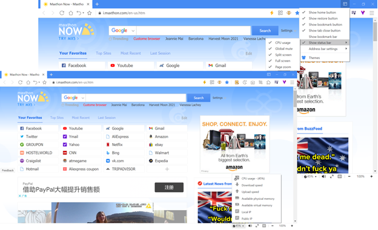

At the top right, click Customize UI button, check Show status bar;

You can enable those options on the status bar:

CPU usage

Global mute

Split screen

Fullscreen

Page zoom

Click the CPU usage on the status bar to enable more options.

## Flash Player Is No Longer Available

As of 2021, Adobe has ended support for the Flash Player plugin. Flash content, including audio and video, will no longer be playback in any version of Maxthon.

## Incognito Mode

If you don’t want Maxthon to remember your activity, you can browse the web privately in incognito mode. Under this mode, you can access bookmarks, Maxnote, Passkeeper and use the browser most functions.

At the upper right corner, click Menu  > Incognito

- Right-click on URL, bookmark, Quick Access, choose Open in the incognito window

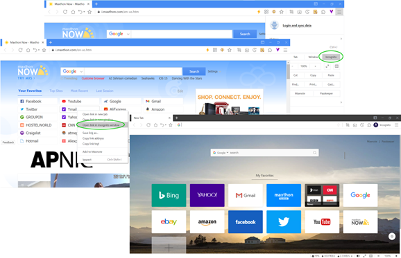
