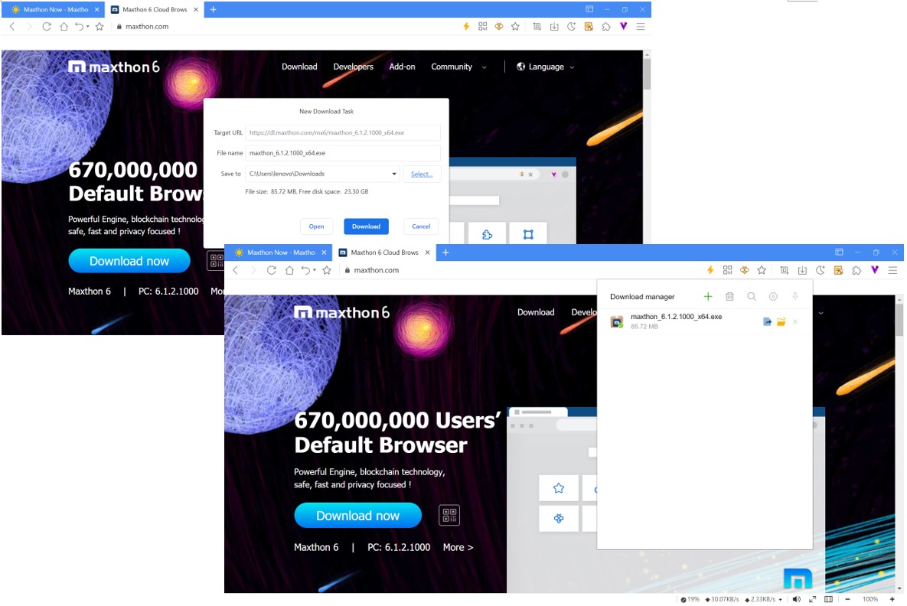
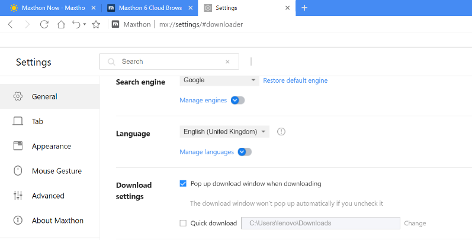
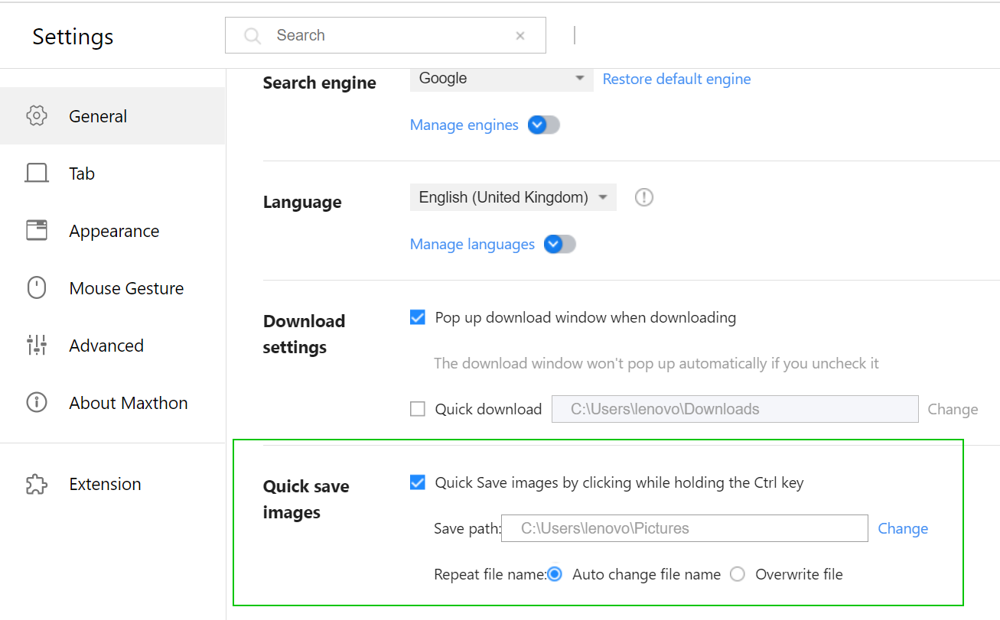

# Downloading Files

To save a file or image on your computer or device, you can use the downloader. The file will be saved in your default download location.

## Download Manager

Click on the download link or right-click on the file and choose to Save as. You can customize the download file name and the download location in the download manager window. The file will begin to download after clicking Confirm. When the download finishes, a number will be displayed on the bottom right of the downloader icon.

Manage the download task in the download manager:

1. Pause or cancel the downloading file
2. Open the downloaded file 
3. Open the downloaded file location: 
4. Delete the download task, click the Delete icon  to delete
   - Delete download record
   - Delete the download record and file
5. Create a new download task: at the top of the download manager, click the Add button 
6. Clear all: at the top of the download manager, you can click the Delete button  to choose:
   - Clear all records: delete all items in the list (but not the file downloaded).
   - Clear invalid: delete all invalide items
   - Clear all records and files: delete all items in the list and coresponding files.
7. Search download records: at the top of the download manager, click the Search button , you can enter the keyword to search
8. Download manager settings: at the top, click the manage button , it will open the download settings page:

If **Quick download** is checked, it will download the file directly to the download location without pop up the download window to confirm the download task. The download location can be customized.

## Other Download Settings

#### Download image

- Right-click on the image, then choose [**Save as**]
- Use the **Quick save image** function:
    - On the settings page, **General > Quick save images**, check Quick save images while holding the Ctrl key
    - You can customize the image save location
    - Choose to auto change the file name or overwrite the file directly

#### Save webpage

At the top right, click the Menu button ** > More tools > Save page as**

## Default Download Location

If you do not change the file download location, the download task will be saved to **C:\Users\Windows user name\Downloads**
