# Maxnote <!-- {docsify-ignore} -->

**Collect knowledge from any webpage**

> **Maxnote** will be saved automatically  
> You can also access **Maxnote** on mobile using Maxthon mobile browser

Maxnote is a special feature of Maxthon, which enables you to save information through the internet with just a click.

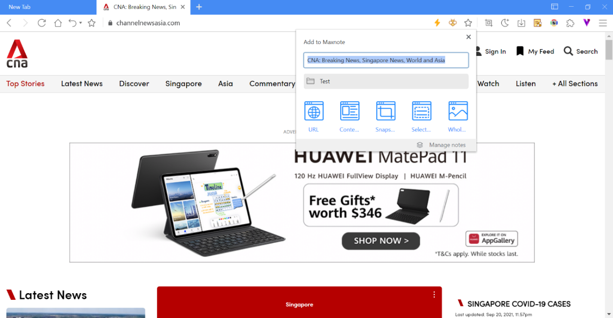

To store the webpage using Maxnote, click on the bee button on the address bar. You could edit the following settings in the popup box:

- Title of note
- Select the folder to save the note
- Different saving modes:
  - URL: to save URL only
  - Content: Main content of the web page will be analyzed and saved
  - Snapshot: Select area for screenshot and save to Maxnote
  - Select: Selection of specific content
  - Whole webpage: Save the current webpage as an image

## Save URL to Maxnote

Maxnote supports the saving of URL links. Click on the bee button on the address bar, select the popup box to save the link. The title and URL of the page will be saved to Maxnote. Simply click on the note and the link will be open in a new tab.

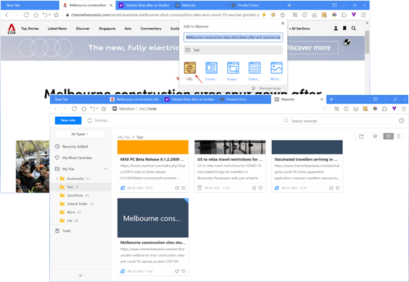

## Save website content to Maxnote

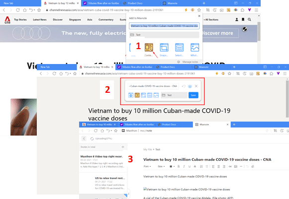

1. Click on the button to add to Maxnote, select website content button;
2. Enter into preview mode. Click on the eye button to close the preview, click [ **Save** ] to confirm
3. Click into the note saved to Maxnote and you will be able to edit the content.

## Add snapshot to Maxnote

1. Click on the button on the address bar, select the snap button;
2. In screenshot mode, select the area for screen capture and click on [ **Copy** ] to confirm;

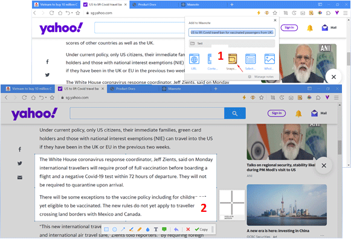

3. Enter preview mode to confirm selection, click [ **Save**] to confirm. You could click on the button to close the preview.
4. Click into the note saved to Maxnote and you will be able to edit the content.

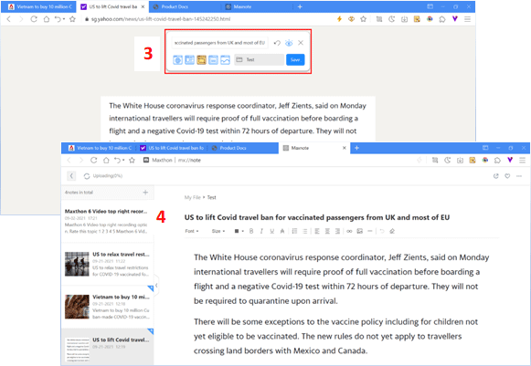

## Save selected content to Maxnote

1. Click on the button on the address bar, select button;
2. In selection mode, select specific content for saving and click [**Done** ] to confirm

3. Enter preview mode to confirm selection, click [**Save**] to confirm. You could click on the button to close the preview.
4. Click into the note saved to Maxnote and you will be able to edit the content.

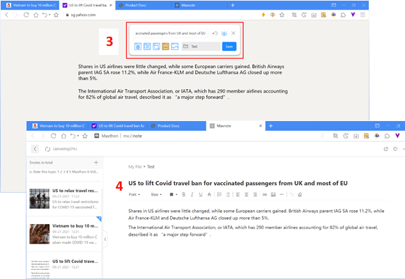

## Save the whole webpage to Maxnote

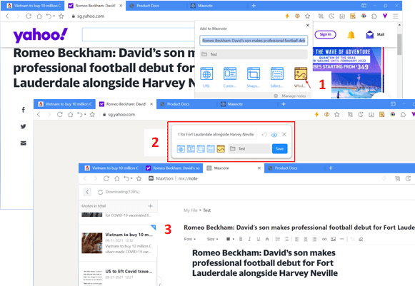

1. Click on the button on the address bar, select button;
2. Enter preview mode to confirm webpage captured, click [**Save** ] to confirm. You could click on the button to close the preview.
3. Click into the note saved to Maxnote and you will be able to edit the content.

## Guide to use Maxnote

Click to access Maxnote and edit/manage the notes saved.

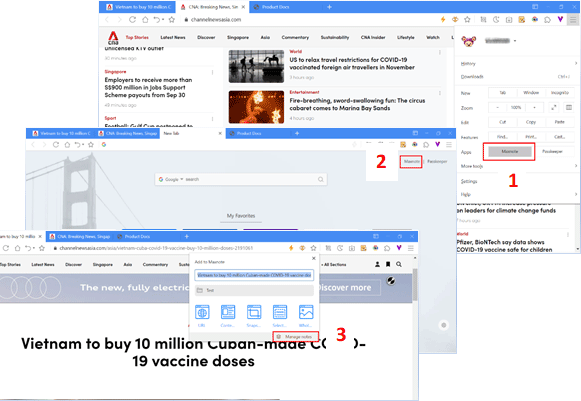

You could access Maxnote through the following methods:

1. Click on the button at the top right corner, select [ **Maxnote** ] from the menu
2. Click on [**Maxnote** ] located at the top right corner in a new tab page
3. Click on the button on the address bar and click on [**Manage notes** ] at the bottom right corner of the popup box

#### Maxnote interface and listings

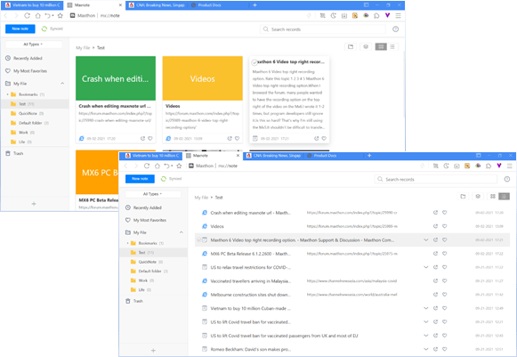

- By default, the system will reflect the last saved / edited note’s content. You could switch to another note using the sidebar on the left.
- Maxnote provides card and list viewing options. You could switch it by clicking on the options button in the top right corner.

#### Create new note

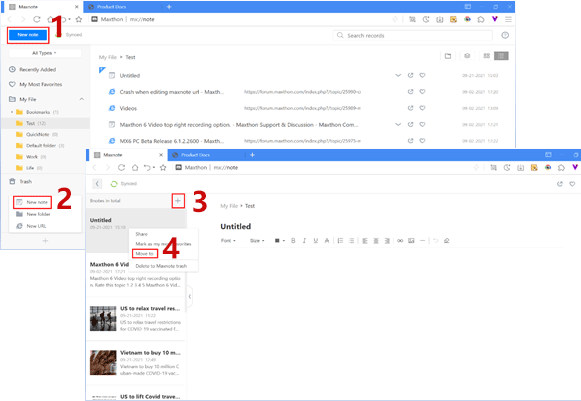

1. Click on the button [**New Note**] located at the top left corner to start a new note;
2. You could also click on the button at the bottom left corner to expand the menu. Select [ **New Note** ] to start;
3. On the editing page, you could click on the button to start a new note;
4. The new note will be placed at the bottom of the content. Right-click on the new note and select [ **Move to**], to move the current note to other folders.

#### Using folders to organize notes

Create multiple folders in Maxnote to better organize your notes.

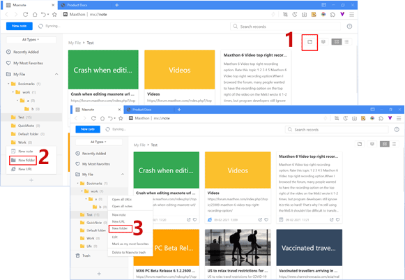

You could create new folders using the following methods:

1. Click on the icon on the top right corner;
2. Click on the button at the bottom left corner to expand the menu. Select [**New folder**] to create
3. Right-click at the content sidebar, select [ **New folder**]

#### Moving and sorting of notes

1. Moving notes to organize it into folders
    - Drag and drop selected notes to a designated folder.

  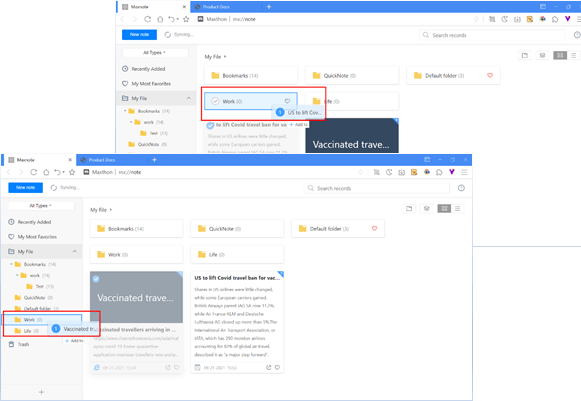
    - Select the note you wish to move, click on the icon and select the folder you wish to move the note to. Alternatively, right-click on the note and select [ **Move to**] and choose the folder accordingly.

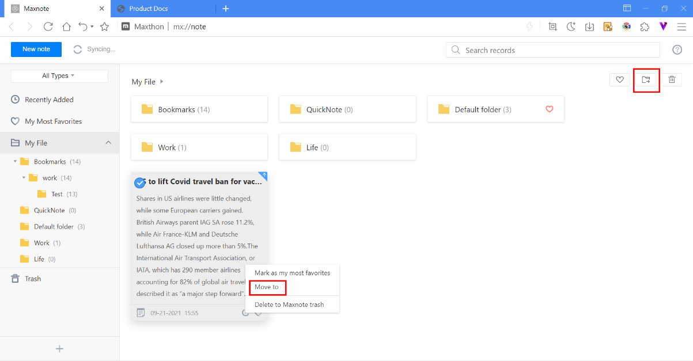

2. Sorting tool

  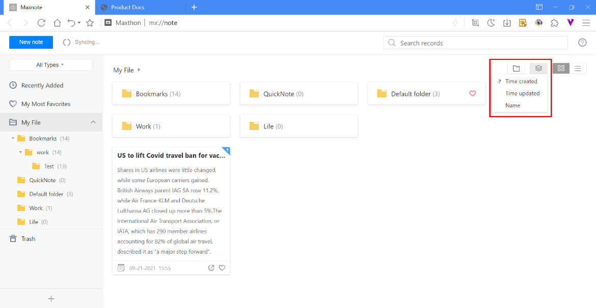

  Click on the icon at the top right corner and notes can automatically be arranged in sequence of:

   - Time created
   - Time updated
   - Name The above sorting method changes the sequence every time you clicked.

#### Deleting notes and marking notes as favorite

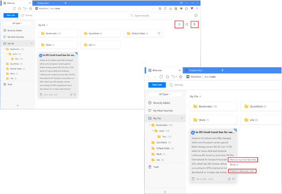

- Right-click on the note and select [ **Mark as my most favorites**] or [ **Delete to Maxnote trash** ] from the menu;
- You could also select multiple notes and click on the icon to mark all selected notes as most favorites or click on the icon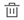 to delete selected notes at once.
- Notes that were marked as favorites will appear in the [ **My most favorites** ] folder located at the sidebar. By clicking on the icon again for that selected note, you could choose to unfavorite it;
- Deleted items will be stored in the sidebar. You could restore the item or completely delete it.

#### Syncing of notes

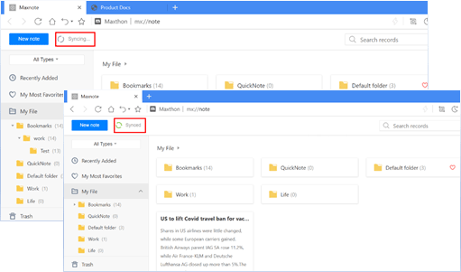

- Once you log in to the Maxthon cloud account, real-time synchronization of notes will begin.
- Once syncing process is completed, the top left corner will show [ **Synced**]
- You could also click on the [ **Synced**] button to start the syncing process manually.
