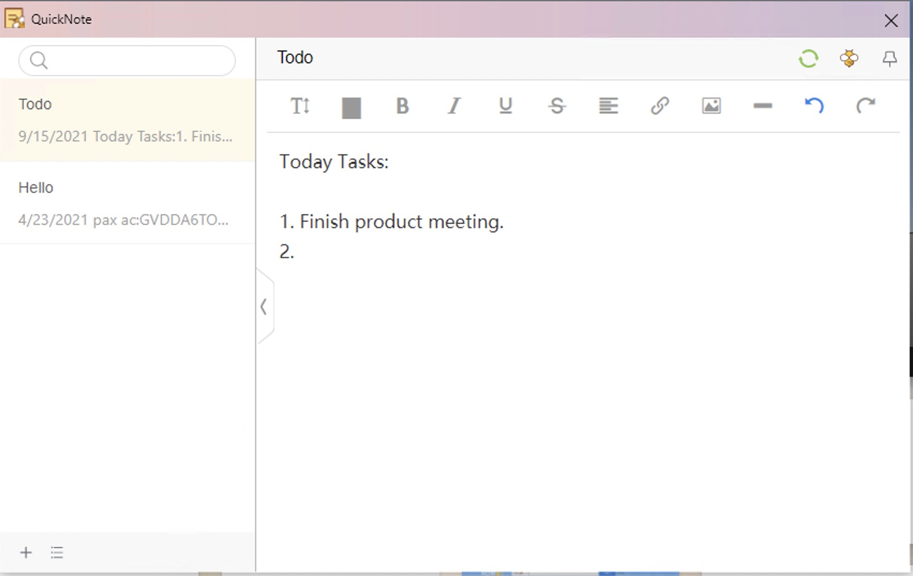
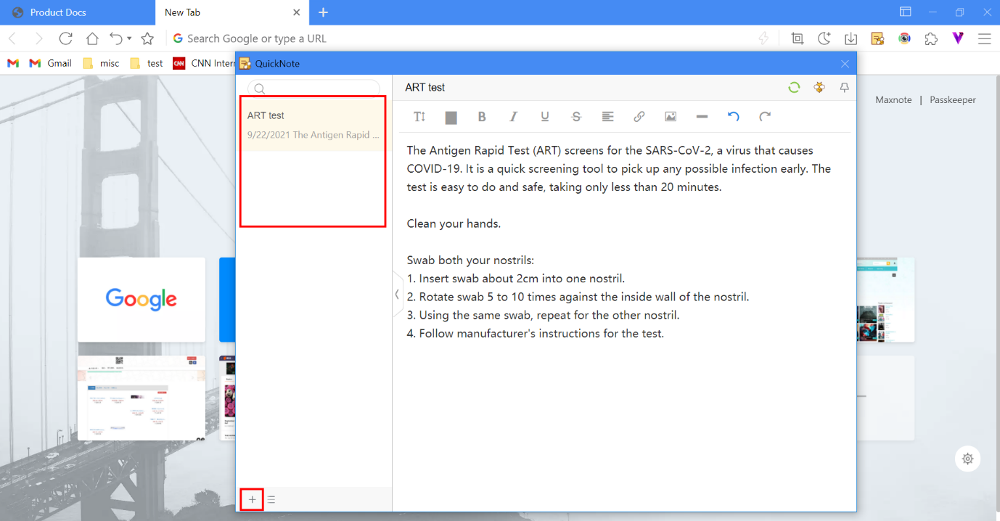
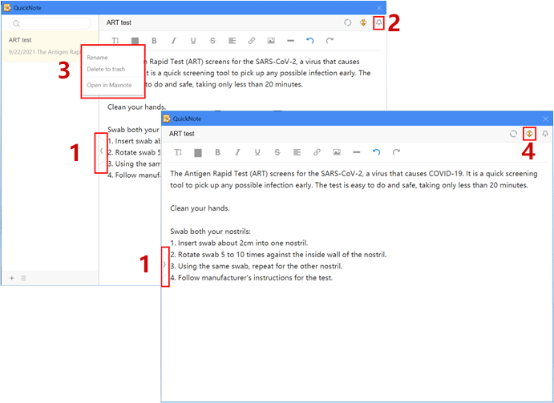
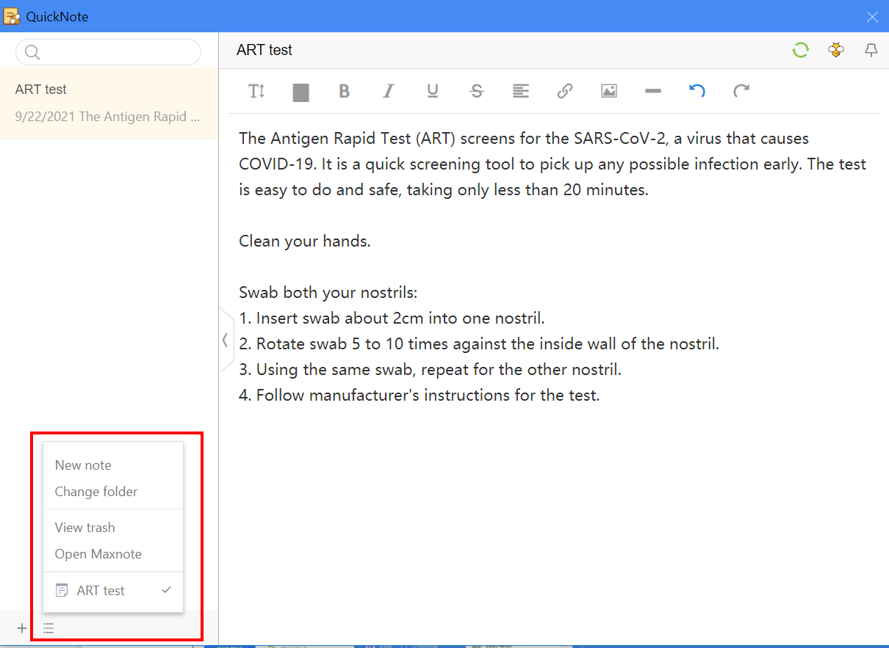

# Quicknote <!-- {docsify-ignore} -->

**Write down great ideas or anything worth to note while browsing the web.**

> **QuickNote** is part of Maxnote  
> Press **Ctrl+G** for quick access

## What is QuickNote?

QuickNote is a lite version of Maxnote, allowing users to note down contents easily while browsing websites. Simply click on the  button on the address bar or use shortcut [ Ctrl + G ] to access QuickNote.

1. New note: Click on the plus button at the bottom left corner to start a new note.
2. Listing of notes: QuickNote does not support the creation of a new folder. All the notes saved in the specific folder will be reflected in chronological order.
3. Notes editing: Add or edit content and pictures easily and information will be synced automatically. If you login to the Maxthon cloud account, QuickNote will be automatically synced with Maxnote.

## Browsing of Quicknote

1.  You could resize QuickNote by dragging the sides of the window. Click on the  icon located near the sidebar to collapse or expand the window for editing.
2.  QuickNote will automatically be closed after being inactive for a period of time. You can pin them by clicking on the  button so that they stay visible over any other windows on your computer screen. Click on the same button to unpin QuickNote.
3.  If you wish to view a specific QuickNote in Maxnote, right click on the note and select [ Open in Maxnote ]. The selected note will be opened in a new tab in the current browser window. You could also choose to [ Rename ] or [ Delete to trash ] in the right click menu.
4.  Click on the  icon on the top right corner to redirect to Maxnote.

## QuickNote menu

Click on the  button located at the bottom left corner to expand the menu and you could select the following:

- New note: Create a new note;
- Change folder: Select from the list of folders stored in Maxnote to save your QuickNote. Upon selection, all the sub-folders or notes in that particular folder will be arranged and shown in chronological order;
- View trash: Maxnote trash folder will be opened in a new tab in the current browser window;
- Viewing of individual QuickNote: Menu will reflect all the QuickNotes saved to date, allowing users to select and view the note with a click.
