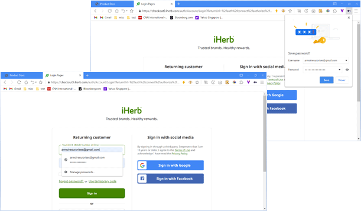
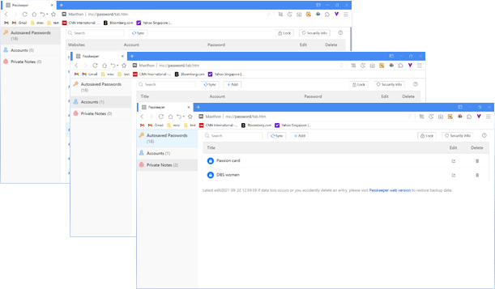

# Passkeeper

## Autofill login details

Passkeeper helps to save your username and passwords for different sites. This allows the browser to fill in the login details automatically when you visit the site again.

## Managing Passkeeper

Click on the  button at the top right corner and select [ Passkeeper ] in the menu. Alternatively, you could click on [ Passkeeper ] at the top right corner of a new tab page. Once the entered password is verified, you will be redirected to the Passkeeper main page.

Passkeeper provides three different encrypted content categories:

- Autosaved passwords: The login username and password you saved while visiting websites;
- Accounts: Allows users to add login details manually that requires high level encryption;
- Private notes: For users to save details that are not related to account login. No standard format yet still provides a high level encryption.
  \*Note: [ **Accounts** ] and [ **Private notes** ] requires user to login with Maxthon password to access since it is highly encrypted. Users under the guest account will not be able to access it.
