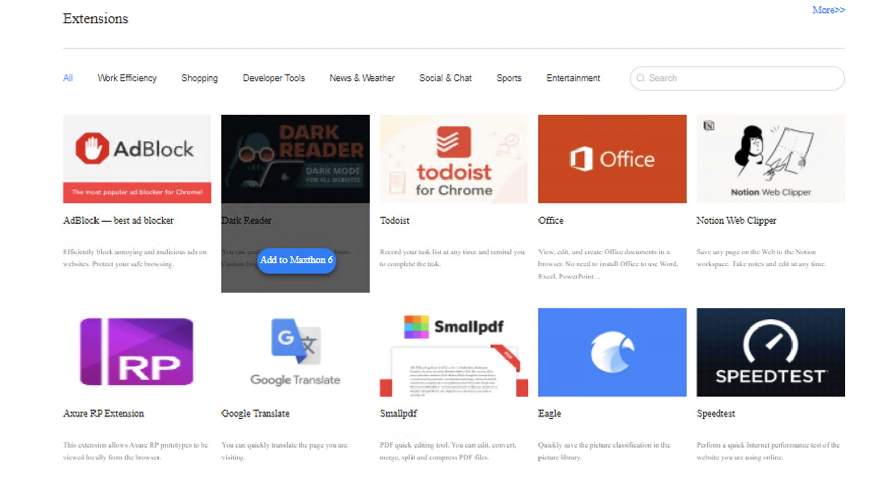
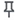
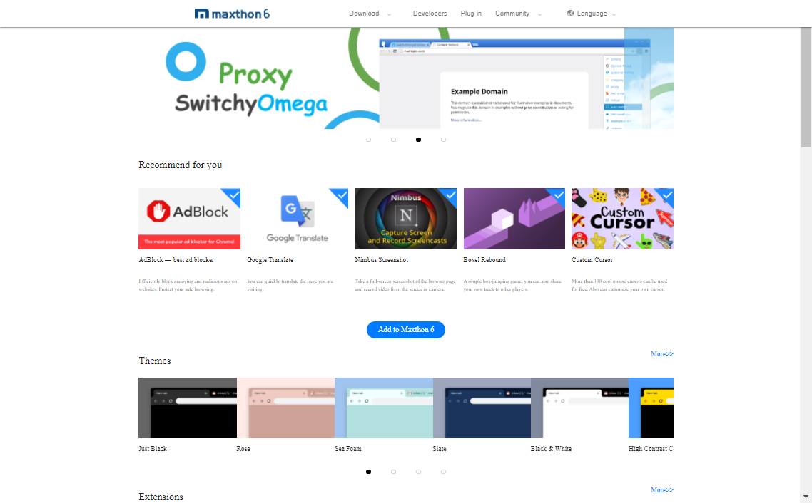

# Extensions <!-- {docsify-ignore} -->

**Maxthon now supports all Chrome extensions!**

## The extension pop-up window

Maxthon6 supports chromium standard extensions. Click the extension button in the address bar to view the list of currently using extensions.

- Pin/Unpin: Click the solid pin button to unfix the certain extension, so that it will be hidden from the address bar, click the hollow pin button to fix which means the extension icon will be pinned in the address bar;
- Extension menu: right-click the extension icon fixed in the address bar or the more button beside the extension name in the pop-up window to open the extension menu;
- Manager: Click to go to the extension manager;
- More: Click to go to the Maxthon6 extension center.

## Shut down and delete useless extensions

Click the menu button in the upper right corner to open the main menu and select "more tools" > "extensions" to open the extension manager page. Another way is to click the address bar extension button (the puzzle piece) and click manager in the lower right corner of the pop-up window.
The extension can be tuned off and deleted in the extension manager page.

## Install extensions in the extension center of Maxthon 6

Enter Maxthon 6 extension center (https://webstore.maxthon.com/ ), Thousands of convenient extensions are recommended here. Various themes are also recommended here. Click to install and use them.

Tip: use the big blue "add to Maxthon 6" button to install all selected recommended extensions with one click.

## Download and install extensions on other platforms

If you can't find suitable extensions in the Maxthon 6 extension center, you can also choose the Chromium standard extension provided by other third-party platforms.
