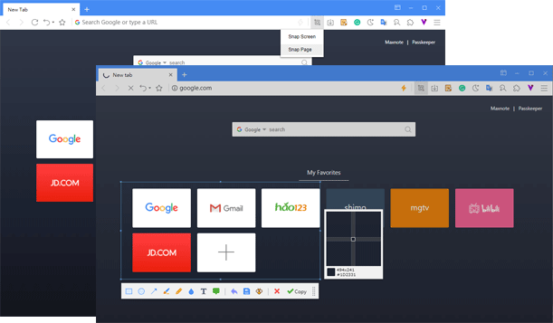
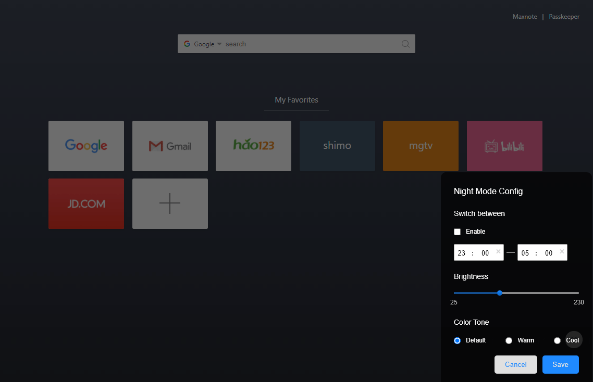
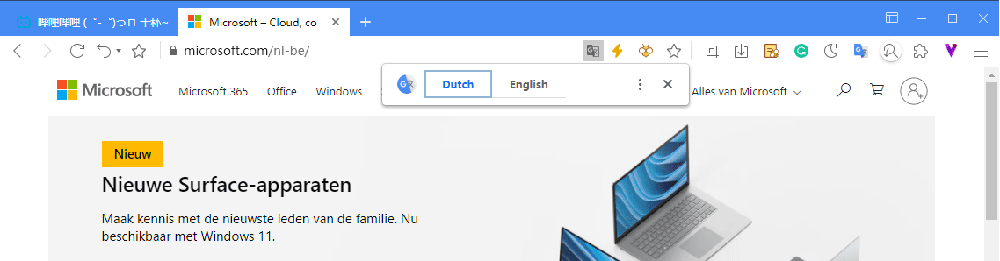
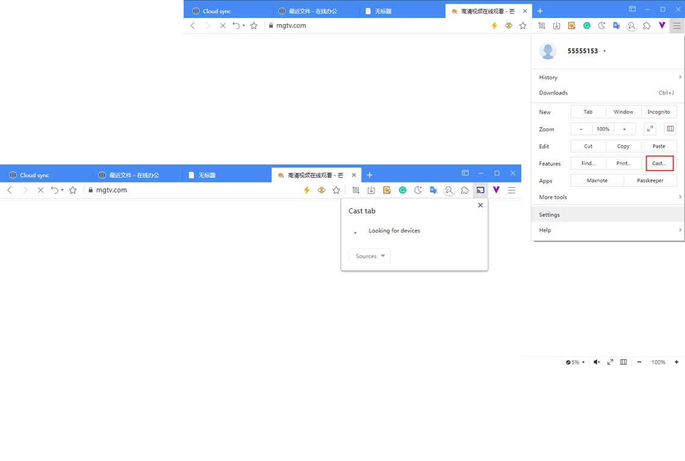

# Other Features

## Screen snap

Activate the screen snap function by clicking the snap button in the toolbar.

Maxthon provides you two ways to snap：

1. **Snap screen** select the area on the screen you need to snap by a box selecting tool.
2. **Snap page** equals "saving the web page as a picture"

> You can press **Ctrl+F1** to access **Snap Screen** feature

## Night mode

Activate the night mode by clicking the moon button. Exit the night mode by clicking it again.

Right-click the night mode to customize the night mode:

- Schedule: Set the night mode automatically enabled within a certain time range every day;
- Brightness: adjust the brightness of the mask;
- If you don't like the current mask, you can also set the mask to a different color.

## Automatic translation

When you browse a foreign website, the translate button will automatically appear in the address bar. Click it to translate the website to your default language.

## Print the page

Click the main menu button in the upper right corner, find "print..." under "features", select printer contacted to your computer to print the web page.

## Cast Maxthon to TV

Click the main menu button in the upper right corner, find "cast..." under "features", Maxthon will search available devices automatically. Select the device you need after the search.

