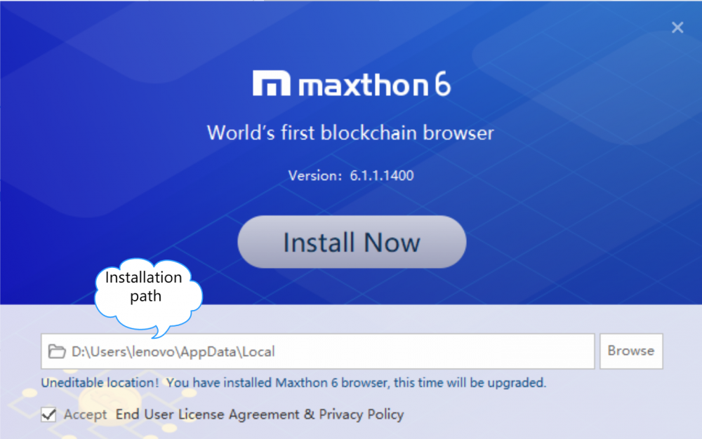
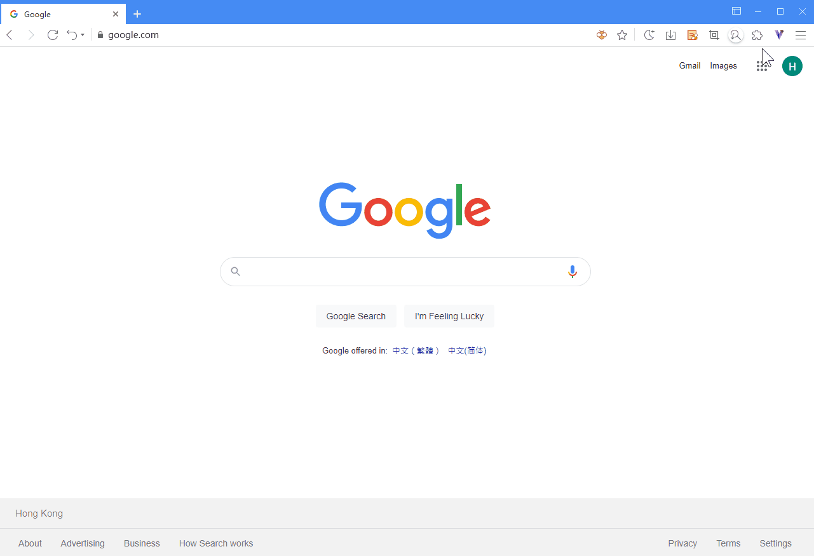
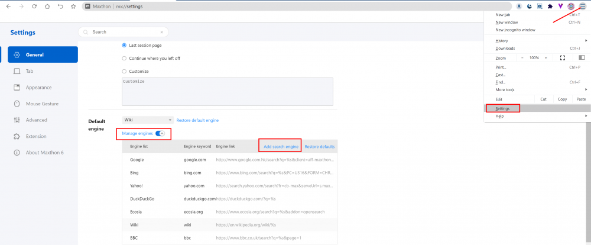
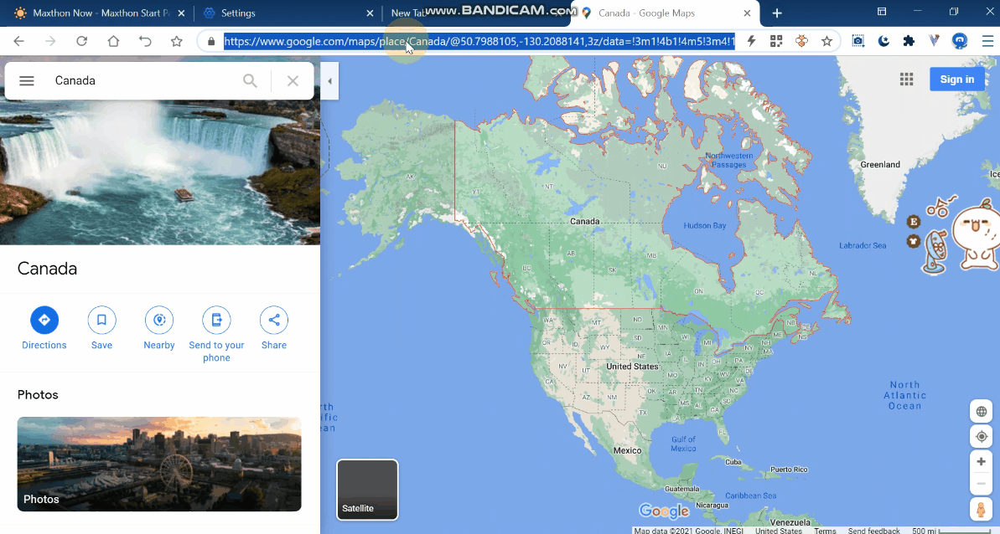
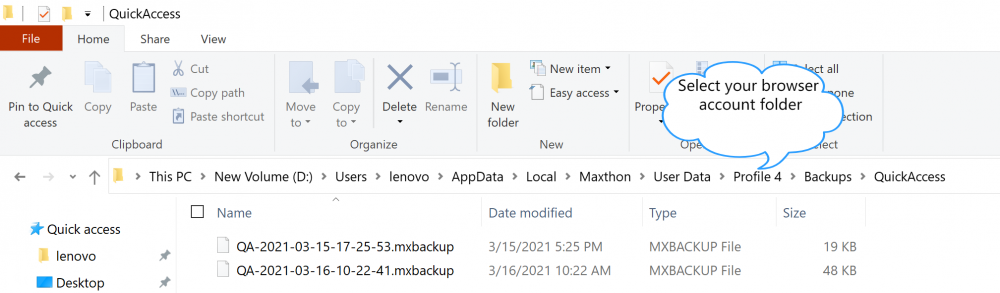
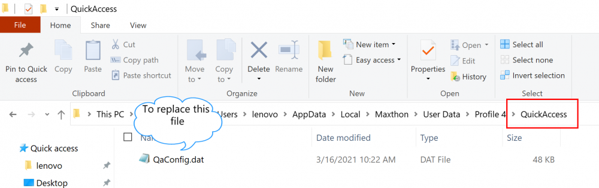
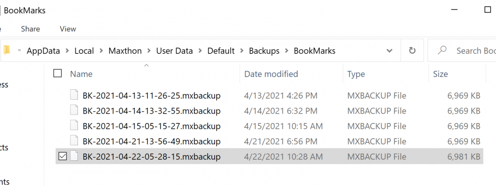
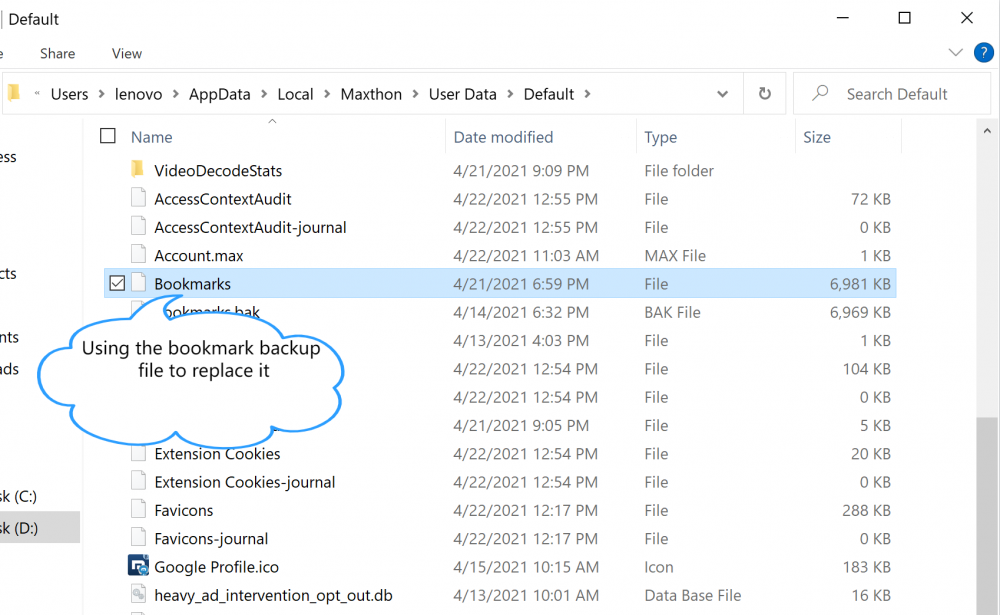

# FAQ

## Browser Crash Handling

- What are the common causes of browser crashes:

  - Opened too many pages. Resources are pretty occupied, and the kernel load is beyond limits;
  - Residual process is locked which lead to the browser failing to start or crash;
  - The extension installed is unstable which causes the browser to crash;
  - The Account abnormal error triggers the exception handling of the browser, causing it to crash or stuck;
  - Other software (especially anti-virus software) interception cause the browser to crash;
  - The old function of the advertisement filtering plug-in leads to the exception of advertisement interception (you can try to manually update or disable the advertisement interception plug-in).

- Browser crash problem solving
  1. Open the task manager to check whether there is a residual Maxthon process. If so, it is necessary to forcibly end the process. If it cannot be ended, restart the computer and then try to start the browser;
  2. If the problem is not solved, please try upgrading to the latest version of the Maxthon 6 browser. You can go to the Maxthon forum or open [https://forum.maxthon.com/index.php?/release-notes6/](https://forum.maxthon.com/index.php?/release-notes6/) to check whether it is the latest version.
  3. Check whether the current computer has installed anti-virus software, web page injection software, etc. if so, please close the corresponding software first and observe whether the crash is alleviated
  4. Check whether the current computer has too many open programs, memory occupancy, or high CPU occupancy, which may cause the browser web page stuck. You can close some software to release resources. Show the display status bar in the appearance settings to check the CPU occupancy of your computer at any time.
  5. If the problem has not been solved, please contact us in the forum or feedback, and we will reply as soon as possible and help you solve it.

## How to Make Maxthon 6 Faster

Various reasons will lead to the decline of the browser running speed. Generally, there are several methods to solve this problem.

- Browse using [Incognito mode](05-browse?id=incognito-mode)
- Delete browser cache file
- [Change the cache folder storage disk of the browser](14-setting?id=-modify-the-cache-path)
- Delete unnecessary history (MX://History)
  -Because every add-on uses a separate process, it will affect the browser speed while improving the user experience, causing the browser stuck. Closing the add-ons that are not in use can greatly alleviate this problem.
- Using VPN or proxy services will slow down the speed of opening pages. If there is no special need, turn off the VPN service, please.

## Report Problems or Send Feedback on Maxthon 6

If you encounter any problems during your use, please give us feedback so that we can contact you as soon as possible.
You can access the [Maxthon feedback page](https://www.maxthon.com/mx/bug/post/), fill in the feedback form online. Open the main menu by clicking more buttons in the upper right corner and selecting help > feedback will access the feedback page as well.

## what systems does Maxthon 6 support

- Maxthon 6 PC version supports Windows 7 and above (including Win7 / Win8 / Win10 / Win11 versions), both 32-bit and 64 bit systems.
- Maxthon Android supports Android 5 and above
- Maxthon iOS supports iOS10 and above
- Mac and Linux users can use the [historical version of Maxthon](https://www.maxthon.com/mx6/history/).

## How to Modify the Installation Directory

#### Modify the installation directory during the first installation

In the installation interface, click the folder icon on the right of the path and select the path you want to install. [Check the start file to see more](01-start)

#### The installation directory needs to be modified after installation

Maxthon 6 only supports modifying the installation path in the installation interface. After the initial installation, if you want to modify it, you need to uninstall and install it completely again. Anytime you need to reinstall, please log in to your Maxthon account, synchronize your data before the reinstall, so that your data will be completely retained.
If you move the folder directory directly, you may encounter problems when uninstalling the browser later. We don't recommend it.

## How to Enable Plug-ins

- Click the puzzle fragment icon on the right side of the address bar to open the add-on pop-out window. The add-ons enabled are showed there.
- Click the manager button with the cog icon under the floating window or directly open MX://extensions to view the list of add-ons you have installed. Enable, close, or set the detailed permissions of each extension here.
  

Some extensions can be enabled by pre-set shortcut keys. You can directly enter the shortcut keys to enable it.

## How to Add a Custom Search Engine

#### Modify search engine

- Enter the settings page, click the drop-down list in Generals > Search engine to switch to the default search engine.
- Expand the manage engines button to add, delete and modify search engines.

#### Add search engines not included in Maxthon

1. Go to the search engine you want to add.
2. Search for something.
3. Copy and paste the web address of the search results page into the URL field. The address for the search results page is different from the website address.
   - For example, if you search for "soccer," the Google search results URL is http://www.google.com/search?q=soccer.
4. Replace the search term in the URL with `%s`.
   - For example, if you were using the Google search results URL, your search engine address would be `http://www.google.com/search?q=%s`.

## Can Maxthon 5 and Maxthon 6 Data be Synchronized?

Using the Maxthon account, you can migrate the data in the account Maxthon 5 to Maxthon 6 when installing Maxthon 6 for the first time, while preserving the independence of the data in Maxthon 5.
After this synchronization, the data of Maxthon 5 and Maxthon 6 cannot be interconnected again.
However, the content in Maxnote is always synchronized under the same account, whether Maxthon 5 or Maxthon 6 is used.

## How to Recover Lost Data

#### How to recover new tab data after it is lost

If you need to recover your new tab data, you can

1. Exit the browser
2. Open the installation path, such as C:\Users\lenovo\AppData\Local\Maxthon

3. Open the account folder, find the folder "Backups" > "QuickAccess," select one backup file which you'd like to restore, rename it to "QaConfig.dat".
   

4. Back to your browser account folder, open the folder "QuickAccess," use the backup file to replace the current one.
   

5. Restart the browser

To check the installation path, you can run the Maxthon 6 installation package.

#### How to recover bookmark data after it is lost

If you unluckily lose bookmarks, you can try to restore the bookmarks by using the backup file.

1. Open Maxthon 6 browser.
2. Open the installation path, for example, D:\Users\lenovo\AppData\Local\Maxthon\
3. Open the folder "User Data" under the folder "Maxthon"
4. Find the account folder you'd like to restore data, such as "Default"
5. Under the folder "Default," you can find and open the folder "Backups" > "BookMarks"

6. Choose a backup file, copy it, then paste it to your account folder, such as "Default"
7. Rename the backup file as "Bookmarks," no file suffix is required; delete the previous file "Bookmarks."
8. Restart the browser.

#### How to recover password master after data loss

If the password master data is lost, log in to http://www.uu.me and enter the password master. There is a View Backup button at the bottom. You can set your password to any backup in 30 days.
