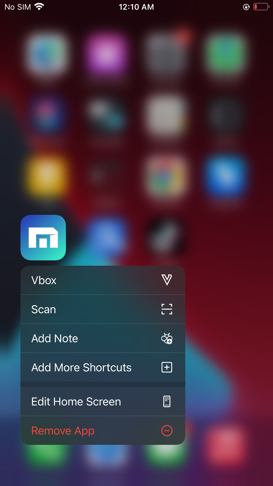
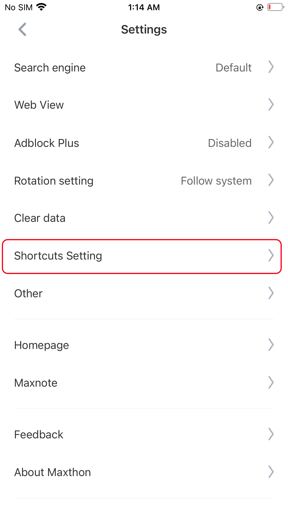
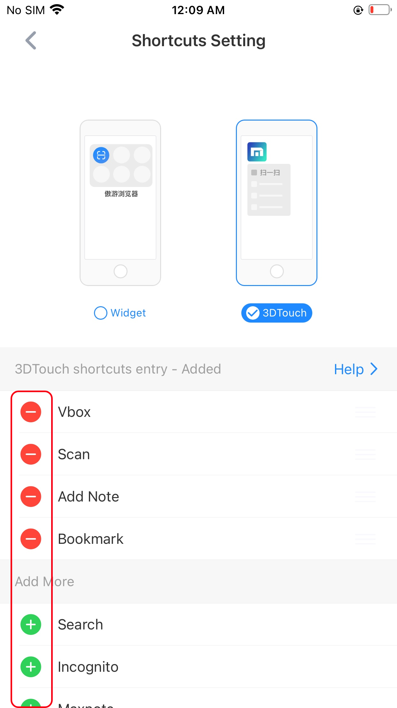

## 3Dtouch Shortcut

#### How to use a fuction through 3D touch Shortcut

Long press the Maxthon browser icon on the Home screen, click the function item, and you will quickly enter this function.

 

#### Customize the shortcut functions

You can go by Maxthon - settings - shortcut settings, get to the customize page

 

Alter the fuctions you need, four tops.

 