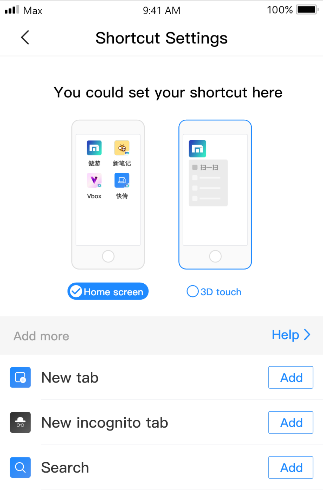

### Home screen shortcuts

#### How to add home screen shortcuts? 

You can go by Maxthon - settings - shortcut settings, get to the customize page

 

Click the Add button as you need.

 

#### How to access a function from the home screen?

Click the particular shortcut icon on the home screen with a little Maxthon icon on the lower-right. The Maxthon browser will boot the function in a second. 