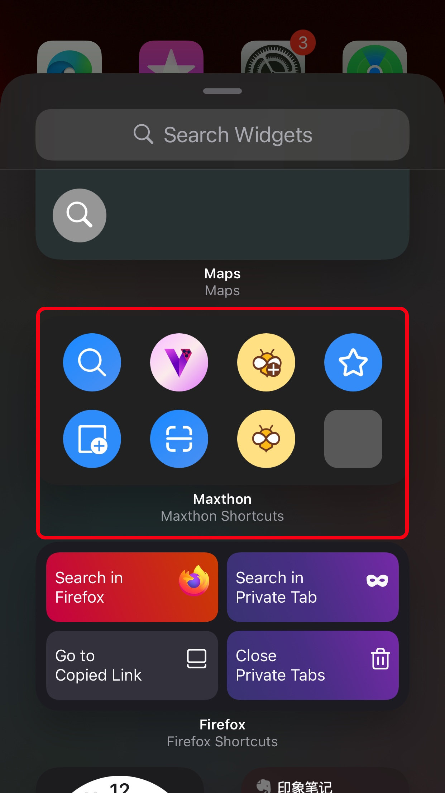
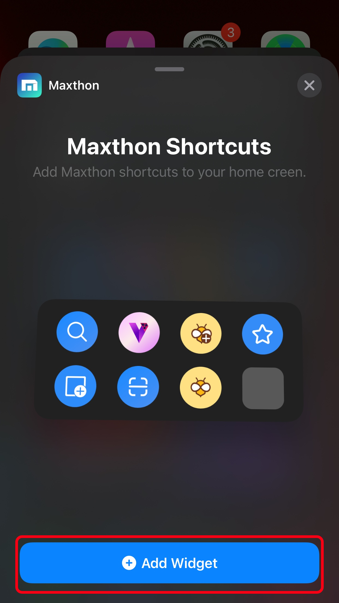
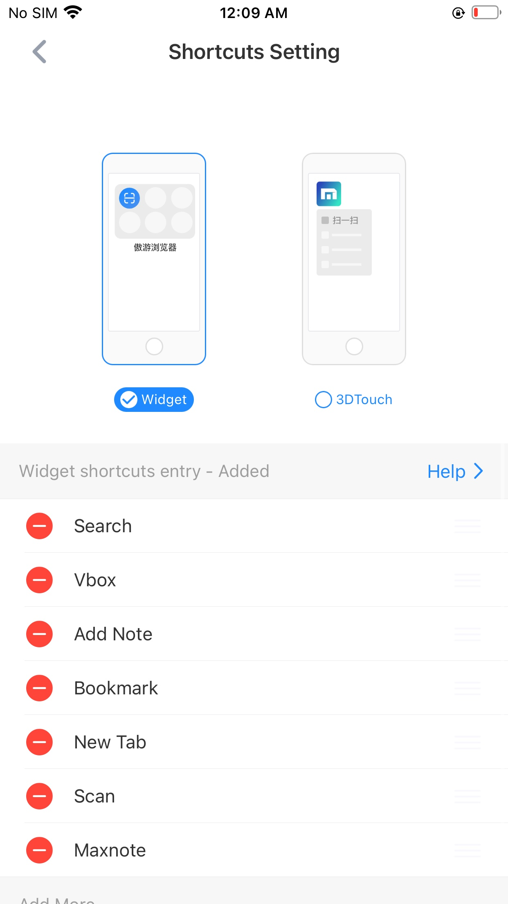

### About Widgets

#### How to add a widget？

Long press in the blank position of the home screen to enter the editing mode.

 

Find the Maxthon widget in the list.

 

Click add widget

 

Check the widget you added on the home screen.

 

#### How to alter the shortcuts in the Maxthon widget?

You can go by Maxthon - settings - shortcut settings, get to the customize page

 

Alter the fuctions you need, 8 tops.

 