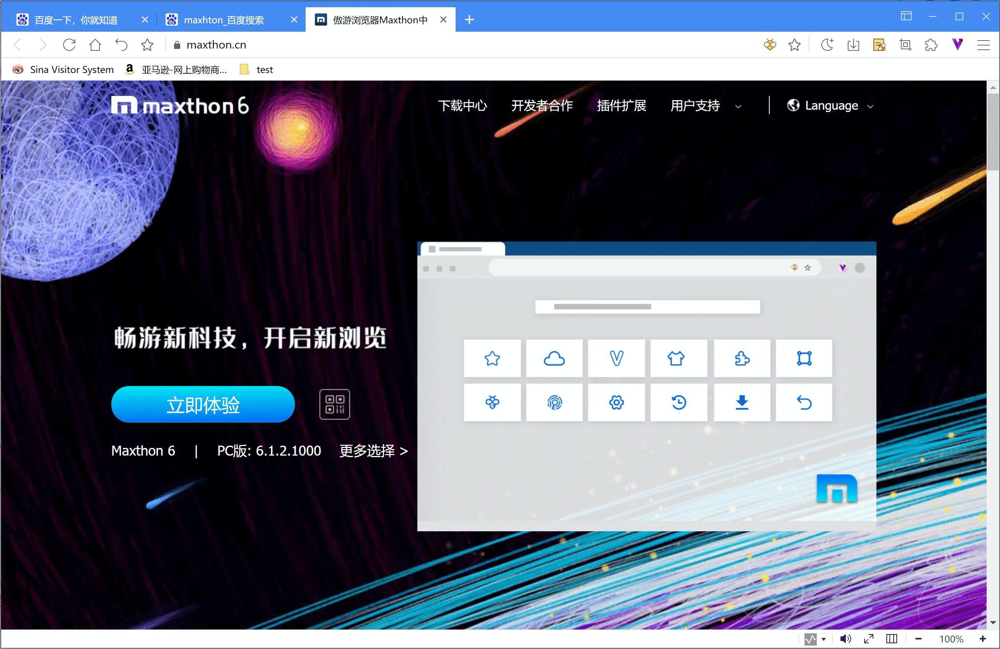
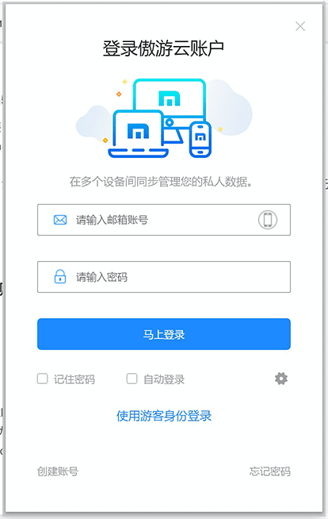
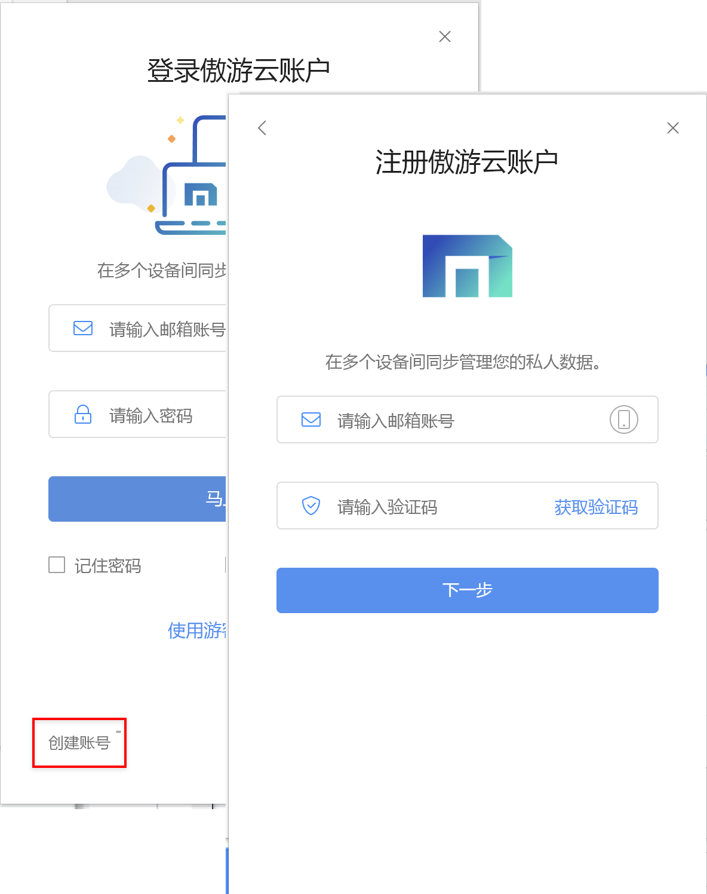
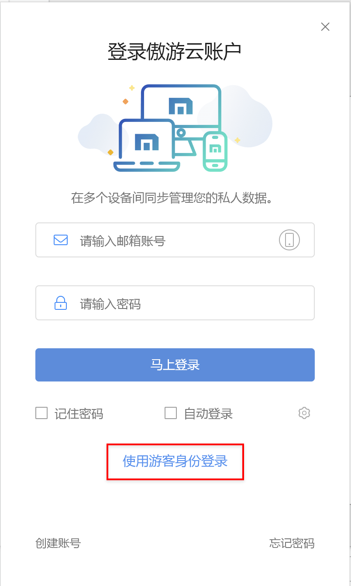
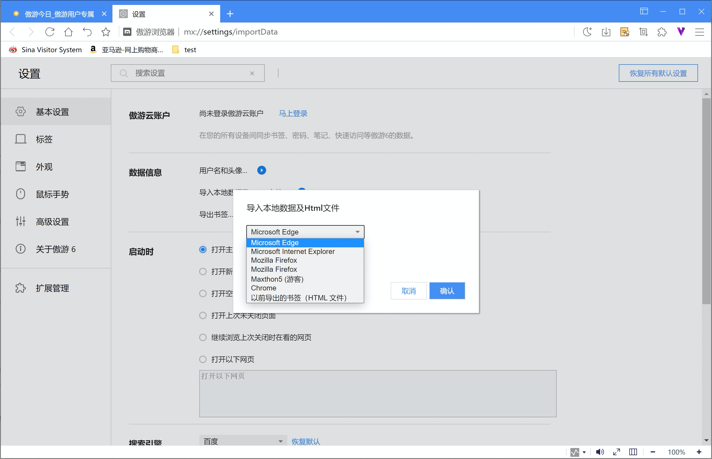
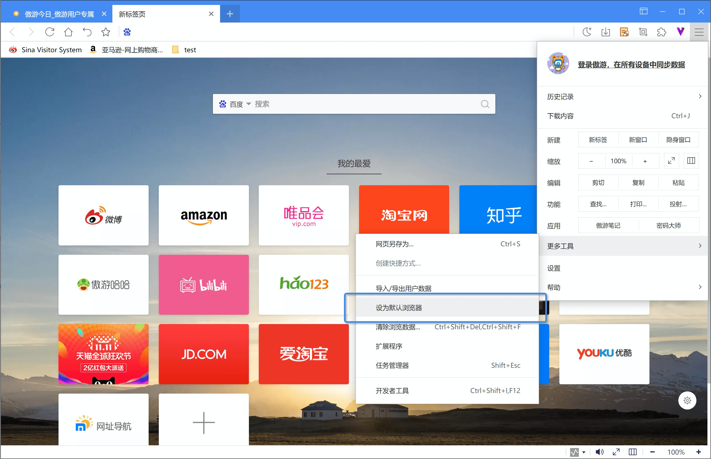
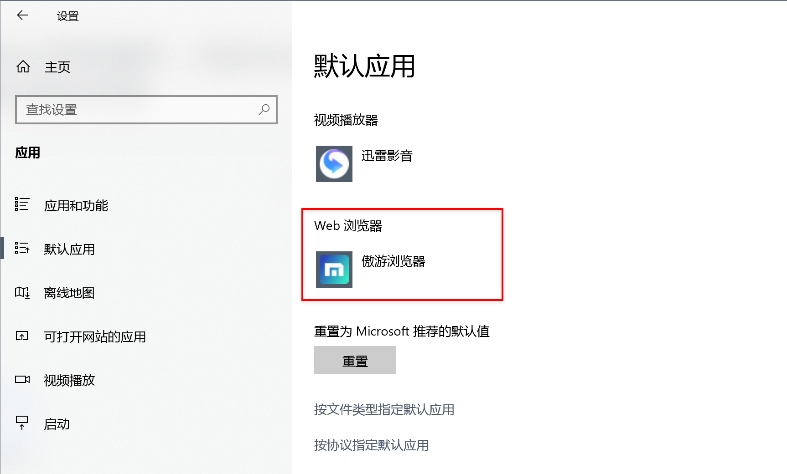
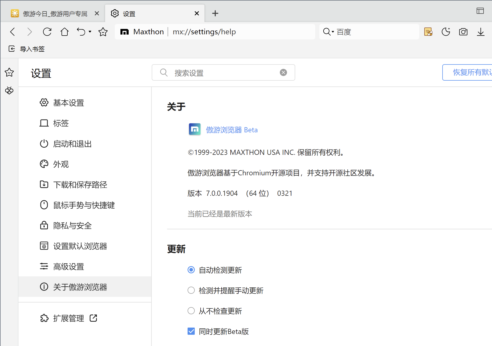
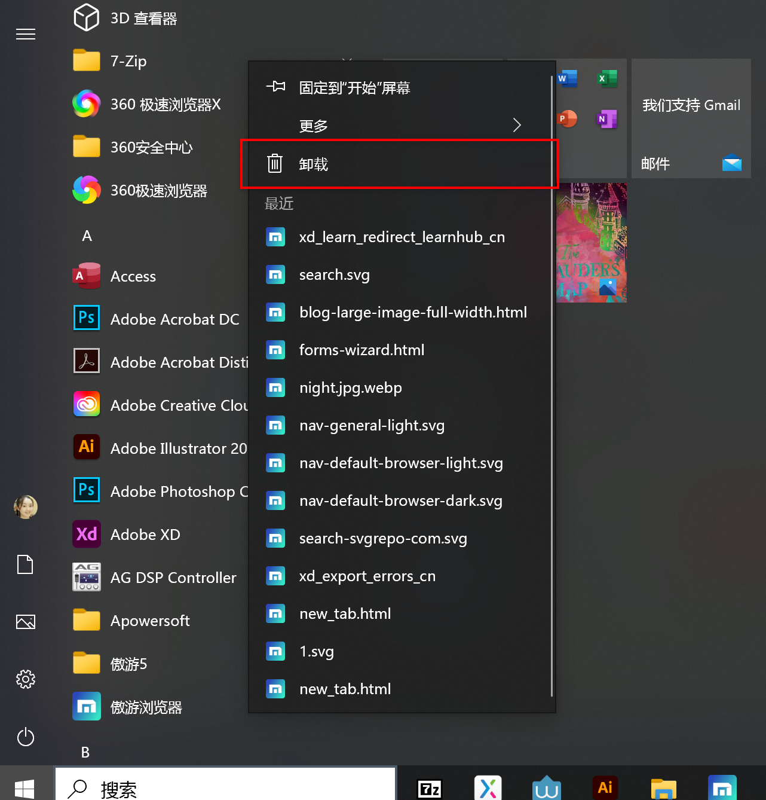

# 开始使用 Maxthon6

## -下载和安装 Maxthon6 

#### -在Windows中安装 Maxthon6

Maxthon6 官方下载地址请访问：maxthon.cn

点击【立即体验】，下载 Maxthon6 安装包，下载时，系统会自动检测您的系统，并为您下载最合适的安装包，此外，您可也可以进入【更多选择】，选择其类型的安装包。最后点击下载好安装程序，选择【立即安装】，安装结束后即可进入 Maxthon6

#### -在Windows中使用 Maxthon6 的便携版

如果您需要临时在其他电脑上使用 Maxthon6，也可以使用便携版

- 下载适合的 Maxthon6 便携版版压缩包（https://www.maxthon.cn/mx6/download/）
- 解压后，直接点击 Maxthon6.exe

*注意：便携版本地数据保存在便携版的文件夹中，如未登录云账户，则文件夹删除后，数据不会回复。

#### -通过 Maxthon5 升级为 Maxthon6 

如果您在本地安装了 Maxthon5，可以直接升级 Maxthon5 至 Maxthon6。

使用该升级方式，您 Maxthon5 中的本地数据将直接被导入 Maxthon6，为您提供无缝升级体验。

## -登录Maxthon账户开启云数据同步

使用 Maxthon 云账户，不仅可以保证您的私人数据安全不丢失，同时还能跨设备使用您的数据。

####  -登录一个已有的Maxthon账户

 您可以登录一个已有的 Maxthon 账户，在当前电脑延续您过往的使用体验。

 

注意：如果您是Maxthon 5 的老用户，初次使用 Maxthon 6 时,我们会复制您的历史数据至 Maxthon 6，同时保留 Maxthon 5 数据的独立性。

####  -创建一个新的 Maxthon6 云账户

如果您是 Maxthon 的新用户，您可以使用手机或邮箱注册一个新的账户，开启您的 Maxthon 体验。

## -使用游客身份登录浏览器

您也可以在登录页面选择【使用游客身份登录】，该状态下您的所有数据均保存在本地，不能跨设备使用，且部分功能将被禁用。

注意：游客状态下请谨慎使用电脑的清理程序，如误删除本地存储文件，则数据丢失不可恢复。

## -导入本地数据

如果您在本地有其他浏览器数据或Html文件，可直接导入 Maxthon6 中使用。

- 点击【主菜单/设置】在【基本设置】中，点击【导入本地数据及HTML】；
- Maxthon6自动识别并支持导入Edge、IE、Firefox、Chrome等绝大多数常用的浏览器数据。

## -将 Maxthon6 设置为默认浏览器

将 Maxthon6 设置为默认浏览器，那么您点击任何链接或您设置好的打开文件格式，都会自动在Maxthon6中打开。以Windows10为例：

- 【主菜单/更多工具】中，点击【设为默认浏览器】

- 系统自动弹出的默认应用设置中，点击Web浏览器，在弹出列表中选择 傲游浏览器6

- 为便于您日后轻松地打开 Maxthon6，请按照以下步骤将 Maxthon6 的快捷方式添加至您的任务栏
  - 在计算机上打开 傲游浏览器；
  - 在底部的 Windows 任务栏中，右键点击 傲游浏览器 图标；
  - 点击固定到任务栏。

## -更新及卸载 Maxthon

####  -Maxthon6的更新

通过【主菜单/设置】，在设置中切换至【关于傲游6】，以及【主菜单/帮助/关于傲游浏览器】，均可以进入傲游6的更新页面。

- Maxthon6 的更新提供三种模式
  - 自动检查更新（推荐）：当有新的版本上线后，系统将自动检查并更新至最新版本；
  - 检测并提醒手动更新：当系统检测到有新的版本上线后，将为您发送通知，您需要在当前页面手动更新；
  - 从不检测更新：设置为该选项后，系统不会为版本的更新提供任何帮助，您需要手动检查并手动更新。
- Maxthon6 每隔7~10天即推出一版Beta内测版，如果用户想提前体验并参与进 Maxthon6 的内测中来，请勾选【同时更新Beta】，勾中该项目后，系统会升级至版本号最高的版本，无论是正式版还是Beta版。

####  -Maxthon6的卸载

- 您可以Win菜单中找到 Maxthon6，然后点击鼠标右键，在弹出的选项中选择【卸载】即可完成卸载。
- 您也可以打开控制面板，在【程序】中选择卸载程序，找到傲游浏览器，选择【卸载】即可。

