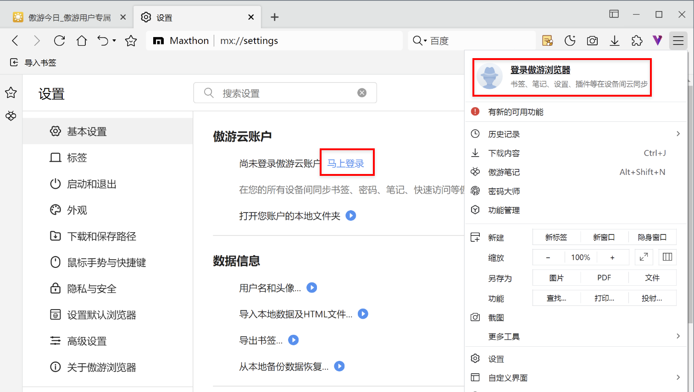
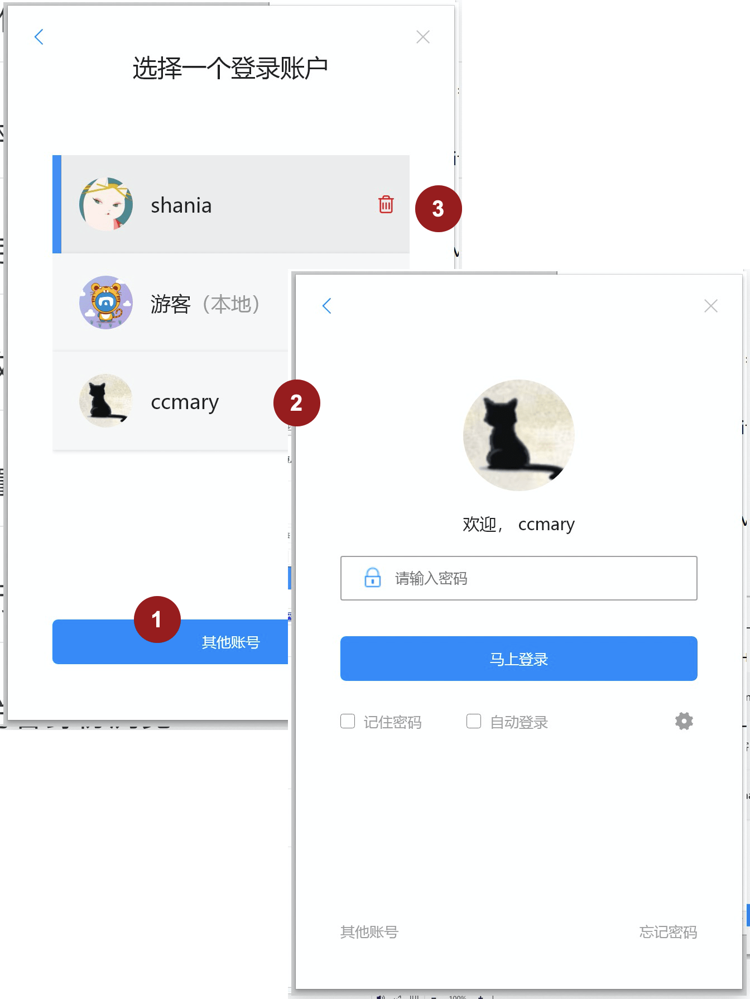
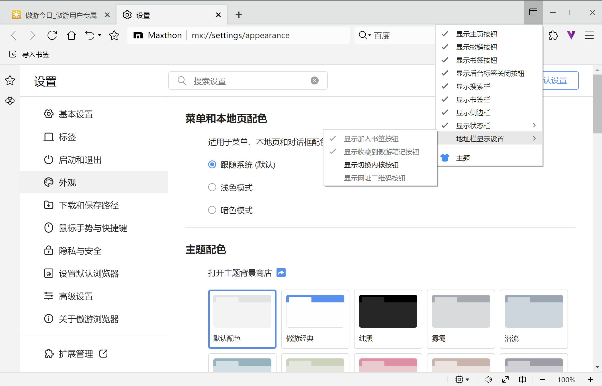
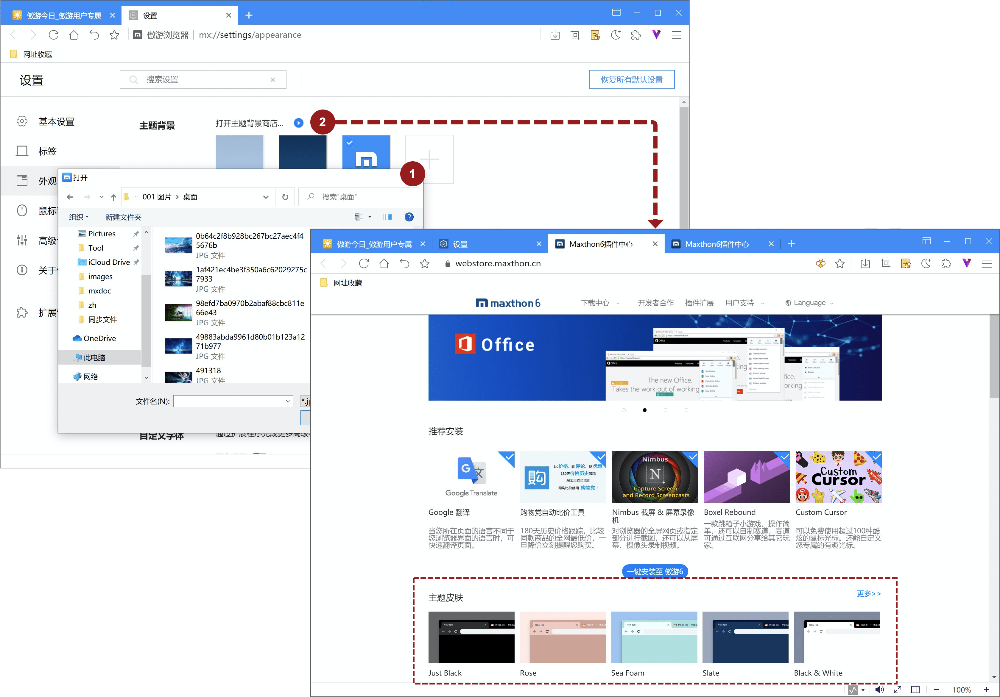
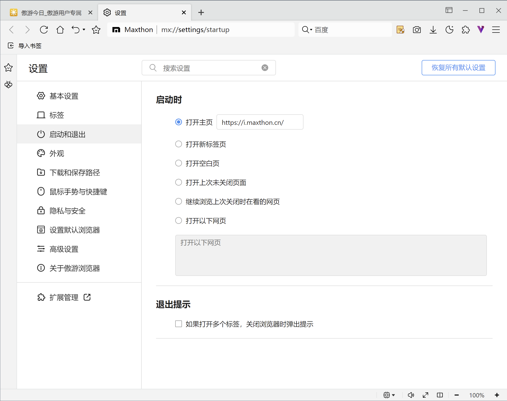
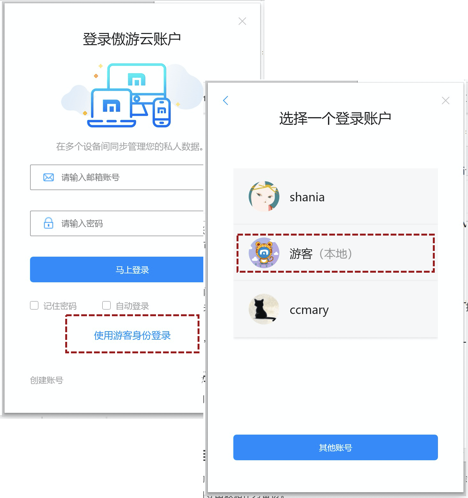

# 云同步与个性化设置

## -使用傲游云账户进行数据同步

在 Maxthon6 中，您可以继续使用傲游云账户的数据同步功能。登录傲游云账户后，会在本地生成一个独立的数据包与之对应，执行本地数据与云账户数据之间的同步。使用傲游云账户的同步功能，可在不同设备间共享浏览数据和浏览器设置。

如果在初次登录浏览器时，使用了游客身份，依然可以在主菜单及设置页面登录傲游云账户。

*注意①：如果您已经拥有一个傲游云账户，初次登录 Maxthon6 时，会自动将 Maxthon5 中的数据导入Maxthon6中，此时傲游云账户中同时存在 Maxthon 5 和 Maxthon 6 的数据，且互不影响。

*注意②：如果您在不同的终端同时使用Maxthon5和Maxthon6，需要注意即使使用相同的云账户，但 Maxthon5 和 Maxthon6 彼此数据并不互通。

登录傲游云账户后，在【设置/基本设置】的傲游云账户中，提供了针对不同情况的功能：

1. 重新导入傲游5云数据：如果您的Maxthon6云账户数据产生了异常，可以使用该功能重置Maxthon6云账户数据，确认后将使用MX5云数据覆盖当前。

2. 合并本地数据至云账户：如果您使用了一段时间的游客身份，并想要将“游客”数据导入当前云账户，可使用该功能。

## -登录多个云账户

如果您有多个傲游云账户（比如区分工作和生活账号），或与家人共用计算机，可登录多个云账户。

登出当前账户，进入账户选择列表：

1. 添加一个新的傲游云账户

2. 切换傲游云账户，每次登陆，均需执行密码验证。需注意【自动登录】仅可用于每次打开浏览器，但切换账户时依然需要执行密码验证。

3. 如果某个账户在本机不在继续使用（或临时使用账户），点击【删除】将在本地删除账户数据，同时该账户不再显示在列表。

   

## -自定义浏览器界面

用户可对浏览器界面执行自定义，这些设定将通过您的云账户同步，在所有的终端同步。

- 您可以通过右上角的（自定义界面)，随时调整浏览器界面，设定需要显示或隐藏的功能；

- 您还可以在【设置/外观】中进行设定。

  

## -修改浏览器背景及风格

您还可以选择浏览的背景或更改整体风格：

1. 在【设置/外观】中，点击主题背景中的【添加】，可将本机图库中的图片作为浏览器背景；

2. 您可以在插件商城中，选择喜欢的主题皮肤，整体进行更换；

3. 您还可以在其他支持Chromium内核的插件商城中，下载皮肤并安装至Maxthon6。

   

## -设置主页和启动页

您可以为每个云账户设定其独特的启动显示页面：

- 打开主页，您可设定任意页面作为主页；

- 打开新标签页；打开空白页；

- 打开上次未关闭页面；

- 继续浏览上次关闭时在看的页面，设定此项目后，再次启动浏览器将自动为您打开上次未关闭的网页；

- 打开以下网页，您可以设定一组网址作为浏览器启动时打开页面。

  

## -以游客身份访问浏览器

如果您是临时使用浏览器或未拥有傲游账户时，可选择使用游客身份访问浏览器。

游客是Maxthon6的本地账户，无需密码验证即可登录，可使用Maxthon6的绝大多数功能。

*注意：如删除了浏览器本地数据包，将会导致数据永久丢失。
