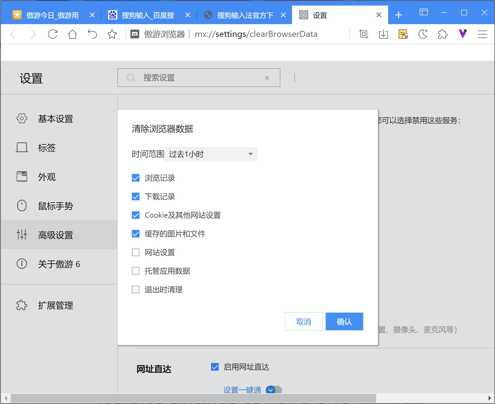
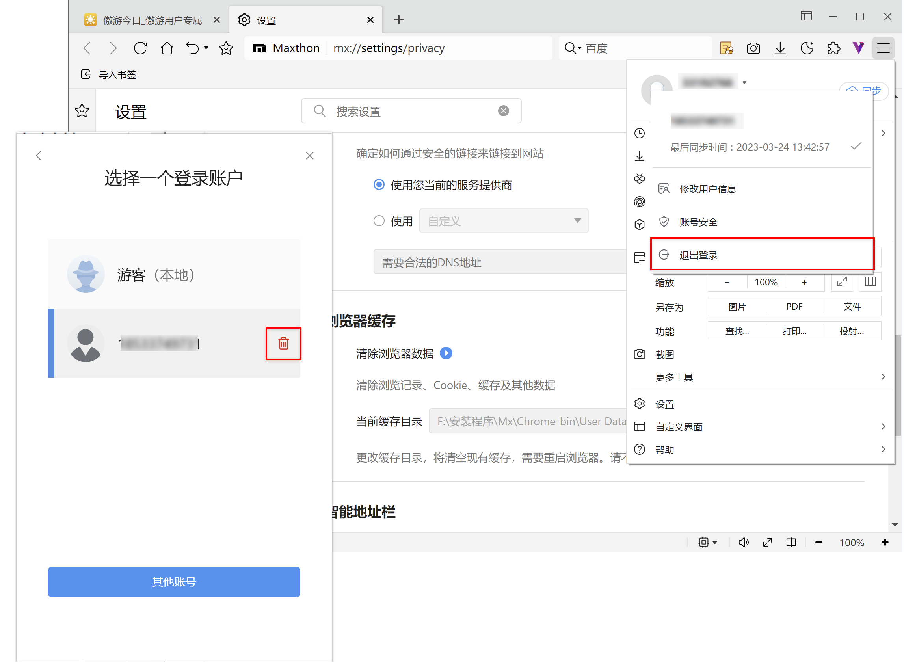
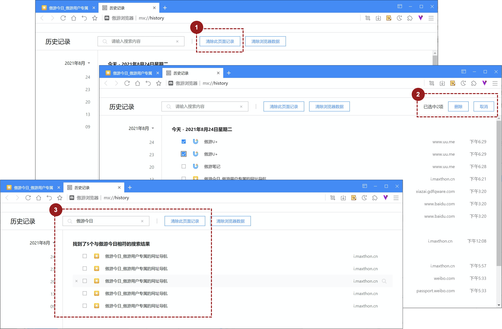
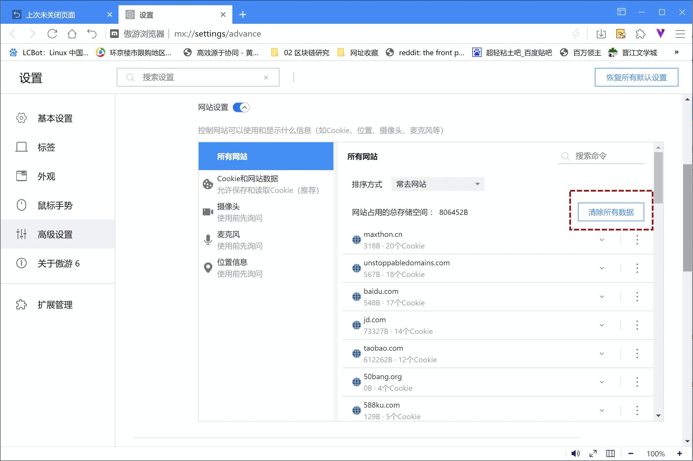
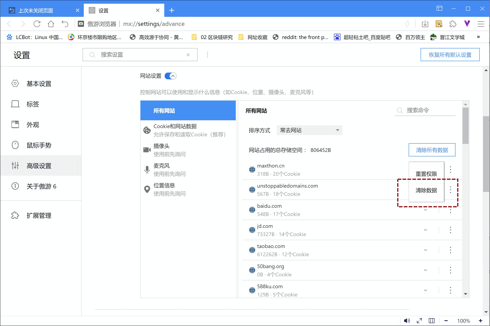
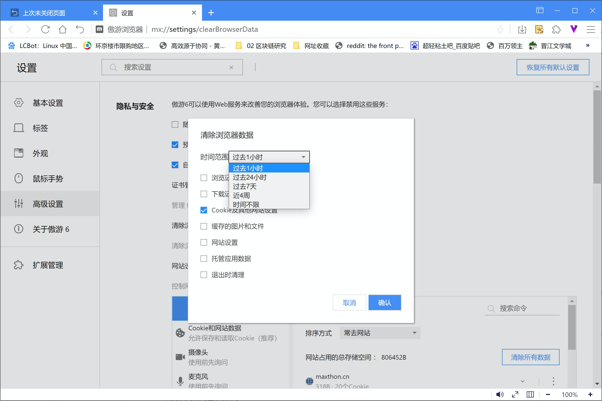
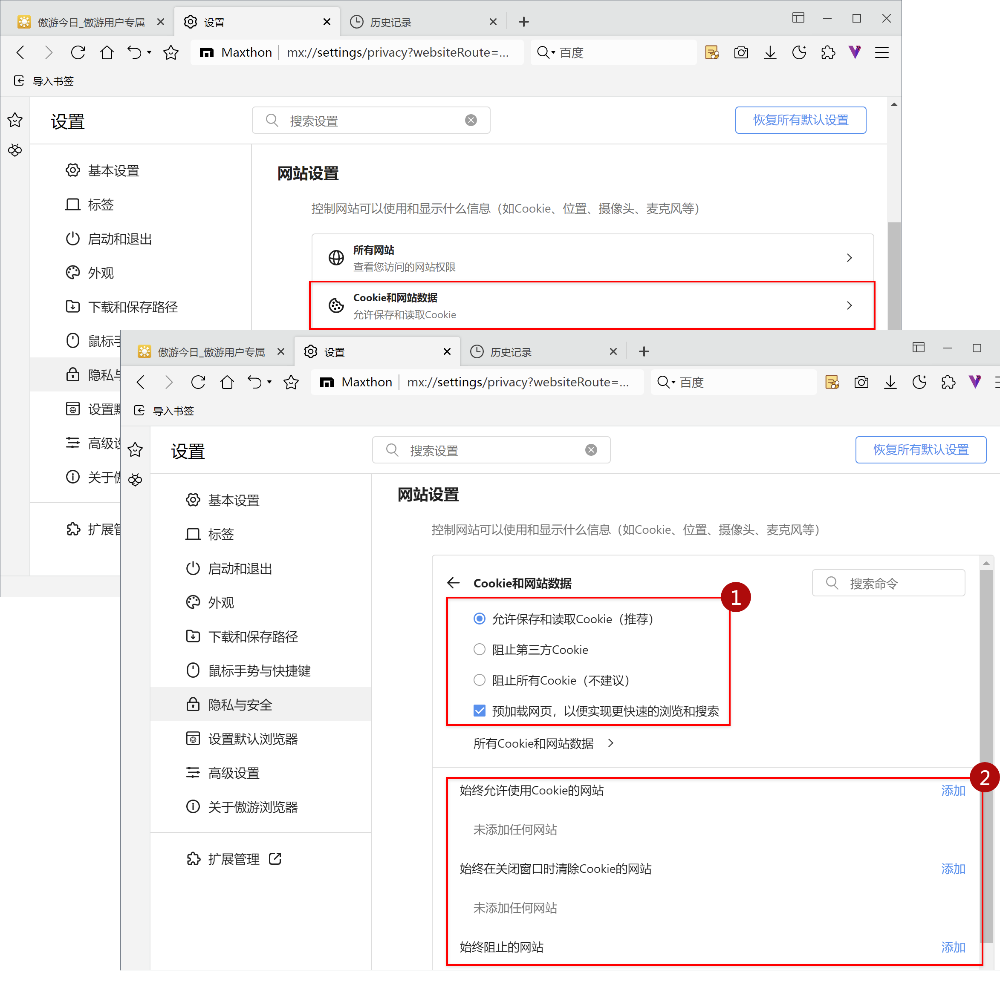
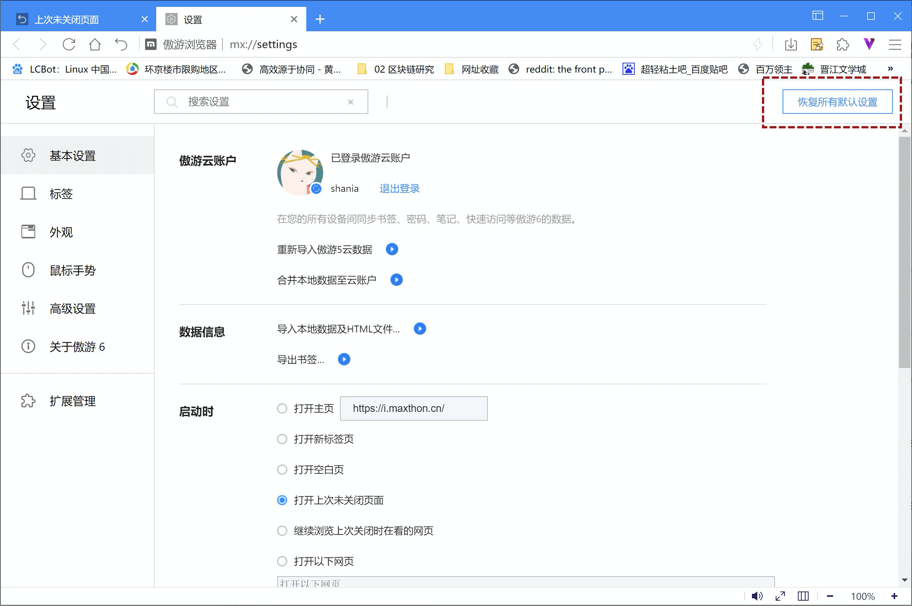

# 数据清除和恢复

您可以控制自己的历史记录和其他浏览数据，可以删除您的所有数据，或者只删除特定时间内的数据。还可以自由导出数据作为备份。

## -Maxthon的数据

#### -可直接删除的数据

数据可直接通过“清除浏览数据”一键直接删除

- 浏览记录
  - “历史记录”中的数据
  - “上次未关闭页面”中的数据
  - 地址栏联想中基于“历史记录”和“最近访问”关联的网址
- 下载记录：指下载管理器中的历史下载列表，清除这部分数据不会从您的计算机中实际删除文件。
- Cookie及网站数据
  - Cookie：Cookie是您访问过的网站所创建的文件。Cookie通过保存浏览信息来让您获得更轻松的在线体验。比如，你设定的网站“1个月内自动登录”就是由Cookie实现的。
  - 网站数据：各种支持HTML5的存储类型，包括应用缓存、网络存储数据、网络SQL数据库数据和索引型数据库数据。
  - 处理程序：Maxthon为特定类型的链接设置的默认操作，例如某些链接可以打开Gmail之类的网站或 iTunes 之类的程序。
  - 媒体许可：HTML5或Flash类型的受保护内容（例如您以前播放或下载的电影或音乐）的许可证。
- 缓存的图片和文件：Maxthon保存的部分网页，以便在您下次访问时提高网页打开速度。清除后再次访这些网页需重新下载。
- 内容设置：您提供给网站设置的权限，例如，如果某个网站可以运行JavaScript，则可以使用您的摄像头。
- 托管应用数据：与托管的扩展应用相关的数据（例如Gmail离线版所使用的本地存储数据）

#### -需特殊清理的数据

- 存储类应用：比如书签、傲游笔记、密码大师、Vbox，不可直接清除数据，需在对应的应用界面执行数据删除操作；

- 扩展程序：扩展程序可以将数据存储在您的计算机中，删除这些数据需卸载扩展。

- 搜索记录：您在使用浏览器提供的搜索功能时，搜索数据存储您设置的默认搜索引擎中，这部分数据需要单独删除。

  

## -清除浏览器数据

Maxthon为您提供了便捷的一键清理数据功能。

- 点击右上角更多图标，打开主菜单；
- 依次打开 更多工具/清除浏览数据
- 可选需要清理数据的时间范围
- 选择要移出数据的信息类型
- 点击确认后即可完成
- 您还可以在【设置/高级设置/隐私安全中】使用该功能。

注意：如果您已经登录了傲游云账户，该操作不仅会清除本地存储数据，还会通过清除云账户保存数据，以及您在其他使用该云账户的其他设备对应数据。

## -清除本地云账户数据

如果您登陆了傲游云账户，当您不在继续使用该账户，想要在当前计算机删除该账户的全部数据时，可以使用删除本地身份数据的方式：

- 点击右上角更多图标打开主菜单，然后点开昵称旁边的下拉菜单，选择【退出登陆】
- 确认关闭浏览器后，在弹出的身份选择页面，选择对应身份，点击删除该身份对应的本地数据。

*注意：该方法可用于清楚本地身份数据，但不会影响云账户数据。

## -删除历史记录

如果您不想全部清空浏览器数据，也可以直接删除历史记录，或其中的部分数据。需要注意的是，如果您在清除数据的时候保持着云账户登录，将同步清除您的云数据以及所有登录该账号的终端数据。

点击浏览器右上角更多图标，在主菜单中选中【历史记录/历史记录】（Ctrl+H)，进入历史管理页面。

1. 清除全部历史记录：点击顶部【删除此页面记录】，即可删除本地全部历史数据;
2. 删除选中历史记录：勾选想要删除的记录，点击右上角【删除】，即可删除选中的记录；

3. 通过搜索删除历史记录：通过搜索关键词，在搜索结果页执行【删除此页记录】，只删除了含有关键词的记录，其他记录未删除。

## -清除、启用和管理Cookie

您可以选择删除现有Cookie、允许/阻止所有Cookie，以及针对某些网站设定偏好设置。请注意清除Cookie后，您将退出相应网站，而且您保存的偏好设置页会随之删除。

#### -清除所有Cookie

- 访问【设置/高级设置/隐私与安全】；
- 展开【网站设置】项目，在【所有网站】中，点击【清除所有数据】。

#### -删除特定Cookies

1. 按照网址删除Cookie

在【设置/高级设置/隐私与安全/网站设置】中，选择【所有网站】，找到目标网址（可搜索）后，点击对应的【更多】菜单，选择【清除数据】，即可删除该网址对应cookie数据

2. 按照时间范围删除Cookie

在【设置/高级设置/隐私与安全】中，点击【清除浏览器数据】，直选中【Cookie及其他网站设置】，选择时间时间范围，点击确认将删除全部Cookie在指定时间内的数据。

#### -更改您的Cookie设置 

您可以允许或组织网站保存Cookie，但需注意，如不允许网站保存Cookie，您将无法浏览大部分要求登录的网站。

在【设置/高级设置/隐私与安全/网站设置】，选择【Cookie和网站数据】，可对修改Cookie设置

1. 允许或阻止所有Cookie：您可以设置允许或阻止所有Cookie，也可选择阻止第三方Cookie，以拦截三方广告。*重要提示：如果您阻止第三方 Cookie，系统就会阻止来自其他网站的所有 Cookie 和网站数据，即使这些网站已列入您的例外情况列表中。

2. 设置部分Cookie：您可以将网址加入【始终允许】【始终阻止】和【关闭后清除】列表中，已实现对Cookie的差别设定。

   

## -恢复浏览器默认设置

您可以随时在Maxthon中恢复浏览器设置。如果所安装的应用或扩展程序在您不知情的情况下更改了设置，那么您可能需要这样做。不过，您保存的书签、笔记及密码不会被清除或更改。

在【设置】页面，点击右上角【恢复所有默认设置】，系统将会恢复到初装状态。

