# 使用标签页

## 打开新的标签页

1. 在Maxthon窗口顶部，点击右侧最后一个标签页旁边的【打开新的标签页】图标；右键点击，可以直接在新的标签页中打开已复制的链接。
2. 对网页内的任意链接按住Ctrl的同时点击，或使用右键菜单【在新标签页中打开链接】。

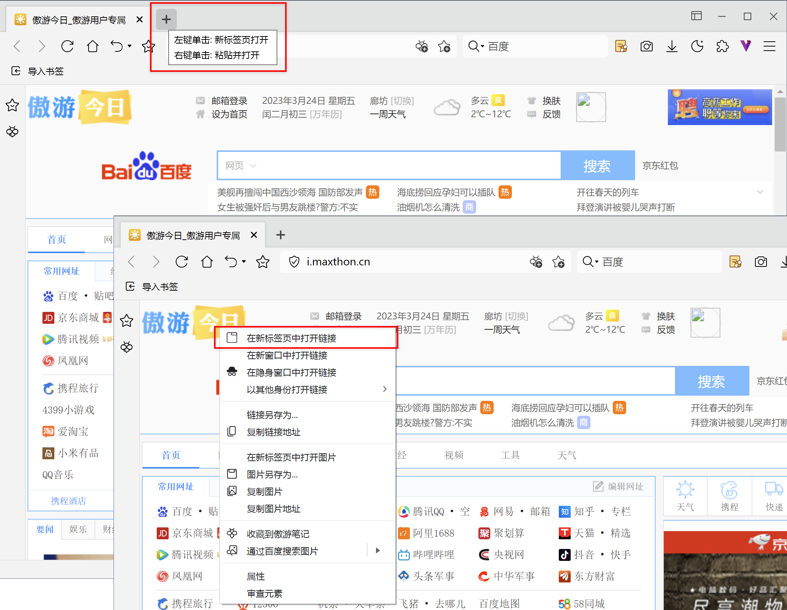

## 在新窗口打开标签页

您可以在桌面打开多个浏览器窗口：

1. 点击右上角更多图标打开主菜单，在新建项目中，点击【新窗口】；
2. 使用新标签页右键菜单【将标签页移至新窗口】，如果此时已打开多个窗口，则可在列表中选择想要移动至的窗口；
3. 网页内任意链接点击右键菜单【在新窗口中打开链接】；
4. 直接将标签页拖出当前浏览器窗口。

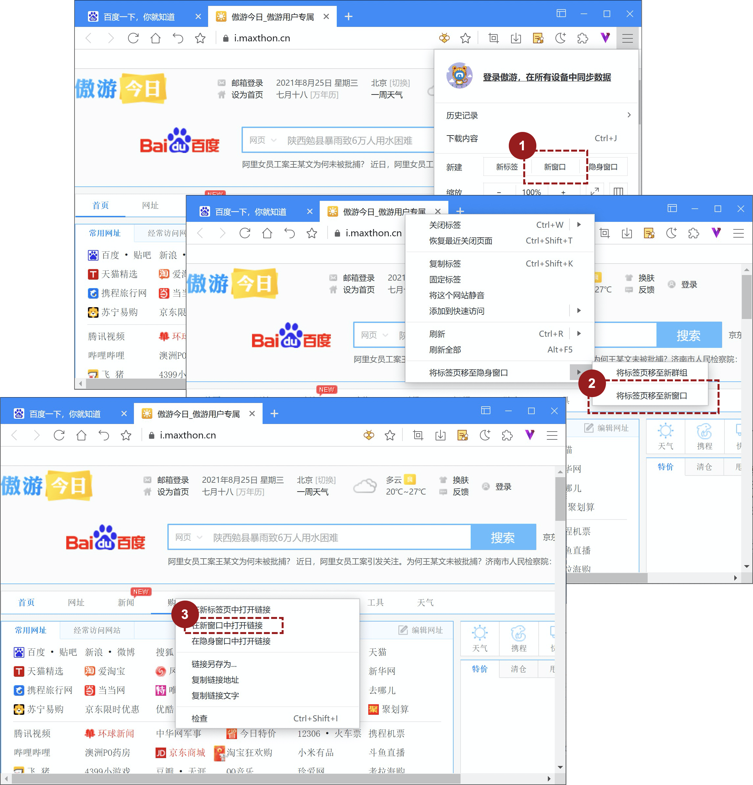

## 自定义属于您的新标签页

#### 编辑标签

1. 添加新的标签至快速启动列表

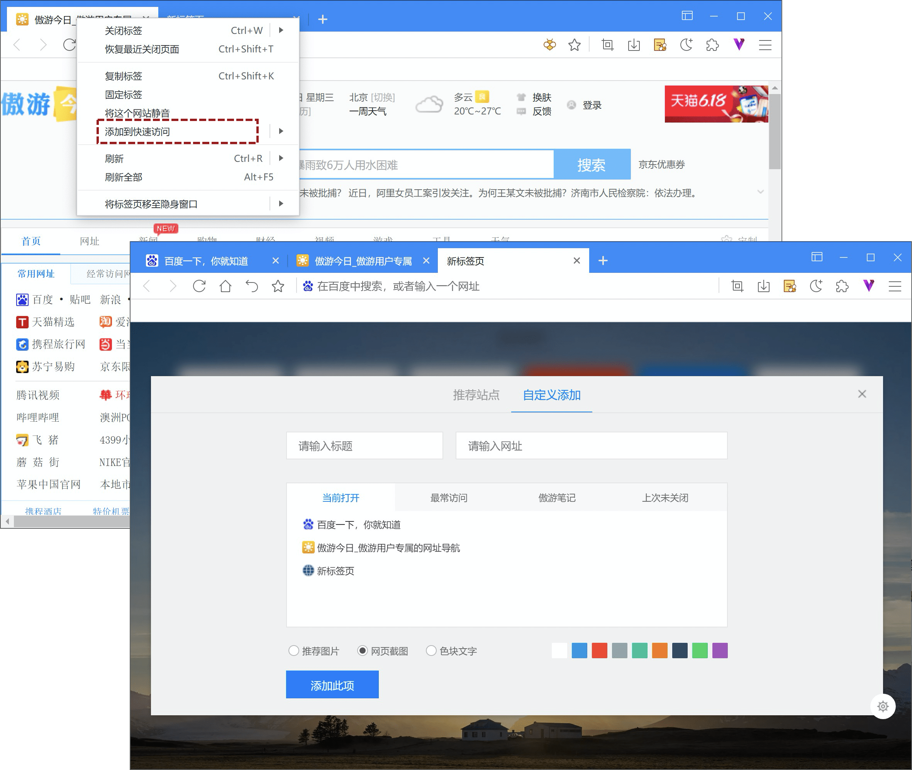

- 您可以直接在标签页使用右键菜单【添加到快速访问】；
- 也可在新标签页，点击列表最末的【添加】，切换至【自定义添加】标签下，可自行设定标题、网址及展示形式：
  - 推荐图片：使用图库中预设图片，如该网址无预设图片自动更改为色块形式。
  - 网页截图：使用当前网址的快照截图作为展示图片
  - 色块文字：网址标题+选定色块的叠加的形式

2. 标签的编辑和使用

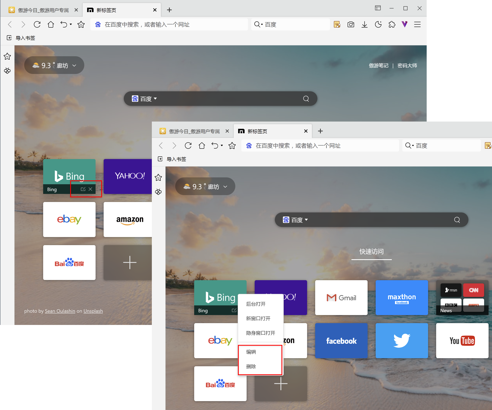

- 鼠标悬浮在快速启动项目上时，点击 进入修改模式，点击删除。
- 可以在再快速启动项使用右键菜单，选择【编辑】、【删除】。
- 点击标签将自动跳转，也可以使用右键菜单：
  - 在后台打开，保持当前页面不切换，在后台新建标签页打开网址
  - 在新窗口打开：新建一个窗口打开网址
  - 在隐身窗口打开：新建/切换 隐身窗口打开网址

3. 拖拽排序

拽图标至两个图标中间位置，当图标自动移动，出现空白位置时松手，即可移动至该位置。

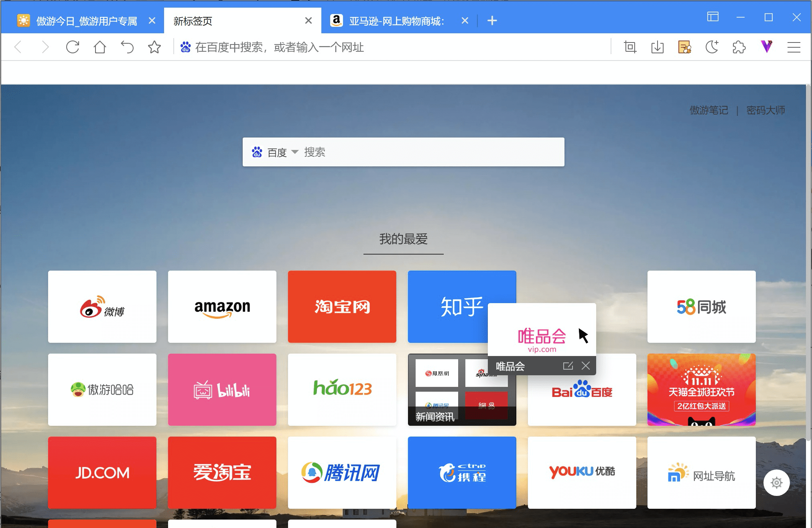

#### 使用文件夹整理标签

Maxthon的新标签页支持使用文件夹整理标签。

1. 创建文件夹

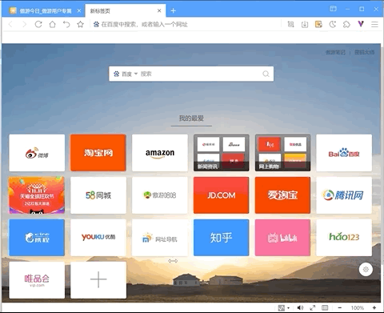

拖拽标签与另一个标签重合，当后面的标签出现深色阴影时松开鼠标，则自动创建一个文件夹

2. 将标签移出文件夹

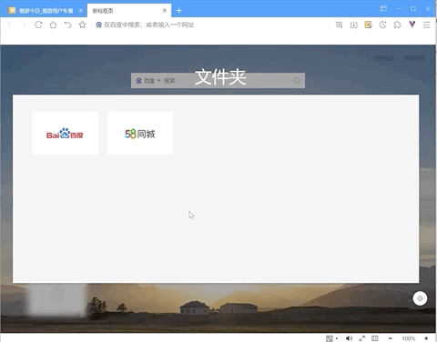

拖拽标签至文件夹外，即可返回主界面，放入适合位置即可。

*注意：当文件夹内最后一个文件被拖拽出后，文件夹将自动删除，即Maxthon不支持保留空白文件夹。

####  设置新标签页样式

您可以自定义新标签页。点击右下角的【设置】图标 ，进入新标签页设置选项。

* 新标签页背景设置。
  * **背景图设置**：在设置菜单中，默认的新标签页背景为“每日一图”。系统会每天自动从壁纸网站中获取一张图片作为您的新标签页背景图，每天有一点新鲜感。如果您需要更换图片，可以点击每日一图右边的更换链接，或在新标签页中直接点击更换背景图标 。您也可以选择关闭背景图（背景显示为纯色），或从本地上传图片作为背景图。
  * **更换文字和遮罩颜色**：新标签页提供两种主题配色，分别为白色字体，暗色遮罩和黑色字体，浅色遮罩。遮罩是为了使显示在背景图上的文字更加清晰。
  *  **设置遮罩和模糊百分比**： 设置配色方案的下方，您还可以调整滑动条来设置遮罩的透明度和模糊程度百分比。遮罩百分比越高，透明度越低，背景越接近纯色。
  *  **背景预览** 在当前背景中，你可以预览设置好的背景图片样式。

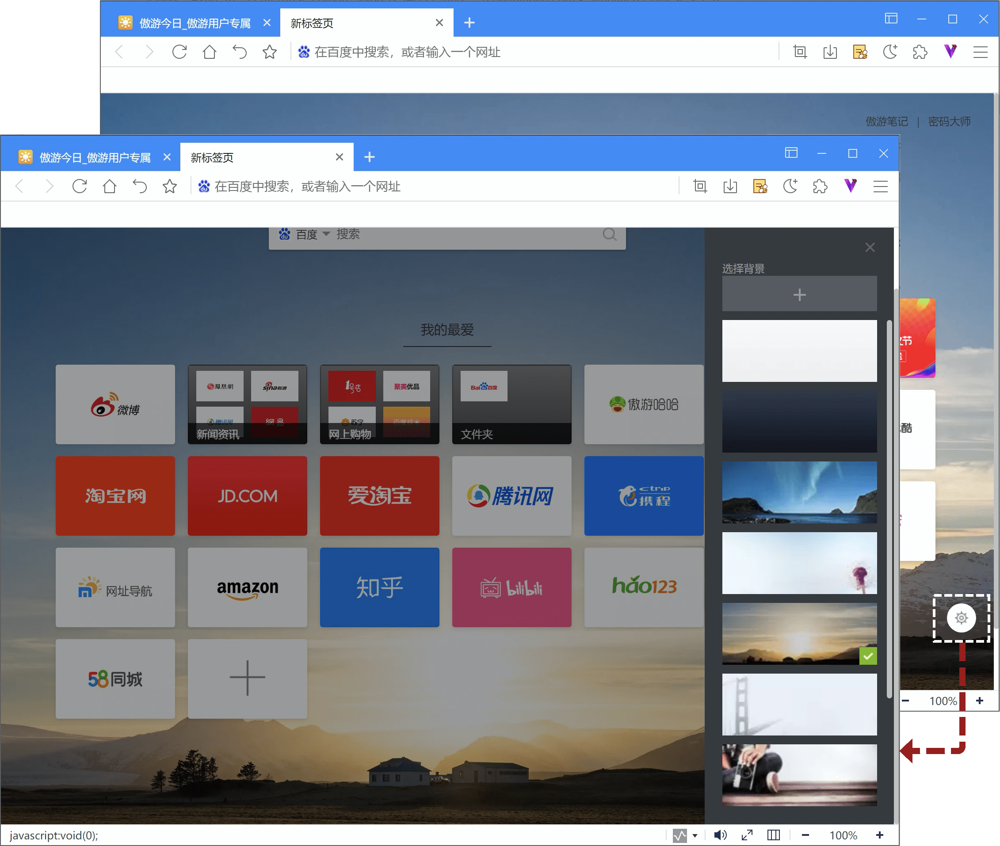

* 外观设置
  * 您可以在设置中选择开关新标签页中的功能模块。关闭后，对应的模块或按钮将不再显示。

* 搜索设置
  * 设置搜索引擎
  * 设置搜索热词显示 开启后，搜索框激活时显示当天的热搜词。
  * 设置搜索框样式。常规样式会显示并可设置默认搜索引擎；极简样式为简单线框，不可设置搜索引擎。

## 标签移动与锁定

1. 如果想要更改标签排列顺序，请沿浏览器窗口方向拖动标签页即可；
2. 标签右键中选择【锁定标签】，标签右边出现标志，此状态下标签将不可被关闭。再次右键【取消锁定标签】，标签恢复正常。

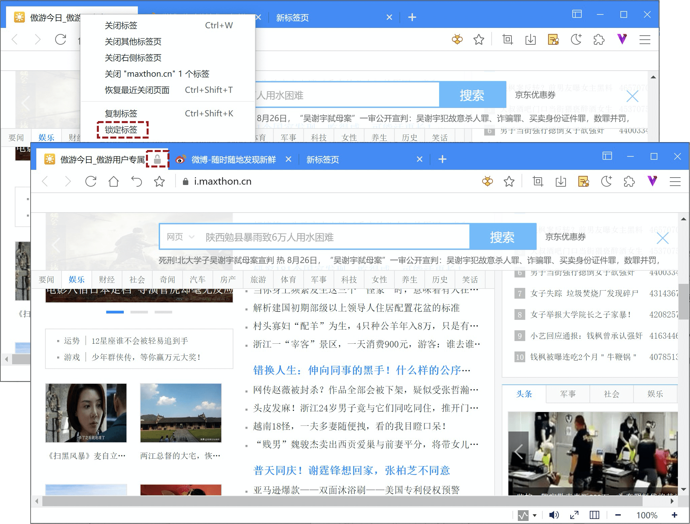

## 为标签页分组

您可以使用群组整理标签页

1. 添加群组：

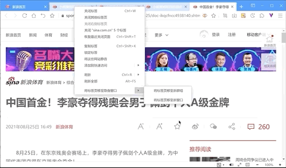

- 选中部分标签（按住 Shift 再点击可多选标签)，点击鼠标右键【将标签页移至新群组】；
- 您可以收起标签页群组，这样的话，只有群组名称或彩色圆圈会显示在标签栏中。若要展开或收起群组，请选择其名称或彩色圆圈。

2.群组交互

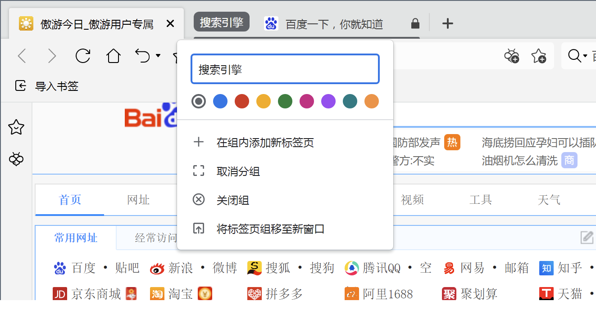

- 若要修改标签页群组，请右键点击左侧的彩色圆圈或名称。您可以：
  - 为该群组命名。
  - 向该群组添加更多标签页。
  - 移除该群组。
- 若要将某个标签页添加到现有群组，请将此标签页拖入该群组。
- 若要从群组中移除某个标签页，请右键点击此标签页，然后选择从群组中移除。

*注意“取消分组”是指释放分组内标签，而“关闭群组”是指关闭群组内的所有标签。

## 恢复标签页或窗口

如果您无意中关闭了某个标签页或窗口，可通过以下方式恢复：

1. 点击地址栏的撤销按钮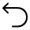，或快捷键【Ctrl+Shift+T】打开上一个关闭的页面；
2. 右键撤销按钮，可查看更多已关闭标签列表；
3. 使用标签右键【恢复最近关闭标签】；
4. 点击右上角主菜单按钮打开主菜单，选择【历史记录】中的【最近关闭的标签】也可以恢复已关闭标签或窗口。

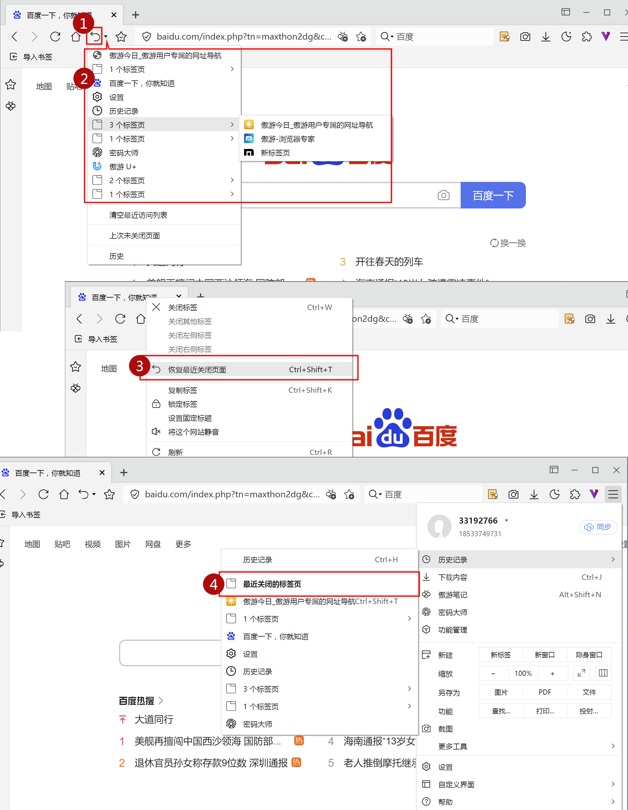

## 关闭标签

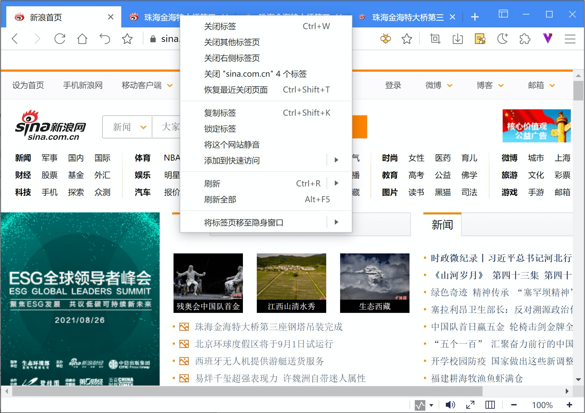

1. 点击标签关闭按钮，或右键菜单中点击【关闭标签】，即可关闭当前标签
2. 批量关闭标签：

- 右键菜单【关闭其他标签页】，将关闭除当前标签外其他所有标签；
- 右键菜单【关闭右侧标签页】，将关闭当前标签页右侧的全部标签；
- 右键菜单【关闭"xxxx"n个标签】，将关闭与单签标签拥有相同根域名的所有标签。

3. 使用鼠标左键双击或右键单击关闭：在【设置/标签/关闭标签】中进行设置，勾选后即可使用对应操作关闭。

## 强行关闭页面或应用

如果标签页、窗口或扩展程序无法正常运行，您可以使用Maxhotn的任务管理器将其强制关闭。

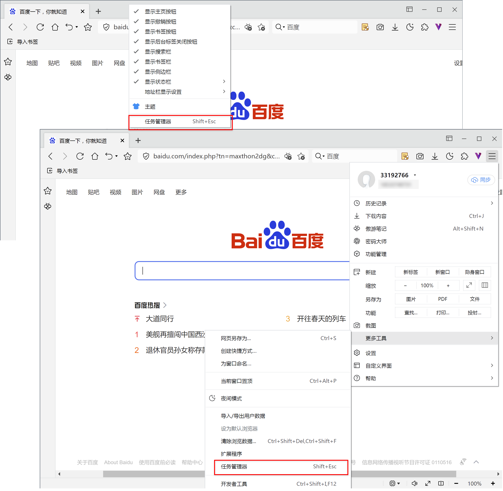

- 使用快捷键【Shift+Esc】；
- 标签栏空余位置点击鼠标右键，选择【任务管理器】项目；
- 右上角主菜单图标，打开主菜单，选择【更多工具/任务管理器】

