# 浏览网页

## 在Maxthon6中搜索网络信息

#### -通用搜索功能

Maxthon6的地址栏除支持网址跳转外，还是一个通用的搜索条，该搜索功能以您设置的默认搜索引擎为您提供搜索服务。

1. 搜索建议

当您在地址栏输入内容时，系统可能会根据您的网络使用记录向您提供建议。这些建议除了来自搜索引擎的模糊推荐外，还来自您的历史记录和书签。通过清理浏览器记录可以删除这些关联信息。

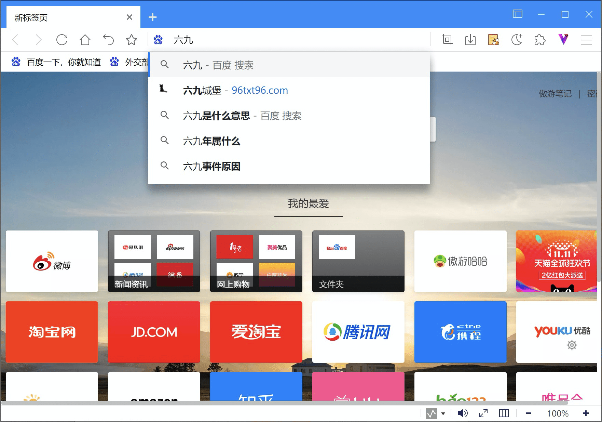

2. 更改默认搜索引擎

您可以切换默认搜索引擎，也可以添加新的搜索引擎。

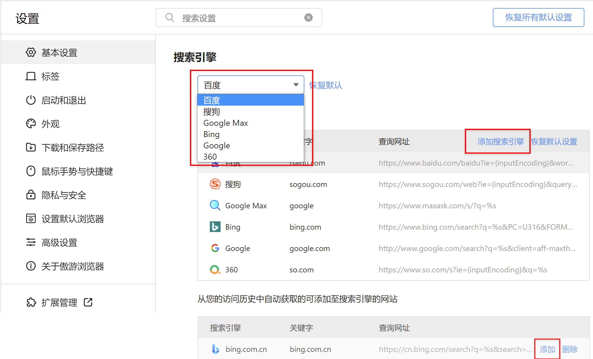

- 进入设置页面，在【基本设置/搜索引擎】中，点击下拉列表可切换默认搜索引擎；切换成功后将影响所有使用默认搜索引擎的功能，比如新标签页内置搜索功能，及右键菜单的选词搜索功能。
- 展开【管理搜索引擎】，可对搜索引擎进行增删改操作。

#### -网页内搜索

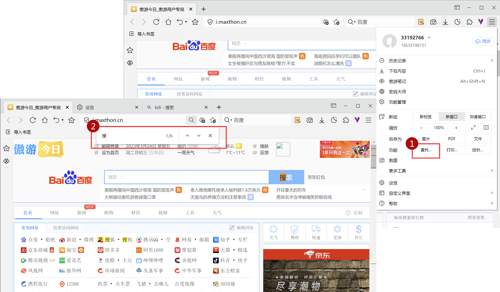

您可以在网页内搜索特定的字词或短语：

1. 点击右上角更多图标打开主菜单，点击【查找】，打开网页查找工具条。
2. 更便捷的方式是使用快捷键【Ctrl+F】，可直接打开网页搜索条。

系统会以黄色突出显示匹配内容，您可以使用滚动条上的黄色标记查看所有匹配内容在网页中的位置。

*小窍门：先复制想要查找的内容，再打开查找工具条，内容会被自动粘贴并查找。

#### -快速选词搜索

您可以选择网页上的词语或短句对齐进行搜索。

1. 选中内容后，右键菜单中选择【使用**搜索**】，将使用默认搜索引擎为您搜索关键词；
2. 您还可以在更多菜单中，选择其他搜索引擎搜索关键词。

## 网页静音

 您可以对网页执行静音操作。

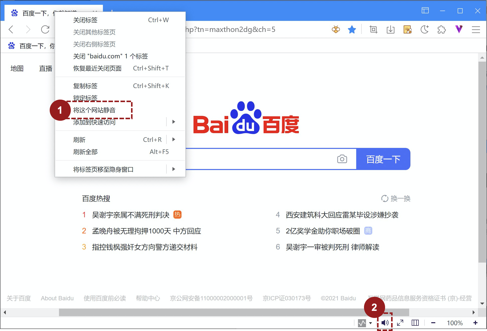

1. 标签右键菜单，选择【将这个网站静音】，该根域名下的所有页面都会被静音。

静音是针对当前网站的设置，除非再次使用右键菜单【将这个网站解除静音】，或通过全局静音解除，否则关闭网页、关闭浏览器均不会影响网站的静音设置。

2. 点击状态栏的，可切换浏览器的静音状态。

状态栏的静音设定时针对浏览器的设定，当设置为静音时，所有浏览器窗口的所有页面均处于静音状态。除非再次点击解除，否则不会恢复。

## 刷新网页

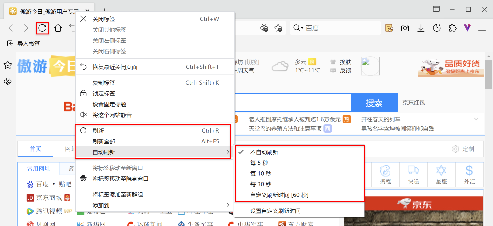

Maxthon6支持以下刷新方式：

1. 快捷键【Ctrl+R】；
2. 点击地址栏左侧的刷新图标；
3. 标签右键菜单中选择刷新

- 刷新：当前页面执行一次刷新
- 刷新全部：当前窗口的全部标签页均执行一次刷新
- 自动刷新：通过设置刷新时间间隔，使当前页面每隔*时间执行一次刷新

## 网页缩放与全屏、分屏模式

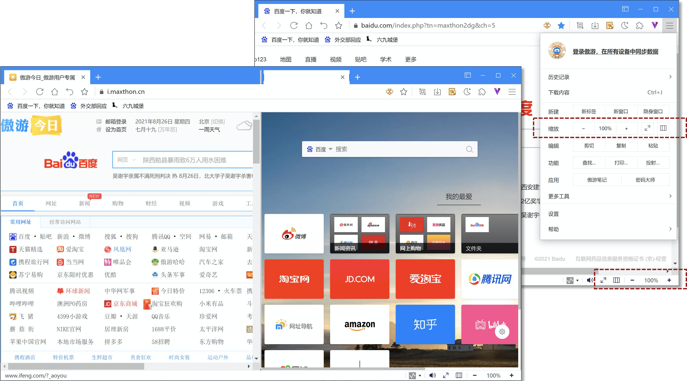

您在浏览网页的时候，可以按照需求，对页面进行缩放、全屏和分屏操作：

- 使用快捷键：
  - 同时点击快捷键“Ctrl“和“+”，屏幕放大；
  - 同时点击快捷键“Ctrl“和“-”，屏幕缩小；
  - 同时点击快捷键“Ctrl“和“0”，屏幕还原100%；
  - F10：分屏
  - F11：全屏
- 点击右上角更多【图标】，在主菜单中选择：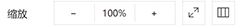
- 使用状态栏缩放功能：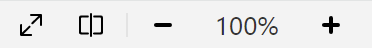

## 使用二维码分享网页

点击右上角自定义界面图标，勾选“显示网址二维码按钮”，在地址栏出现二维码图标，点击该图标即显示网页二维码。

## 使用鼠标手势

Maxthon6继续支持鼠标手势。在设置页，进入【鼠标手势】标签，可对鼠标手势进行细节设置。

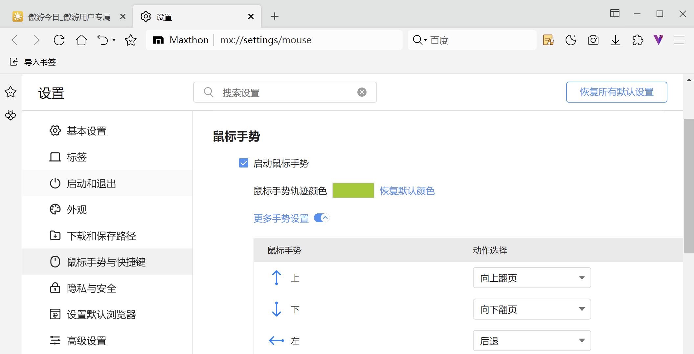

## 自定义快捷键

在设置页，进入【鼠标手势】标签，选择【更多快捷键设置】，可对Maxthon6的全部快捷键自定义设定。

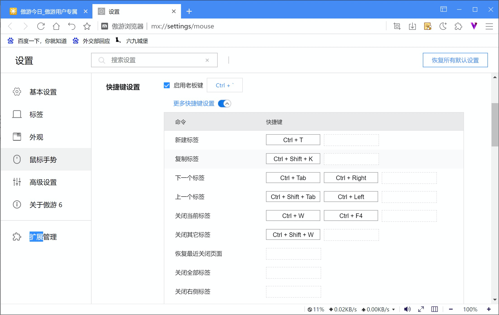

通过快捷键设定，可以使用Maxthon 6很多便利小功能，比如：

- 老板键：使用快捷键后，浏览器自动最小化，保证您的屏幕不被看到。
- 锁定浏览器键：该功能只有登录傲游云账户后可用，使用后，浏览器进入锁定状态，想要重新激活浏览器需要输入账户密码。

### Maxthon6默认快捷键
<table>
<tbody>
<tr><th>命令</th>	<th>快捷键</th></tr>
<tr><td>老板键</td>	<td>Ctlr + ·</td></tr>
<tr><td>新建标签</td>	<td>Ctrl + T</td></tr>
<tr><td>复制标签</td>	<td>Ctrl + Shift + K</td></tr>
<tr><td>下一个标签</td>	<td>Ctrl + Tab Ctrl + →  Ctrl + PgDn</td></tr>
<tr><td>上一个标签</td>	<td>Ctrl + Shift + Tab Ctrl + ←  Ctrl + PgUp</td></tr>
<tr><td>跳转到特定标签页</td>	<td>Ctrl + 1 到 Ctrl + 8</td></tr>
<tr><td>跳转到最后一个标签页</td>	<td>Ctrl + 9</td></tr>
<tr><td>关闭当前标签</td>	<td>Ctrl + W Ctrl + F4</td></tr>
<tr><td>关闭其它标签</td>	<td>Ctrl + Shift + W</td></tr>
<tr><td>恢复最近关闭页面</td>	<td>Ctrl + Shift + T</td></tr>
<tr><td>关闭全部标签</td>	<td>无</td></tr>
<tr><td>关闭右侧标签</td>	<td>无</td></tr>
<tr><td>关闭左侧标签</td>	<td>无</td></tr>
<tr><td>复制标题和网址</td>	<td>无</td></tr>
<tr><td>粘贴并打开(搜索)</td>	<td>Ctrl + Shift + N</td></tr>
<tr><td>在新标签中后台打开</td>	<td>Ctrl+鼠标左键 鼠标中键</td></tr>
<tr><td>补全地址栏网址并打开</td>	<td>Ctrl + Enter</td></tr>
<tr><td>输入网址后按快捷键后台打开</td>	<td>Alt + Enter</td></tr>
<tr><td>锁定标签</td>	<td>无</td></tr>
<tr><td>将当前标签静音</td>	<td>Alt + M</td></tr>
<tr><td>后退</td>	<td>Alt + ← Backspace</td></tr>
<tr><td>前进</td>	<td>Alt + →
<tr><td>刷新</td>	<td>Ctrl + R F5</td></tr>
<tr><td>停止</td>	<td>Esc</td></tr>
<tr><td>停止全部</td>	<td>无</td></tr>
<tr><td>强制刷新</td>	<td>Ctrl + F5</td></tr>
<tr><td>刷新全部</td>	<td>Alt + F5</td></tr>
<tr><td>分屏模式</td>	<td>F10</td></tr>
<tr><td>开启/关闭全屏模式</td>	<td>F11</td></tr>
<tr><td>选中地址栏</td>	<td>Ctrl + L Alt + D F6</td></tr>
<tr><td>使用地址栏搜索</td>	<td>Ctrl + K Ctrl + E</td></tr>
<tr><td>主页</td>	<td>Alt + Home</td></tr>
<tr><td>新建窗口</td>	<td>Ctrl + N</td></tr>
<tr><td>新建隐身窗口</td>	<td>无</td></tr>
<tr><td>新建小号窗口</td>	<td>无</td></tr>
<tr><td>切换窗口</td>	<td>无</td></tr>
<tr><td>关闭当前窗口</td>	<td>Alt + F4</td></tr>
<tr><td>退出浏览器</td>	<td>无</td></tr>
<tr><td>最小化当前窗口</td>	<td>Alt + 空格键 + n</td></tr>
<tr><td>最大化当前窗口</td>	<td>Alt + 空格键 + x</td></tr>
<tr><td>保存表单</td>	<td>无</td></tr>
<tr><td>填写表单</td>	<td>无</td></tr>
<tr><td>区域截图</td>	<td>Ctrl + F1</td></tr>
<tr><td>页面截图</td>	<td>Ctrl + F2</td></tr>
<tr><td>另存为</td>	<td>Ctrl + S</td></tr>
<tr><td>页面内查找</td>	<td>Ctrl + F</td></tr>
<tr><td>移动光标至下一个查找位置</td>	<td>F3</td></tr>
<tr><td>移动光标至上一个查找位置</td>	<td>Shift + F3 Ctrl +Shift +G</td></tr>
<tr><td>开发者工具</td>	<td>Ctrl + Shift + I F12</td></tr>
<tr><td>打开控制台</td>	<td>Ctrl + Shift +J</td></tr>
<tr><td>查看源代码</td>	<td>Ctrl + U</td></tr>
<tr><td>打开上下文菜单（右键菜单）</td>	<td>Shift + F10</td></tr>
<tr><td>打开计算机中的文件</td>	<td>Ctrl + O</td></tr>
<tr><td>移动焦点至工具栏</td>	<td>Shift + Alt + T</td></tr>
<tr><td>移动焦点到主菜单</td>	<td>Alt</td></tr>
<tr><td>打开主菜单</td>	<td>Alt + F</td></tr>
<tr><td>打开个人中心</td>	<td>Ctrl + Y</td></tr>
<tr><td>打开书签菜单</td>	<td>Alt + A</td></tr>
<tr><td>打开书签管理器</td>	<td>Ctrl + Shift + O</td></tr>
<tr><td>下载管理器</td>	<td>Ctrl + J</td></tr>
<tr><td>历史</td>	<td>Ctrl + H</td></tr>
<tr><td>打开傲游任务管理器</td>	<td>Shift + Esc</td></tr>
<tr><td>打开傲游笔记</td>	<td>Shift + Alt + N</td></tr>
<tr><td>打开极简笔记</td>	<td>Ctrl+ G</td></tr>
<tr><td>添加页面到书签</td>	<td>Ctrl + D</td></tr>
<tr><td>添加所有页面到书签</td>	<td>Ctrl + Shift + D</td></tr>
<tr><td>添加页面内其他URL到书签</td>	<td>链接拖动至书签栏</td></tr>
<tr><td>显示/隐藏书签栏</td>	<td>Ctrl + Shift + B</td></tr>
<tr><td>上次未关闭页面</td>	<td>无</td></tr>
<tr><td>清除浏览数据</td>	<td>Ctrl + Shift + F Ctrl + Shift + Del</td></tr>
<tr><td>页面放大</td>	<td>Ctrl + = Ctrl+鼠标滚轮向上</td></tr>
<tr><td>页面缩小</td>	<td>Ctrl + - Ctrl+鼠标滚轮向下</td></tr>
<tr><td>原始页面大小</td>	<td>Ctrl + 0</td></tr>
<tr><td>向下滚动一屏</td>	<td>空格键 PgDn</td></tr>
<tr><td>向上滚动一屏</td>	<td>Shift + 空格键 PgUp</td></tr>
<tr><td>水平滚动</td>	<td>Shift + 鼠标滚轮
<tr><td>转到页面顶部</td>	<td>Home</td></tr>
<tr><td>转到页面底部</td>	<td>End</td></tr>
<tr><td>转到下一个制表位</td>	<td>Tab</td></tr>
<tr><td>转到上一个制表位</td>	<td>Shift + Tab</td></tr>
<tr><td>切换 PDF宽度/页面适应</td>	<td>Ctrl + \（在 PDF 中）</td></tr>
<tr><td>将 PDF 逆时针旋转 90 度</td>	<td>Ctrl + [（在 PDF 中）</td></tr>
<tr><td>将 PDF 顺时针旋转 90 度</td>	<td>Ctrl + ]（在 PDF 中）</td></tr>
<tr><td>打印</td>	<td>Ctrl + P</td></tr>
<tr><td>使用系统对话框打印</td>	<td>Ctrl + Shift + P</td></tr>
<tr><td>锁定浏览器</td>	<td>无</td></tr>
<tr><td>帮助</td>	<td>F1</td></tr>
</tbody>
</table>

## 使用Maxthon6的状态栏

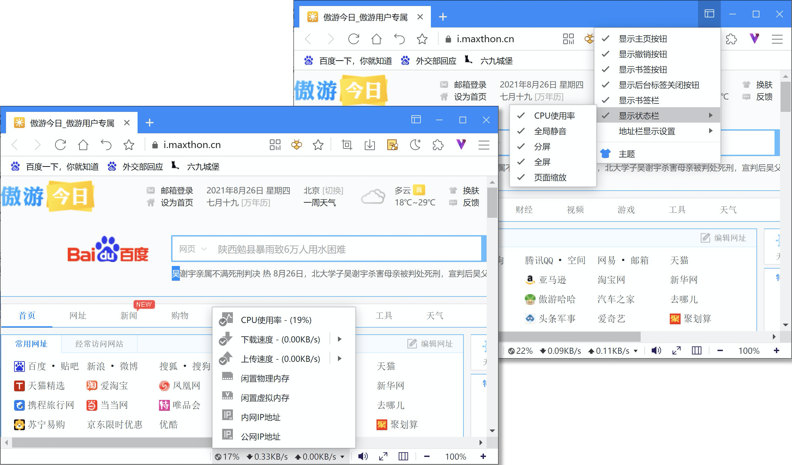

- 点击右上角自定义界面图标，勾选“显示状态栏”；
- 在二级菜单中可继续设定状态栏显示功能
  - CPU效率监控
  - 静音控制
  - 页面缩放
  - 分屏
  - 全屏
- 右键在CPU效率，可对多个上网指标进行监控设定。

## Flash Play不再可用

自 2021 年起，Adobe 已停止为 Flash Player 插件提供支持。在任何版本的Maxthon中，Flash 内容（包括音频和视频）都将无法再正常播放。

## 使用隐身模式无痕浏览网页

Maxthon 6 为您提供隐身模式以保障您的隐私安全，该模式下，您可以访问书签、笔记、密码等存储数据，也能执行绝大多数浏览器功能，但却不会保存您的浏览记录等踪迹数据。要进入隐身窗口：

- 点击右上角更多图标，在主菜单中点击【隐身窗口】；
- 任意链接、书签、快速启动项点击右键菜单，选择【在隐身窗口打开】

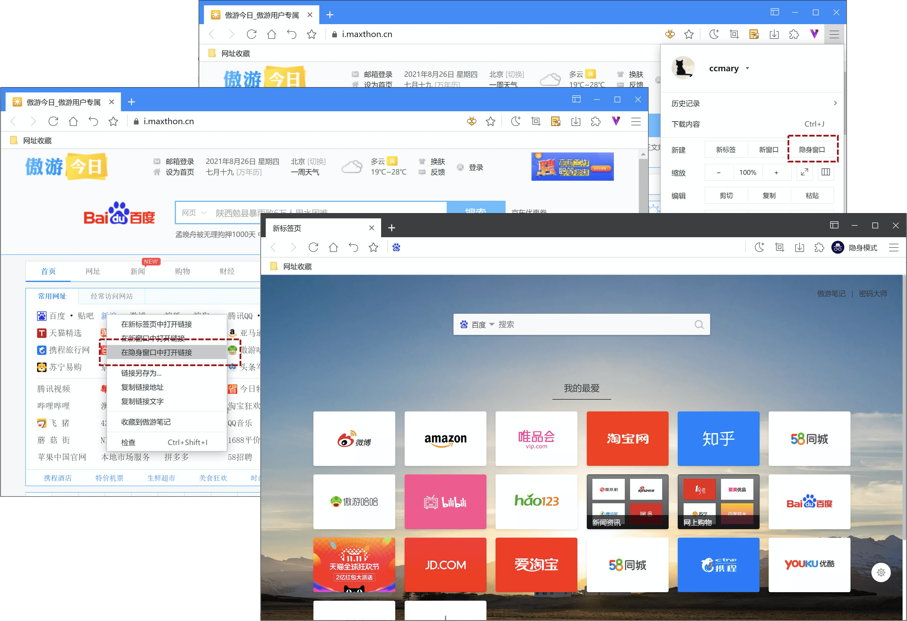
