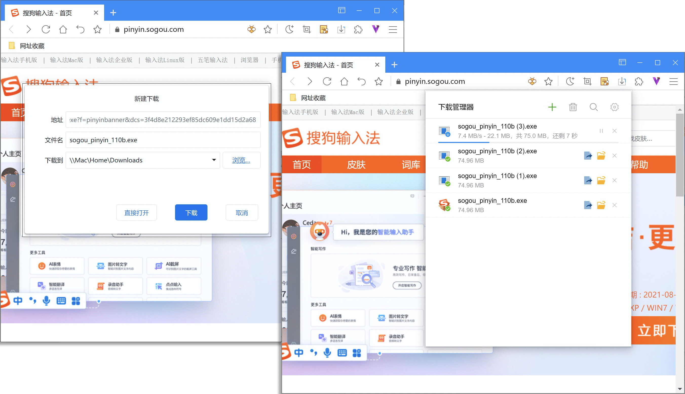
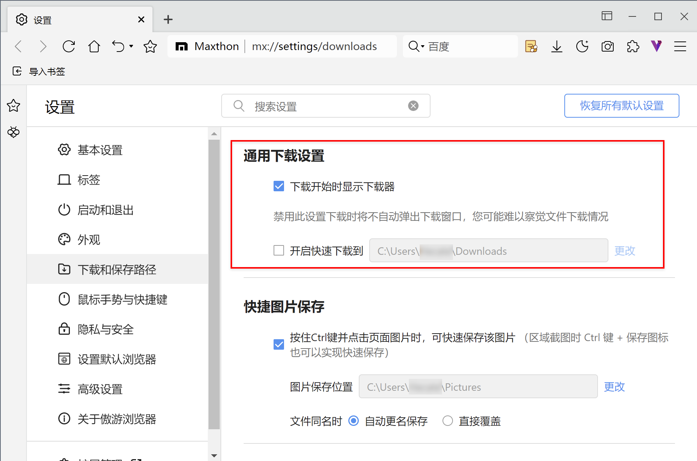
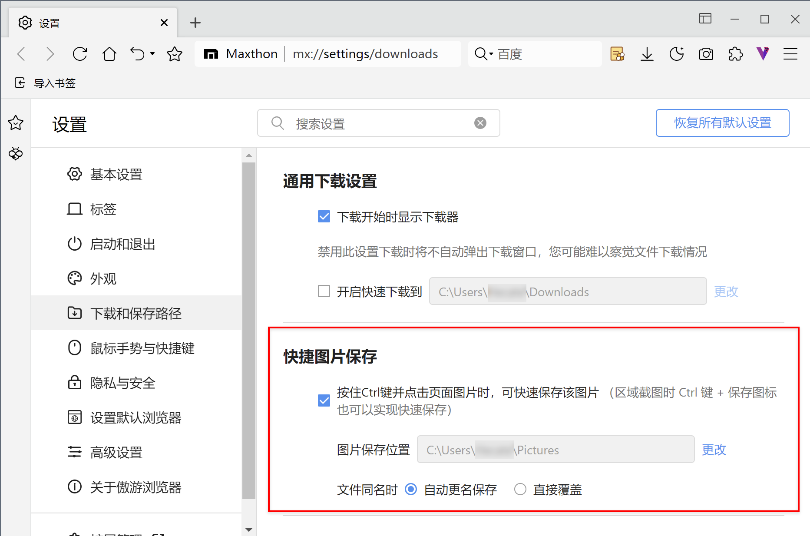
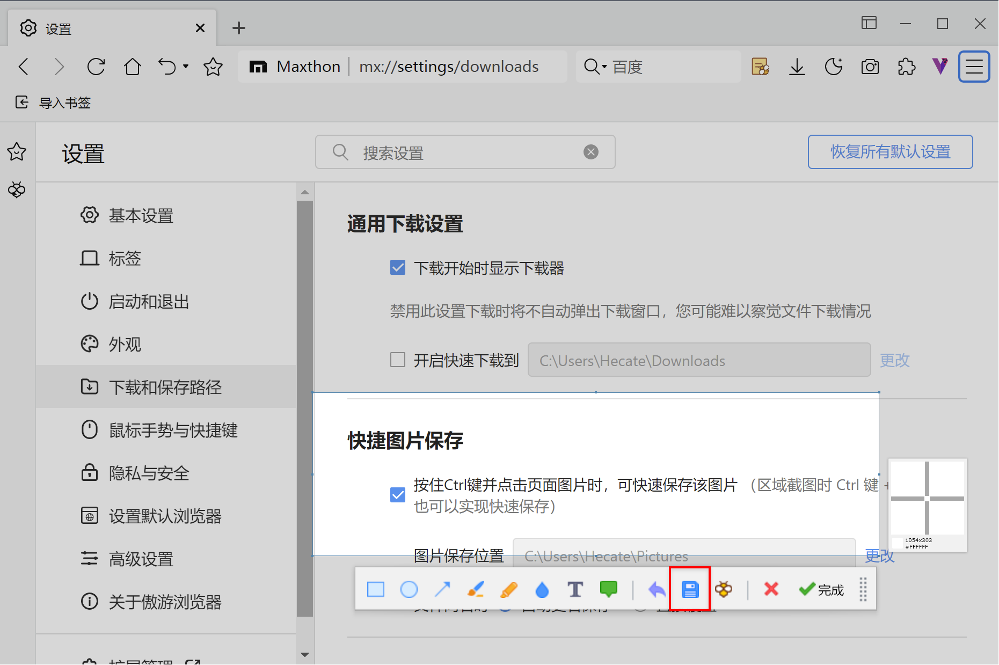

# 下载文件

要将文件/图片保存到计算机或设备上，您可以进行下载。下载的文件将保存到您的默认下载位置。

## 使用下载管理器

大多数文件下载时点击相应的下载链接。或者右键点击相应文件并选择另存为，在弹出的对话框中修改文件名和存储位置，确认后文件将在下载管理器中下载。成功下载后，将会在下载图标上出现提示数字。

您可以在下载管理器中：

1. 暂停或取消正在下载文件
2. 打开已下载文件：
3. 打开已下载文件所在文件夹：

4. 删除：点击记录右侧图标，可选择

- 删除记录
- 删除记录及文件

5. 新建下载：点击下载器顶部 
6. 清空：点击下载器顶部，可选择：

- 清空所有记录
- 清空失效记录
- 清空所有记录及文件

7. 搜索记录：点击下载器顶部 ，可通过关键字检索下载记录列表
8. 下载设置：点击下载器顶部，可跳转至下载设置：

勾选【开启快速下载到】，点击链接将不再弹出确认框，而是直接下载至默认下载文件夹，您可以自定义默认下载文件夹的路径。

##  其他下载

#### -图片下载

- 右键点击相应图片并选择图片另存为，选择保存位置后确认。

- 启用【快捷图片保存】功能
  - 在设置页面，选择【基本设置】标签，勾选【按住Ctrl键点击页面图片时，可快速保存该图片】选项。
  - 可自定义快捷图片保存路径
  - 可选择文件同时是自动更名保存或直接覆盖文件。 

- 截图快捷保存
  - 启用快捷图片保存后，在截图界面按住Ctrl键点击保存按钮，即可将截图保存至快速保存路径。

#### -网页保存

点击右上角更多【图标】在主菜单中的选择【更多工具/网页另存为】

## 默认下载位置

如果您未更改默认下载位置，那么Maxthon将会将文件下载到：Users\\<用户名>\Downloads

