# 使用傲游笔记

傲游笔记是Maxthon的特色功能，为您随时随地的将网络内容一键藏尽。

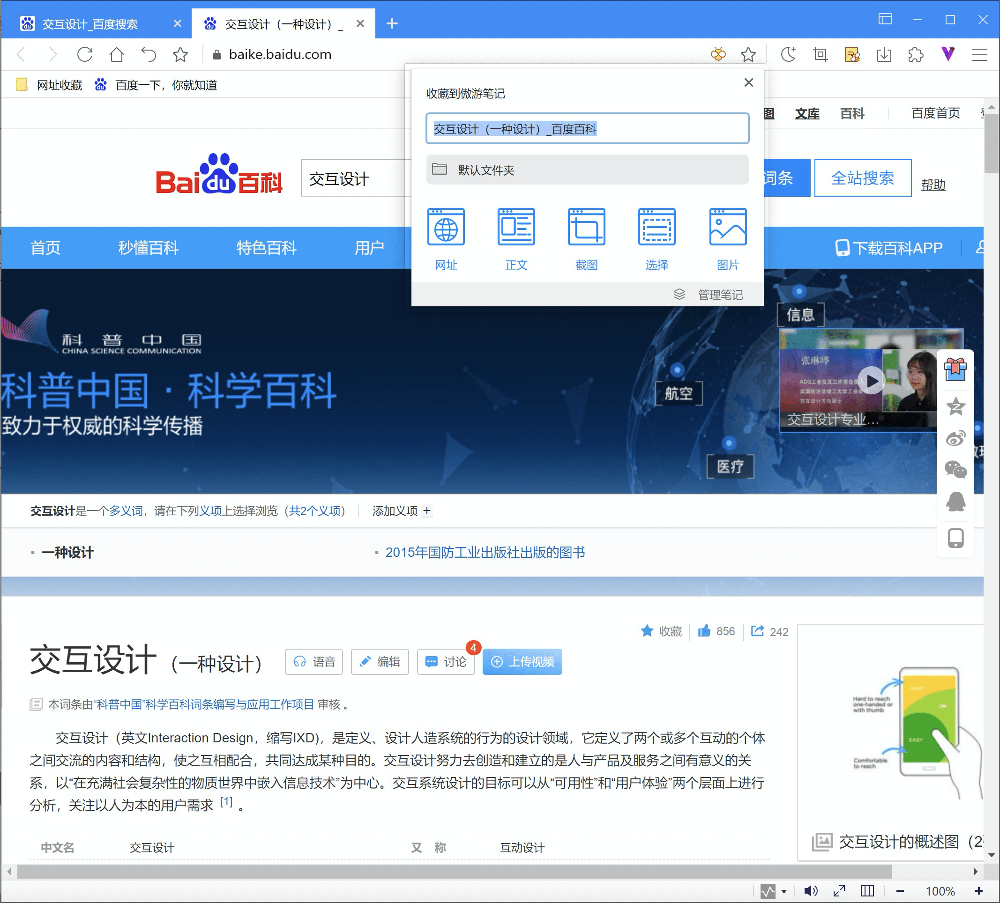

使用傲游笔记保存网页，点击地址栏收藏到按钮，在弹窗的对话框中设置：

- 笔记名称

- 笔记存储位置

- 笔记类型

  - 网址 ：仅保存网址
  - 正文  ：网页正文内容部分将被解析并保存
  - 截图 ：将自定义屏幕截图保存至傲游笔记
  - 选择 ：在当期网页上选择内容，然后保存至傲游笔记
  - 图片 ：将当前网页作为图片保存至傲游笔记

  

## -保存网址至傲游笔记

傲游笔记支持网址收藏，点击地址栏收藏到按钮，在弹出的对话框中选择只收藏网址，网址类型的笔记仅保存【名称+URL】，在笔记点击将直接跳转。

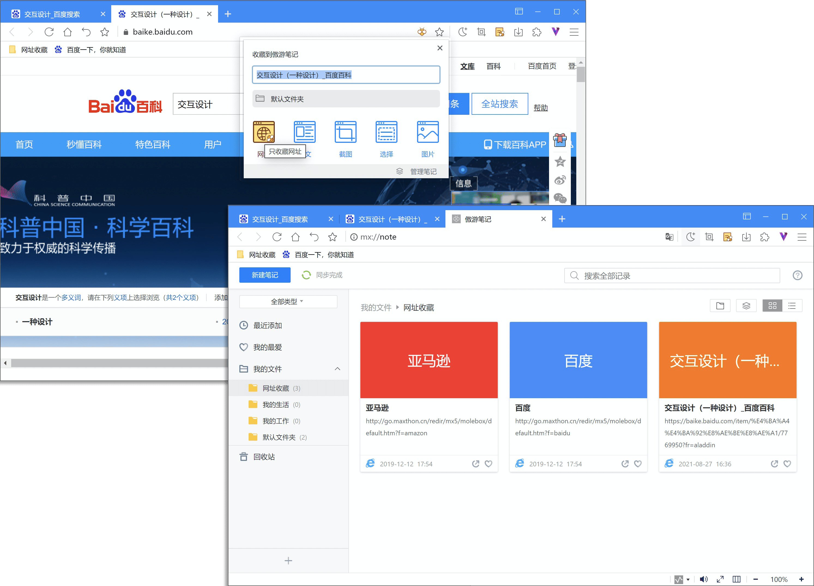

## -保存网页正文至傲游笔记

1. 点击地址栏收藏到按钮，选择网页正文按钮；
2. 进入笔记预览模式，点击笔记工具条上的按钮，可关闭预览，点击【保存】完成
3. 进入笔记详情页，对笔记进行编辑。

## -将截图保存至傲游笔记

1. 点击地址栏收藏到按钮，选择截图按钮；
2. 进入屏幕截图模式下，并对截图进行设置及编辑，点击确认；

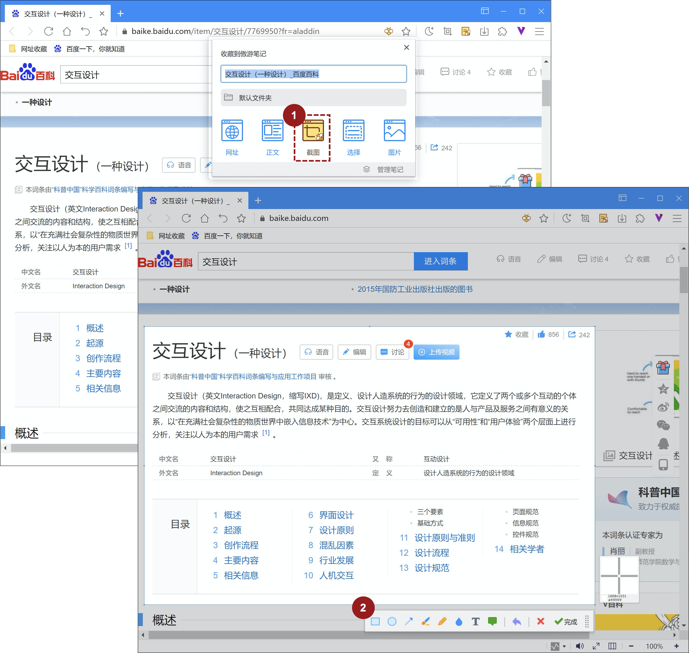

3. 进入预览模式确认截图效果，点击保存完成。点击笔记工具条上的按钮，可关闭预览。
4. 进入笔记详情页，对笔记进行编辑。

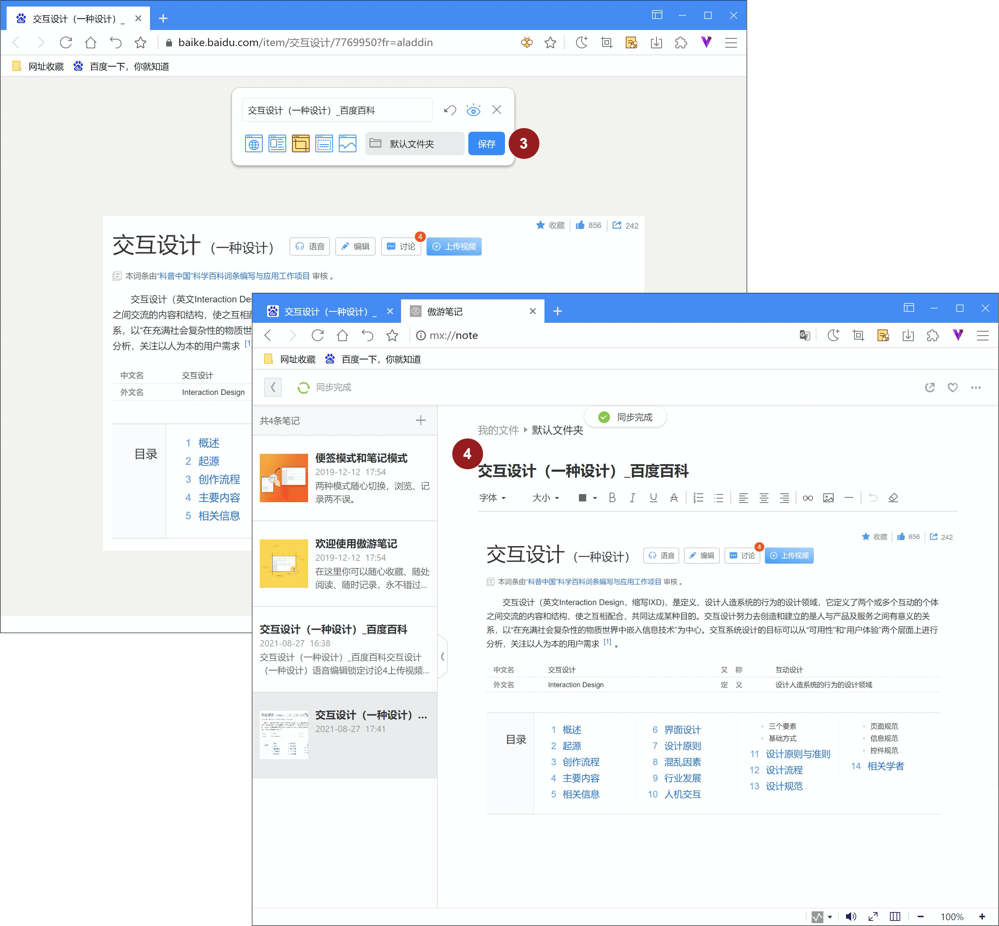

## -将选中的的内容保存至傲游笔记

1. 点击地址栏收藏到按钮，选择选择内容按钮；
2. 进入内容选择模式，选中想要保存的内容后，点击【完成】

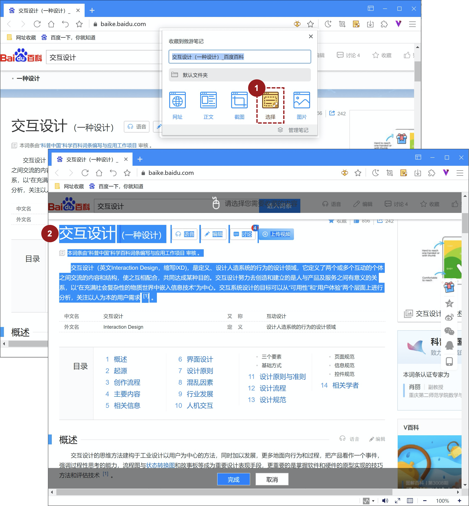

3. 进入预览模式确认效果，点击保存。点击笔记工具条上的按钮，可关闭预览。
4. 进入笔记详情页，对笔记进行编辑。

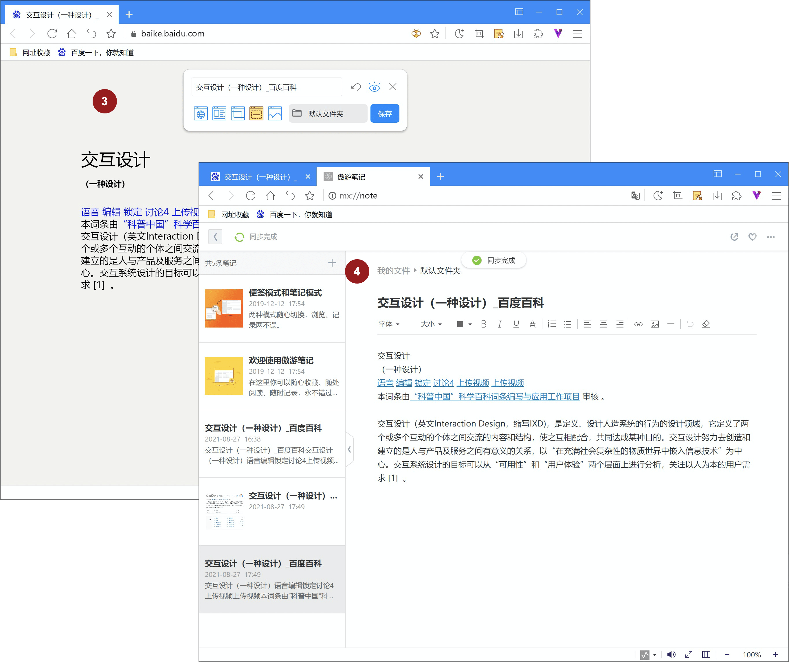

## -将网站保存为图片存入傲游笔记

1. 点击地址栏收藏到按钮，选择图片按钮；
2. 预览截好的图片，点击保存。点击笔记工具条上的按钮，可关闭预览。
3. 进入笔记详情页，对笔记进行编辑。

## -傲游笔记的常规管理功能

进入傲游笔记，对笔记进行编辑及管理

您可以通过以下方式进入傲游笔记：

1. 点击右上角更多按钮，在主菜单中点击【傲游笔记】
2. 在新标签页右上角点击【傲游笔记】
3. 点击地址栏收藏到按钮，在对话框中点击右下角【傲游笔记】

#### -笔记界面及展示形式

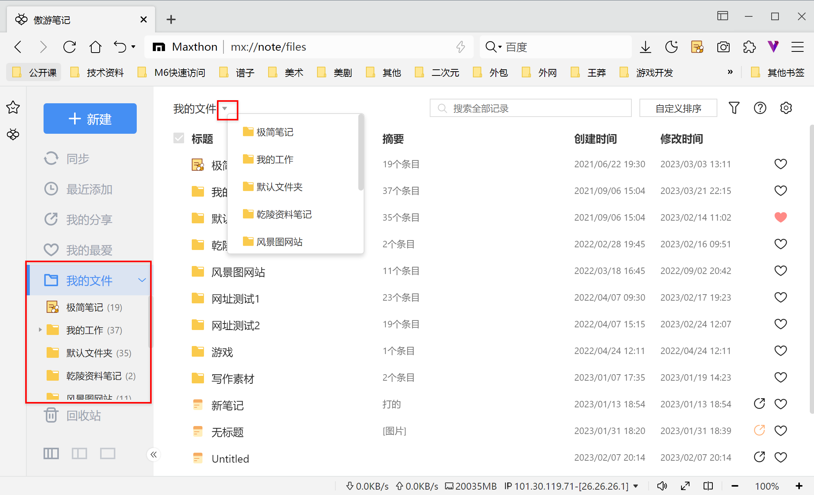

- 默认会进入您上次保存或编辑笔记的目录，可通过左侧目录树切换。
- 傲游笔记提供卡片及列表两种展示形式，通过右上角可自由切换。

#### -新建空白笔记

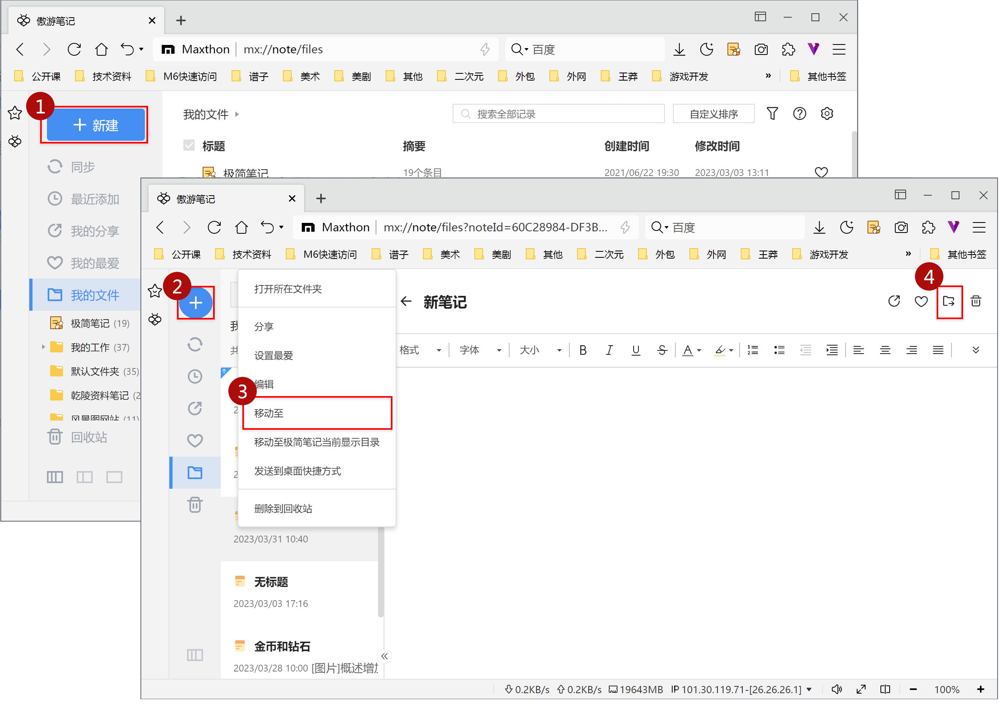

1. 在笔记页面点击左上角按钮，新建一个空白笔记；
2. 还可以点击目录底部按钮，在展开菜单中选择；
3. 在笔记的编辑页面，也可以通过按钮新建空白笔记；
4. 新建笔记默认建立在您当前所在目录下，点击笔记右键菜单【移动至】，可将当前笔记移动至其他文件夹

#### -使用文件夹整理笔记

傲游笔记支持多层级文件夹，帮助您整理笔记。

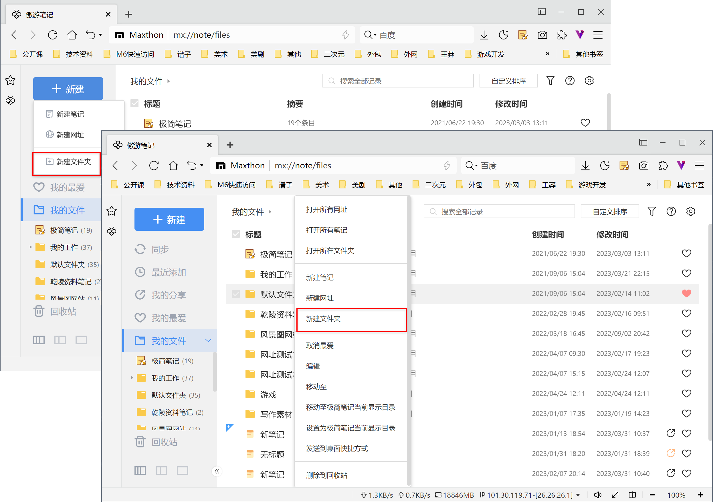

您可以通过以下方式创建文件夹：

1. 点击笔记页面右上角新建文件夹图标；

2. 还可以点击目录底部按钮，在展开菜单中选择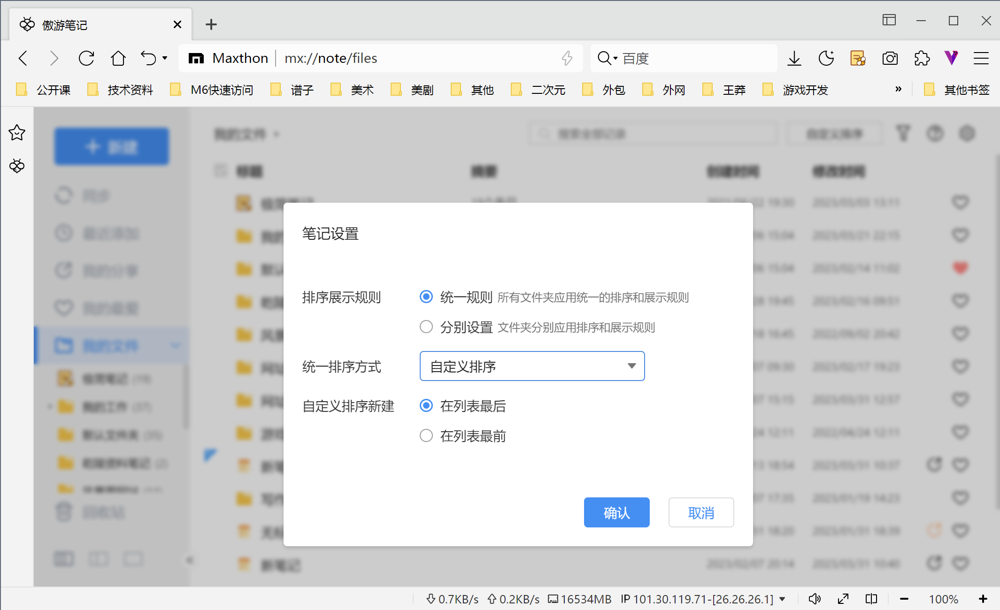；

3. 在目录上点击鼠标右键，选择【新建文件夹】

   

#### -笔记的移动与排序

1. 笔记的移动

- 拖动笔记即可改变笔记排序，还可以将笔记拖入上层目录，或侧边目录，从而更改其存储位置。您还可以同时选定多条笔记一起拖拽。 

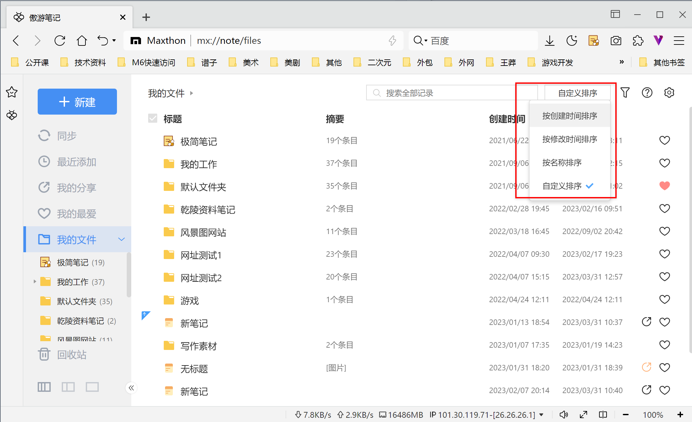

- 选中想要移动的笔记，点击笔记界面右上角移动至按钮，或右键菜单【移动至】，在弹出的对话框中选择目标文件夹，也可实现笔记移动。

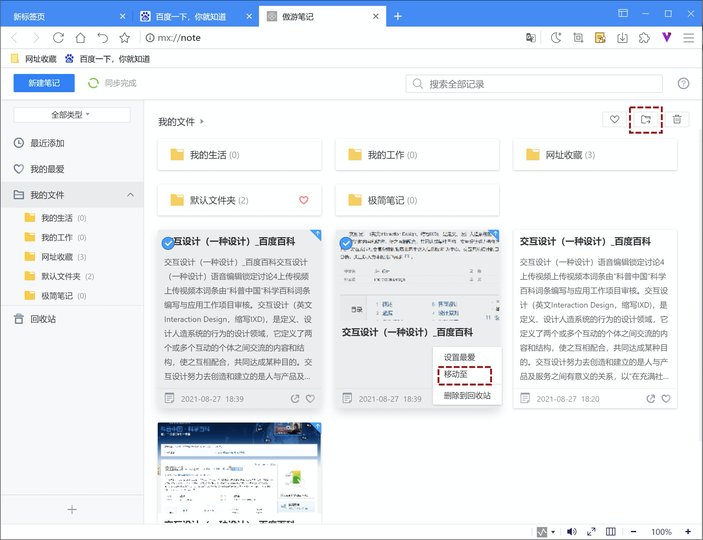

2. 排序工具

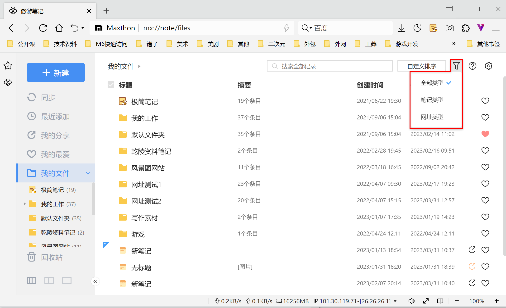

在笔记界面点击右上角排序按钮，可对笔记进行自动排序：

- 按创建时间
- 按更新时间
- 按名称

以上排序方式每次点击更改升降规则。

#### -删除笔记与最爱笔记

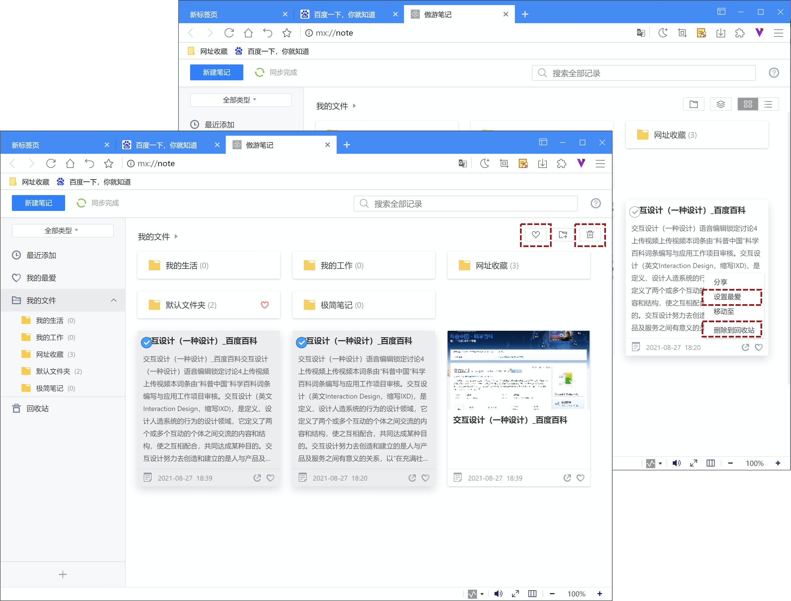

- 您可以通过鼠标右键选择对笔记进行删除或标记为最爱；
- 也可以选中多个文件后，通过右上角设置最爱按钮或删除到回收站按钮完成交互；
- 设置为最爱的文件，可在目录栏中查看，再次点击红心，即可取消设置最爱；
- 删除文件放在，您可在回收站中执行恢复或彻底删除操作。

#### -笔记同步

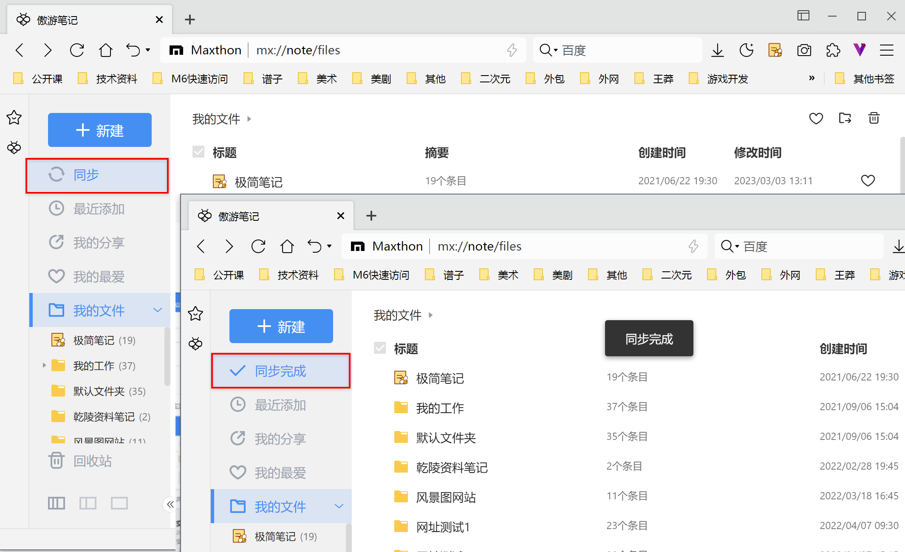

- 如果您登录了傲游云账户，笔记将被实时同步；
- 当同步状态正常时，将在左上角显示；
- 点击同步按钮也可手动激活一次同步。

## - 使用笔记侧边栏

- 在界面设置中打开侧边栏后，可以点击侧边栏上的蜜蜂按钮，打开笔记侧边栏。
- 在笔记侧边栏中点击网址类型可以直接打开笔记中的网址。
- 笔记类型可以在下方的简易编辑框中编辑

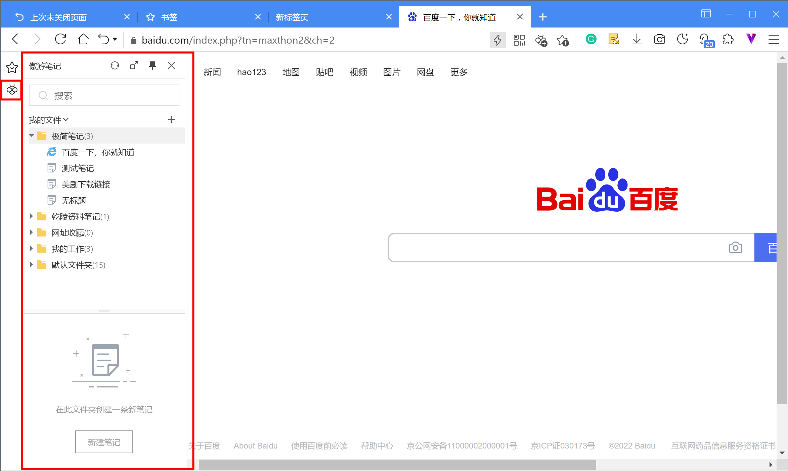

