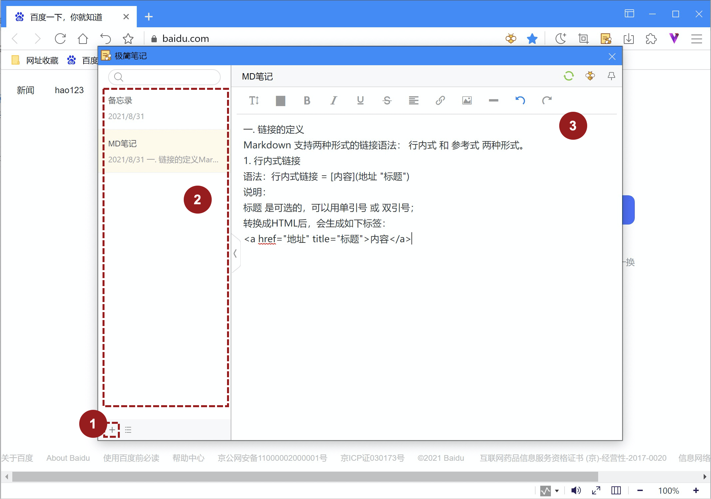

# 使用极简笔记
## 什么是极简笔记？
极简笔记是傲游笔记的极简模式，方便用户在浏览网页时，更快速方便的时候记录内容。点击地址栏按钮，或使用快捷键【Ctrl + G】即可打开极简笔记。

1. 新建笔记：点击左下角可以新建一篇空白笔记。
2. 笔记列表：极简笔记的浏览模式下没有文件层级，选中的文件夹中的全部文件均按照时间顺序被展示在列表中。
3. 笔记编辑区：简单快速的进行图文内容编辑，实时保存；如果您登录傲游云账户，还能自动进行笔记同步。

## 笔记的浏览模式

1. 极简笔记可通过拖拽边缘缩放至您满意的大小，还可以点击目录边缘的隐藏/展开图标，隐藏目录，全屏编辑笔记。
2. 常规模式下，笔记激活后失去焦点即自动关闭，如果你想要笔记始终显示，可点击右上角置顶按钮；再次点击取消置顶。
3. 如果你想在傲游笔记中阅读某一条笔记，可以对该笔记使用右键菜单，选择【在笔记中访问】，即可在标签页中访问该笔记，您还可以通过右键菜单执行【重命名】和【删除】操作；
4. 您还可以点击右上角的傲游笔记图标，跳转至傲游笔记管理界面。

## 极简笔记菜单

点击右下角菜单，可打开极简笔记菜单，并进行如下操作：
- 新建笔记：新建一条空白笔记；
- 设置显示目录：您可以更改傲游笔记中的任意目录作为极简笔记的显示目录，选中后，该目录下的所有文件（包括所有文件夹中文件）将以时间顺序显示在笔记列表中；
- 查看回收站：在标签页中显示傲游笔记的回收站；
- 访问傲游笔记：访问傲游笔记管理页面；
- 选择笔记：菜单中会显示当前目录下的全部笔记列表，方便用户进行快速浏览和选择。

