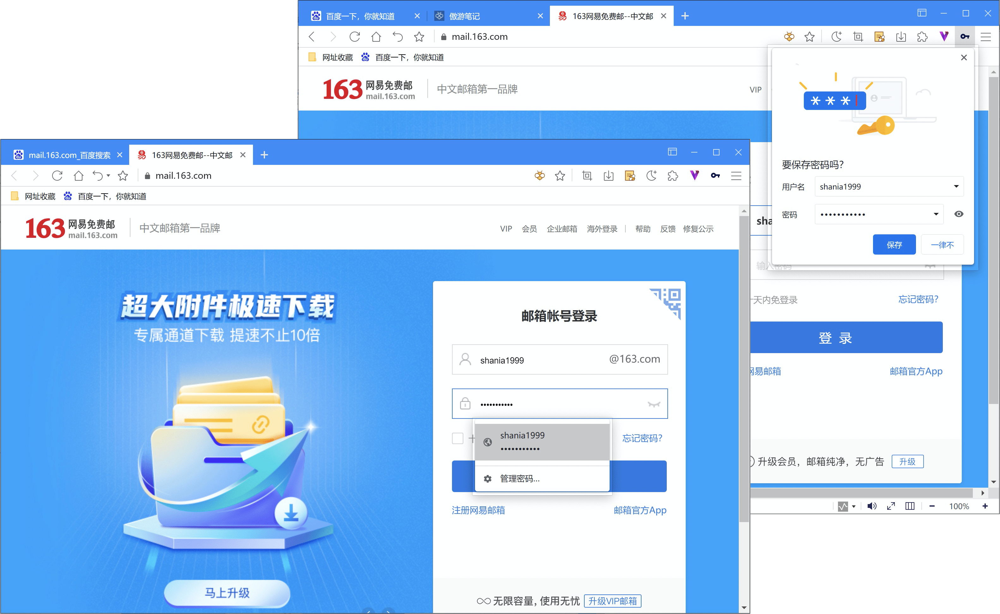
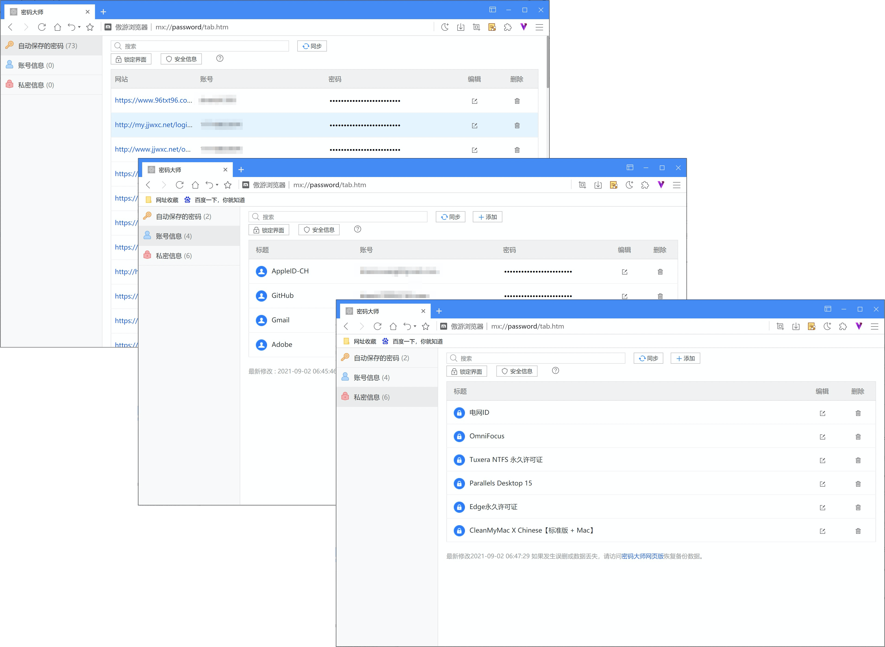

# 使用密码大师

## 自动填表

密码大师可以在您访问网页时，为您保存账号和密码，并在您再次使用时，自动为您填写表单。 

## 密码大师管理

点击右上角主菜单按钮，在主菜单中选择【密码大师】，或在新标签页右上角点击【密码大师】，进行密码验证成功后，可进入密码大师管理页面。

密码大师为您提供五种不同的加密内容保管方式：

- 自动保存的密码：您在访问网页时保存的自动填表内容；
- 账号信息：您创建的账号信息，用于保管加密等级较高的一些重要账号密码信息；
- 私密信息：用于保存您的一些非账号类信息，加密等级较高，格式自由。
- 支付信息：用于保存您的信用卡支付的卡号、卡别名和截止日期等信息。
- 地址信息：用于保存您的账单收件人姓名、电话、详细地址和电子邮件等信息。

*重要说明：【账号信息】、【私密信息】加密等级较高，需进行傲游密码验证，故游客身份不可使用。

