# 使用Vbox

## - 什么是Vbox?

Vbox是基于区块链的一个身份管理工具，它能帮助您在本地建立身份加密信息，而无需您记忆任何复杂密钥，任何区块链应用都可以通过Vbox直接申请本地签名和BSV支付。

## -激活Vbox，获得Vbox身份和免费域名

- 点击右上角Vbox的字母V图标，即可启动Vbox。

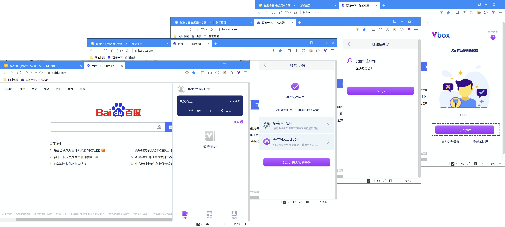

- 在启动页点击【注册Vbox云账户】按钮，按照引导注册即可获得一个区块链身份。
- 您可以使用手机号或邮箱两种方式注册，如果您使用手机号注册，您还可以获得一个免费的NB域名。免费域名一般为一个自增的六位数字。
- NB域名是区块链通用通行证，可以与任意地址绑定，从而成为固定的身份标识，做为登录、交易、转账的依据，并能为区块链的内容形成精简web链接。NB域名可以用于一些与 Maxthon 合作的区块链应用登录。
- 每个Vbox用户只能申请一次免费NB域名，如果您使用邮箱注册，您仍然可以在之后使用手机号申请一个免费域名。每个手机号只能申请一次。
- 注册成功后，Vbox会自动登录，并为您创建一个区块链身份。您需要为这个身份设置身份识别的名称和支付密码。 
- 使用手机号注册完成后，您的身份会自动和为您申请的免费NB域名绑定，使用NB域名登录应用时，域名的这串数字将会成为您在应用登录后的ID。
- 每个身份都可以绑定多个NB域名，如果您希望在应用中显示与众不同的昵称，您可以注册个性化域名。

## -邮箱注册申请免费NB域名

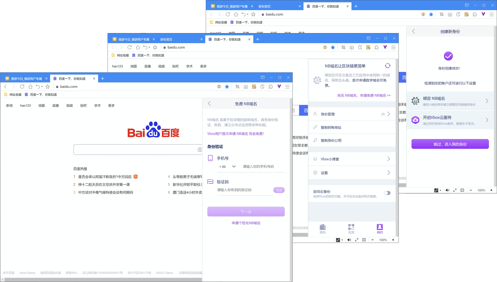

邮箱注册用户如何申请NB域名：

- 您可以在注册成功后的提示页面，点击【绑定NB域名】，也可成功激活身份后，在【我的】页面，点击顶部申请通道。

*注意：Vbox身份可申请多个，但免费数字域名每个用户只能申请一次。

## -绑定域名与个性化域名

一个地址可绑定多个NB域名，在Vbox中，可指定其中一个作为对外展示名片。在【我的】页面，选择【绑定NB域名】，可查看当前地址绑定的全部NB域名，点击可修改绑定域名。修改Vbox中绑定域名将影响对外展示昵称、头像及域名显示。

免费数字域名是一串字符，如果您想申请更多自定义NB域名，可在【绑定NB域名】界面，点击【申请更多自定义超级域名】或直接登录 http://NBdomain.com 进行注册。

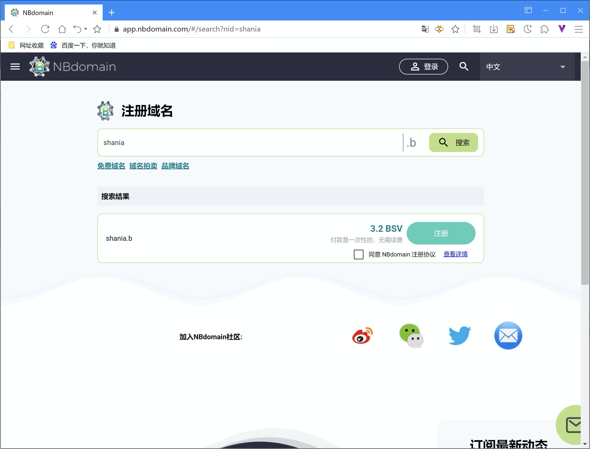

在NBdoamin搜索心仪的域名，若该域名未被注册，即可马上购买。

*注意：新购买的域名将绑定在您用于支付的钱包地址上，如需更改可在注册成功后，在NB个人后台执行【转让】。

## -更改NB域名头像

Vbox身份不支持自定义头像，但绑定NB域名后，可使用其头像作为身份信息，并可对其进行修改。

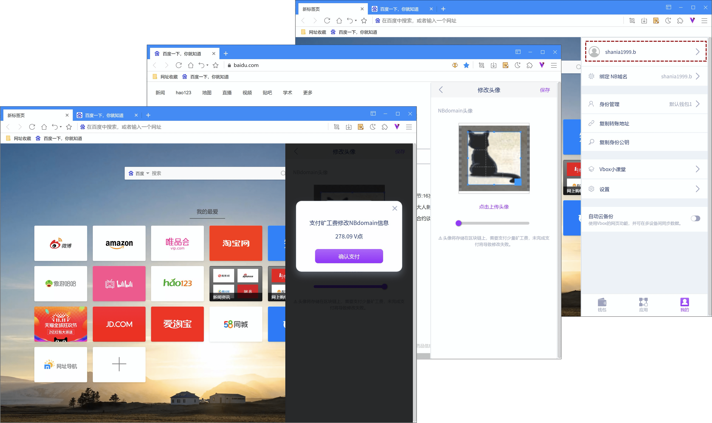

在【我的】页面，点击顶部头像，即可上传新的头像。

*注意：该操作影响NB域名在区块链存储信息，需支付少量矿工费。点击确认后将直接从当前账户扣除，余额不足将导致修改失败。

## -管理链上数字资产

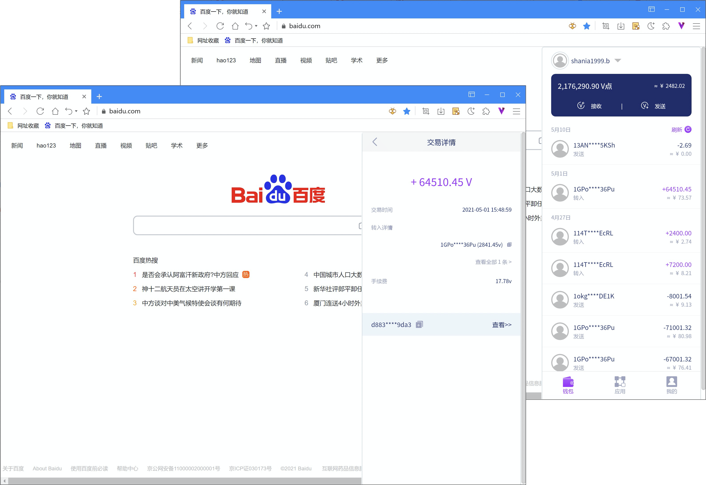

- Vbox的【钱包】功能，可以帮助您管理您的链上数字资产——V点。
- V点是BSV的一种计价单位，1V点=百万分之一BSV。
- 使用Vbox钱包能够简单的查看实时资产总额和交易情况，点击单条交易可打开【交易详情】，其中【查看>>】还可以打开链上交易详情页面。

## -V点收款与充值

在钱包首页，点击接收，打开收款二维码，使用二维码或地址让对方转账。

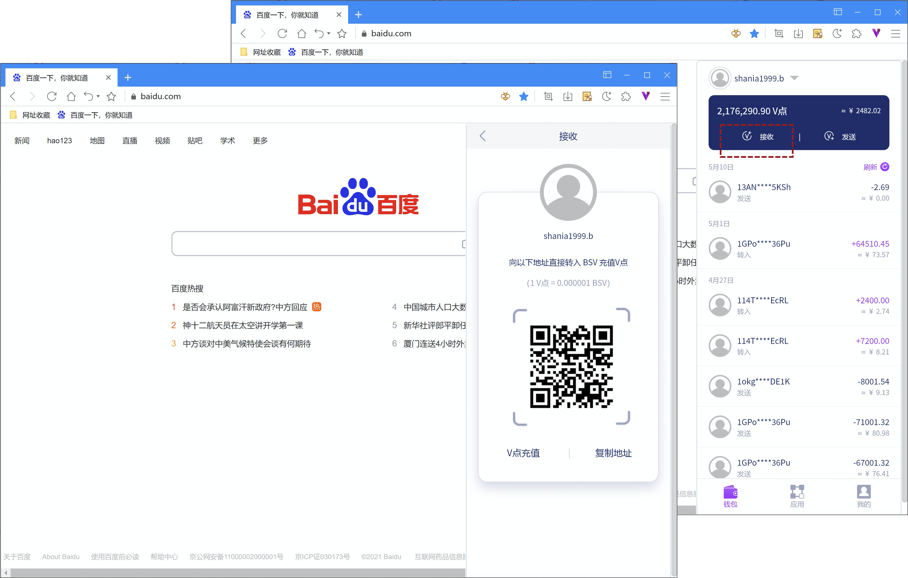

如果您的账户上没有V点，还可以使用【V点充值】，可直接购买V点。

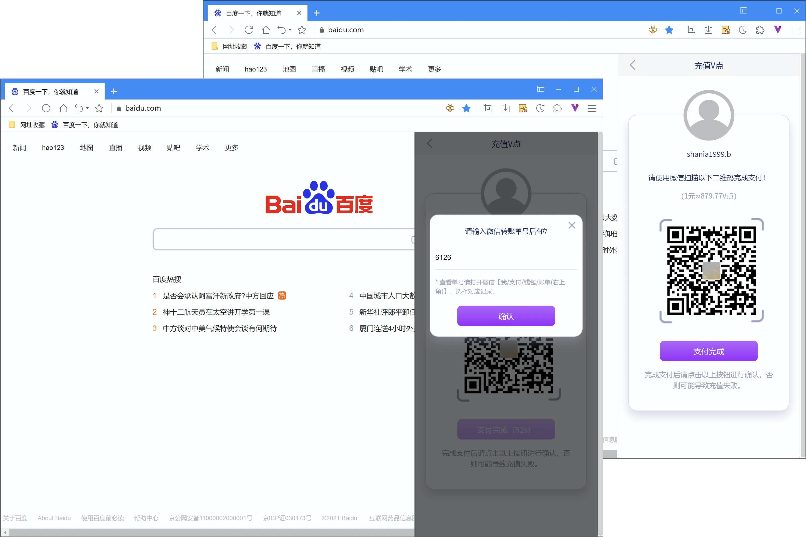

向指定二维码转账后，点击【支付完成】，并输入验证码后，点击确认即可获得V点。

*注意：转账成功后务必需进行验证，否则可能导致充值失败。

## -V点转账

在钱包首页，点击发送，进入转账页面，输入转账地址或NB域名，即可进行转账。

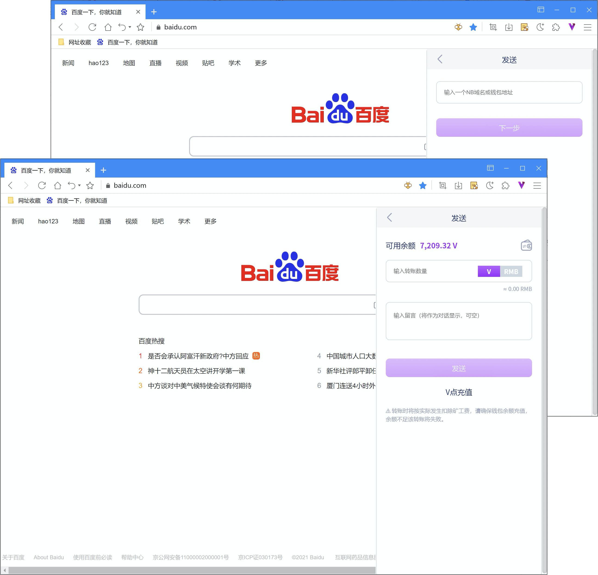

转账的同时可以为对方留言，留言将作为对话展示在交易信息中。

## -Vbox身份切换

Maxhotn允许用户注册多个Vbox身份，每个Vbox身份都对应单独的私钥和钱包地址，切不可更改，解绑。

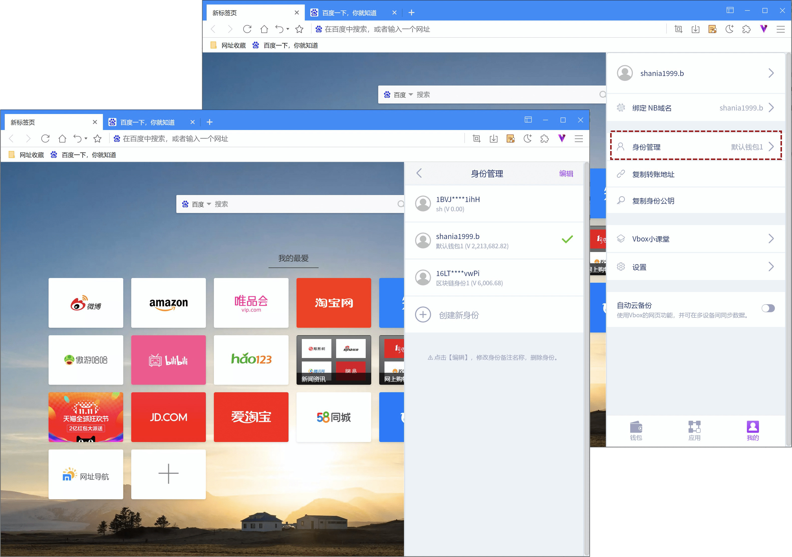

在【我的】页面，点击【身份管理】页面，进入本地身份列表：

- 新建身份：创建一个新的Vbox身份，并获得私钥及侨钱包地址；
- 切换当前身份：切换后，将刷新并显示指定身份信息；
- 编辑身份
  - 修改备注：更改当前身份的备注名称。
  - 删除身份：删除当前身份的全部信息，包括加密数据，身份删除后不可找回，请慎重使用。

此外；您还可以在钱包页面通过顶部的身份选择快速进行身份切换。

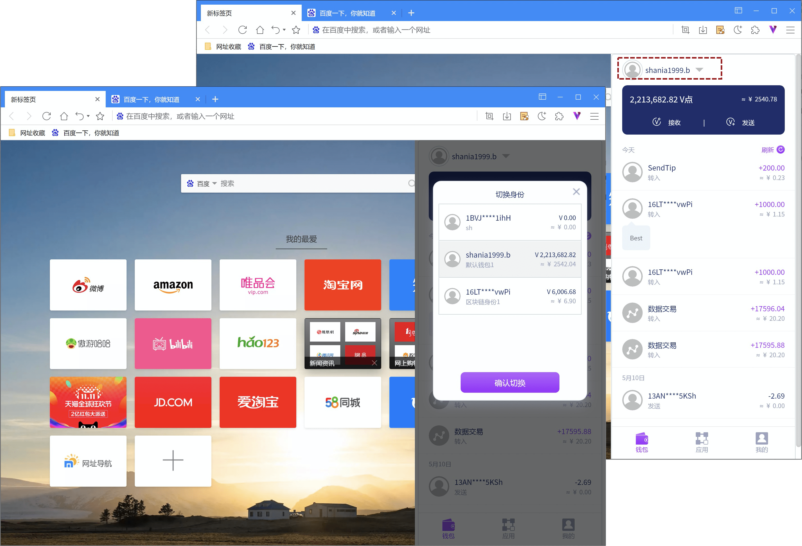

## -使用Vbox授权登录

Vbox可用于身份识别和签名，此时，Vbox可以被看做是一个私钥管理器，当有网站需要用私钥作为认证进行登录或授权时，无需传给三方应用真实私钥，Vbox可为您进行加密验证及签名，以证明您的身份和资产所有权。

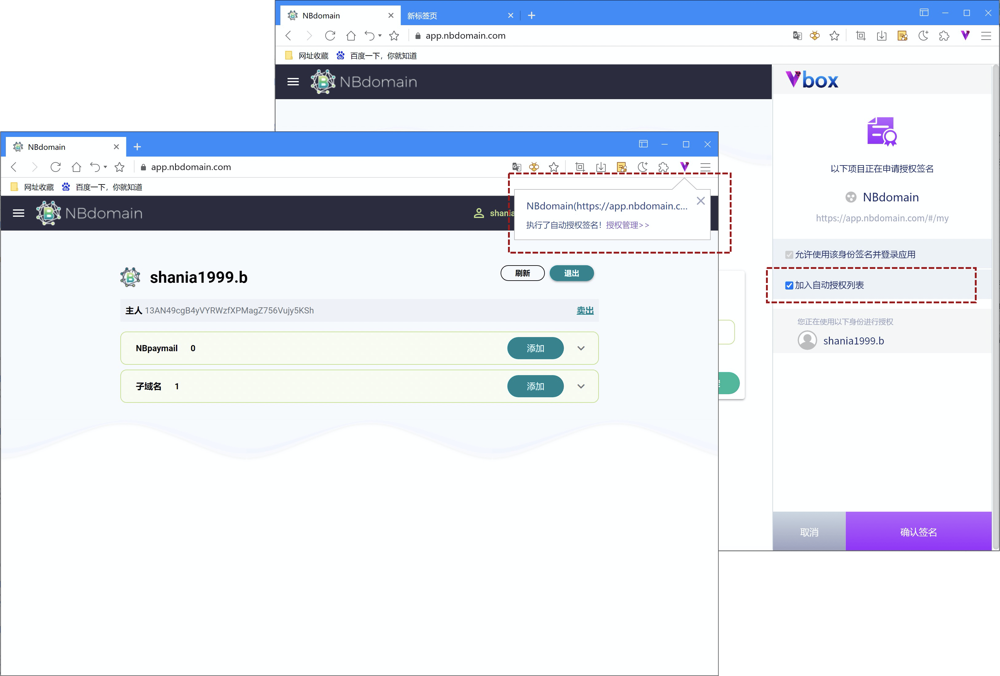

*注意：在授权时，勾选【加入自动授权列表】，可在下一次执行授权时，不在唤起侧边页面手动授权，Vbox将在后台为您自动执行授权。

## -使用Vbox支付

Vbox的核心功能一是作为BSV钱包，可对应用中的BSV支付进行响应，并快速完成支付。

当进行BSV三方支付时，如果您使用的是Maxthon，可选择Vbox进行支付：

1. 可切换身份至本地任意钱包。
2. 勾选【加入自动支付列表】后，来自该应用/域名的支付，在免密限制内的交易，可不再进行密码验证自动在后台完成支付。

## -授权与免密设置

在【我的】页面，点击【设置】进入设置页面，可对【自动登录】和【免密支付】进行管理。

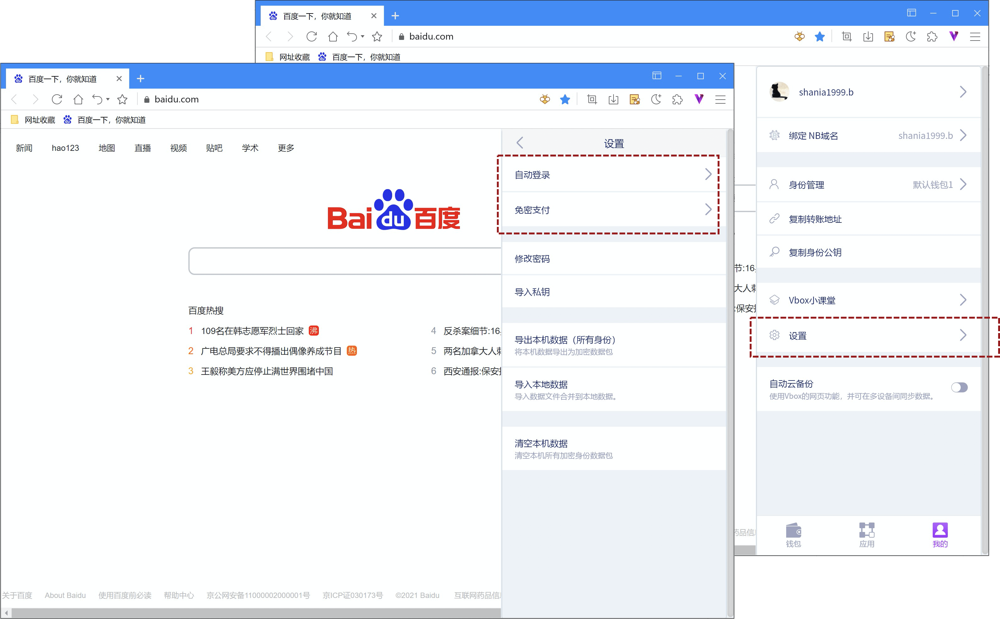

#### 自动登录管理

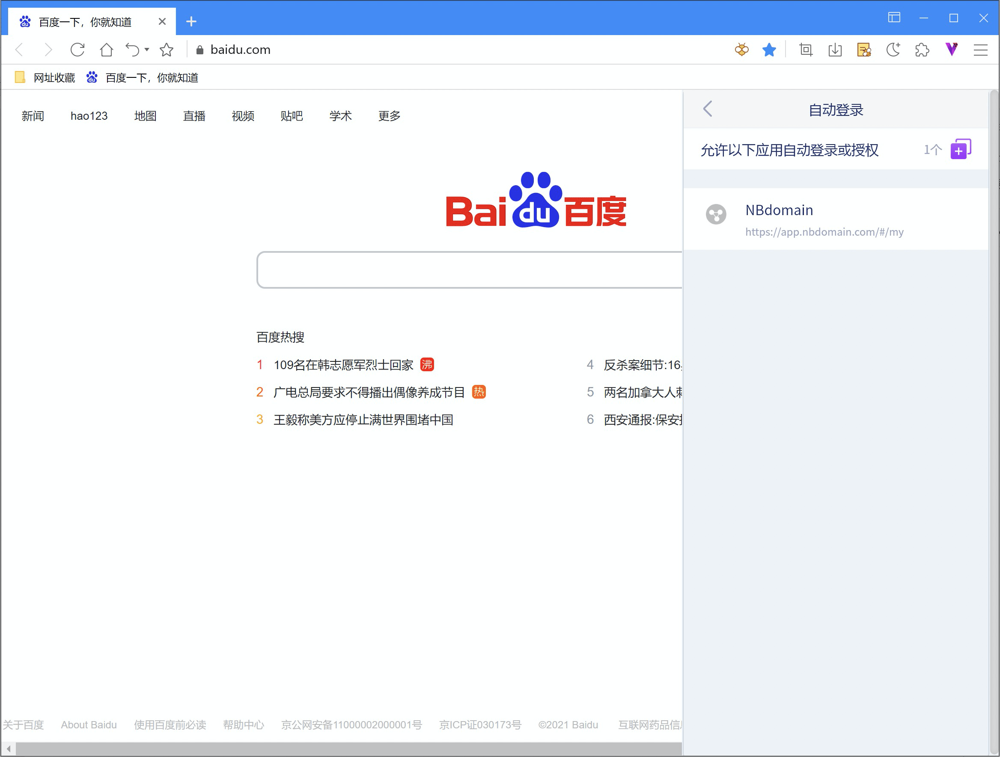

1. 在授权时，勾选了【加入自动授权列表】的项目，将被自动添加至此处；
2. 此外，您还可以通过域名将网站或应用添加至自动登录名单；
3. 点击列表项目，可修改项目域名，或将其从列表删除。

#### 免密支付管理

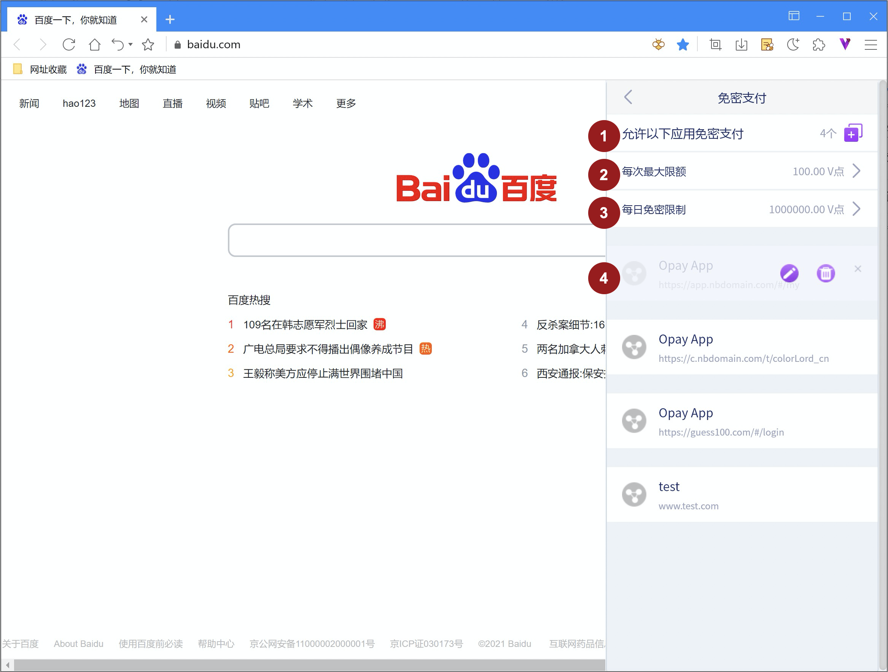

1. 在三方支付时，勾选了【加入自动支付列表】的项目，将被自动添加至此处；此外，您还可以通过域名将网站或应用添加至免密支付名单；
2. 设置【每次最大限额】，免密支付的上限额度，超过该额度的交易需使用密码确认，默认为100V点。
3. 设置【每日免密限制】，每日使用免密支付的总额限制，累计超过该额度需使用密码确认，默认额度为100万V点（1BSV）

## -通过导入私钥创建身份

如果您已经拥有一个BSV钱包，可以通过【我的/设置/导入私钥】，通过私钥创建一个Vbox身份。

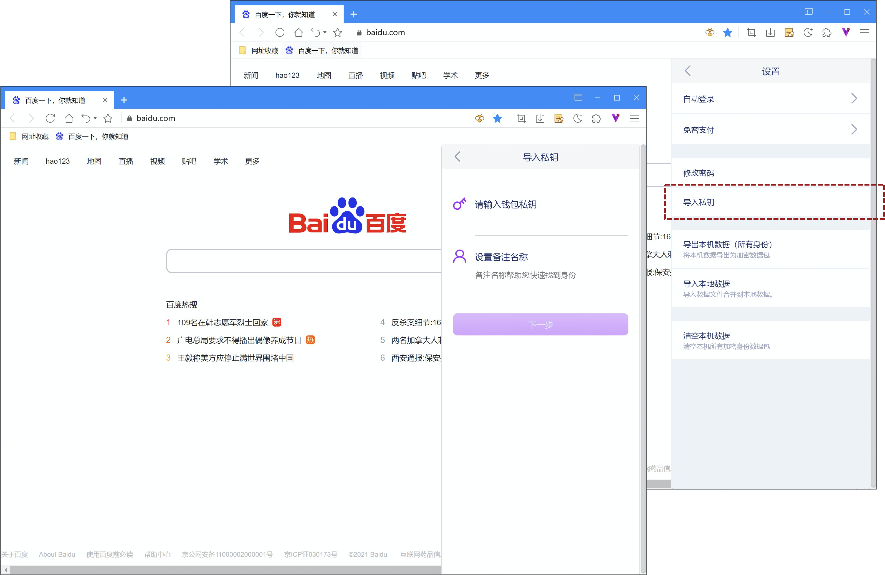

## -自动云备份

Vbox的数据存储在本地，为保护数据安全，避免引错误操作导致数据丢失，Vbox提供了云同步功能。

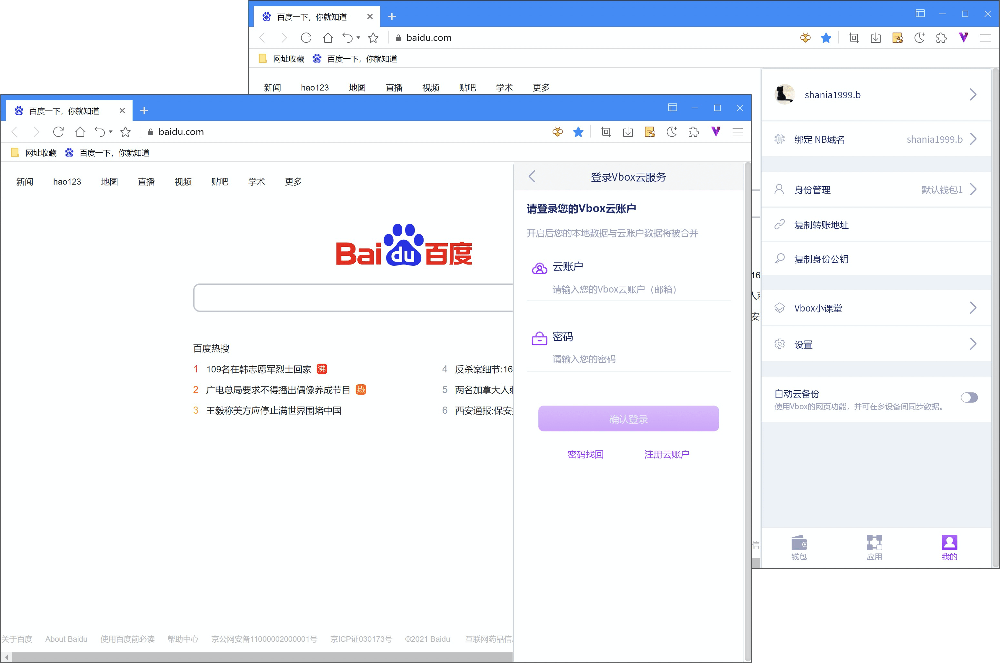

-  在【我的页面】，点击【自动云备份】，登录Vbox云账户后可开启；
- 使用云备份，可在多设备上简单的同步身份数据。

*注意：Vbox的云备份将备份本机的全部数据，保存本地登录的所有身份数据；开启时，如本地数据与云数据有差异，将采用合并数据的方式保护数据安全。

## -Vbox本地数据的导入与导出

除了使用云备份功能，用户还可以通过Vbox本地数据的导入导出维护数据迁移及安全。在【我的】页面，选择【导出本地数据】将导出本机所有身份数据（.v)文件；选择【导入本地数据】，可打开本机保存的身份数据（.v）文件，导入数据与本地数据有差异将采用合并的方式保护数据安全。

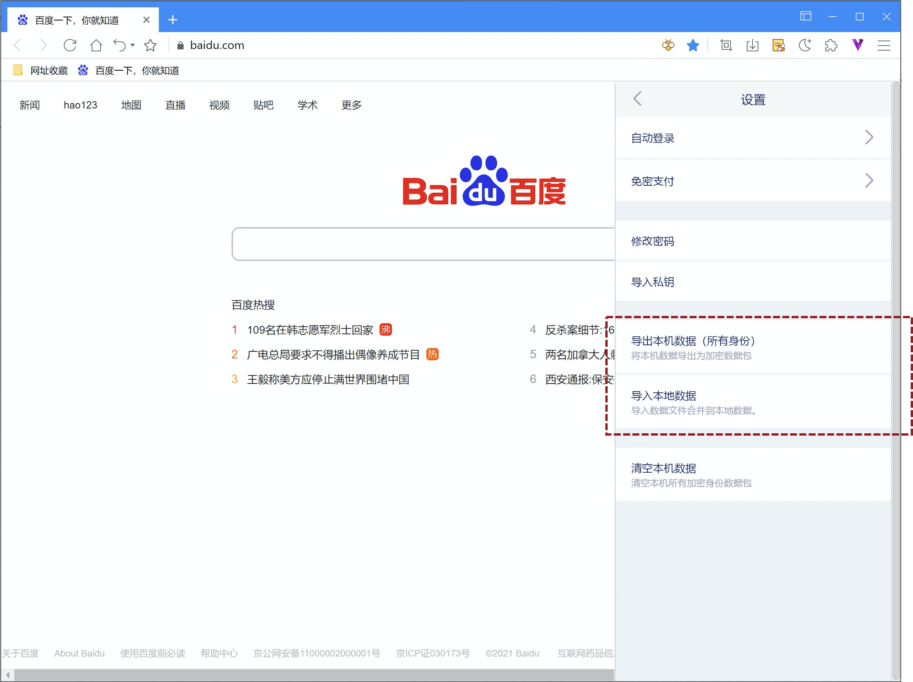

## -Vbox本地数据清理

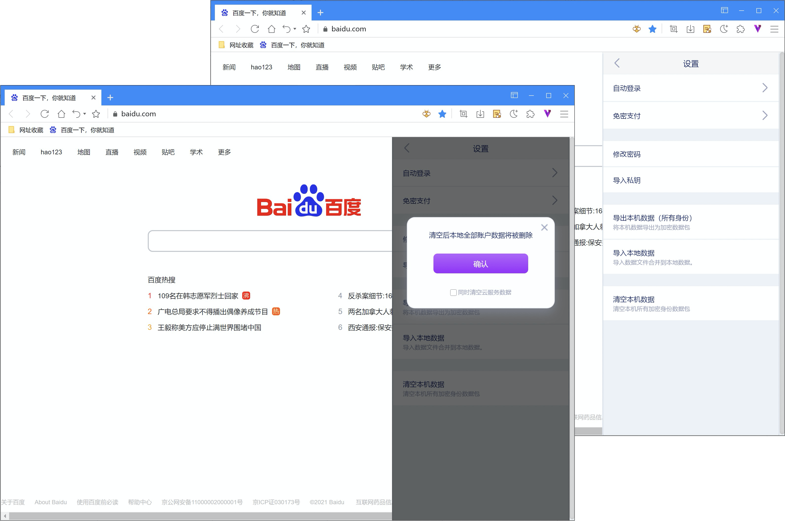

在【我的】页面，点击【清空本机数据】，将会清空本地全部身份的数据，将Vbox还原至未激活状态，本地数据清空后不可找回，请慎重使用。

*注意：如果在清除数据是开启了云备份，弹窗将向您确认是否同步删除云备份，如勾选，则云账户的全部数据将被同步删除，如未勾选，则云备份功能将被自动关闭，然后再清理本地数据。

## -Vbox账号注销
在【我的】页面，点击账号进入云账号管理，点击【注销云账户】，将会为您展示账号注销的相关协议。在确认后的页面中，填写您的账号和正确的验证码即可注销账号。账号注销后，您的Vbox所有云端数据、包括您的账号都会删除。请谨慎操作。
