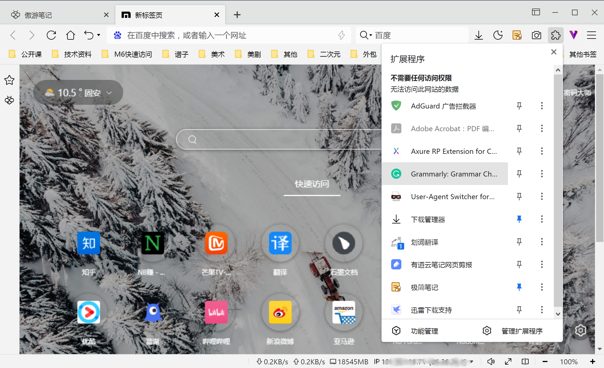
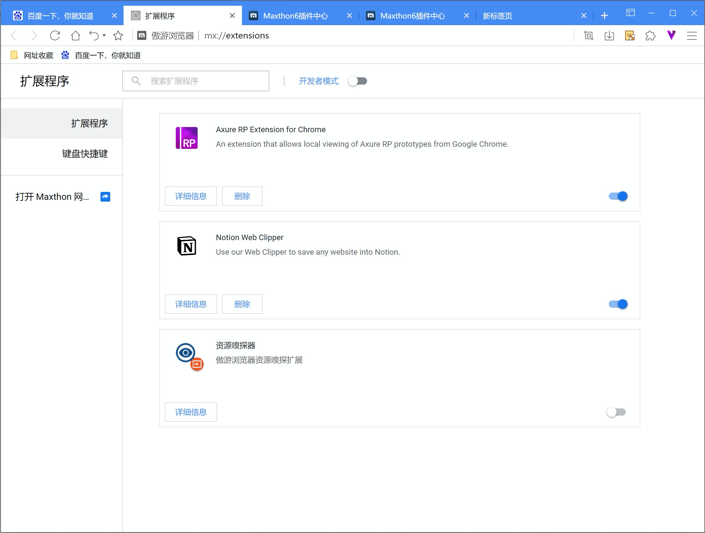
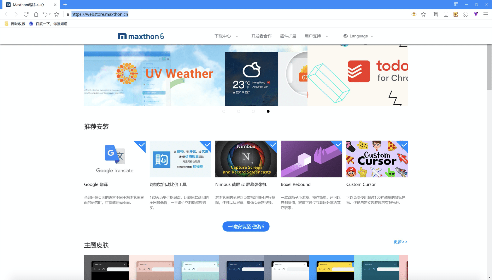

# 使用扩展程序

## 扩展程序的展示及使用

Maxthon支持Chromium标准插件，在地址栏点击插件按钮，可以查看当前正在运行的插件列表。

- 权限标识：Maxthon按照插件在不同页面调用的权限差别分区域展示插件，帮准你维护及监控插件数据活动；
- 固定/取消固定：点击按钮，取消固定，插件将在地址栏隐藏，点击按钮，固定插件，插件图标将显示在地址栏；
- 插件菜单：点击右键（固定），或按钮（取消固定)，打开插件菜单；
- 管理扩展：点击跳转至扩展管理界面；
- 获取更多：点击跳转至Maxthon的插件中心

## 使用扩展管理器关停、删除无用扩展

点击右上角主菜单按钮，打开主菜单，选择【更多工具/扩展程序】，或点击地址栏插件按钮，点击右下角【管理扩展】，打开扩展程序管理页面。扩展程序进行关停、删除等操作。您还可以将您本地的拓展导出成拓展包，备份或共享给其他用户

## 在Maxthon的插件商城中安装扩展

进入Maxthon插件商城（https://webstore.maxthon.cn/），这里为您推荐了大量便捷插件，欢迎您自行定制安装。这里还为您推荐了各种主题皮肤，点击即可安装使用。

小窍门：使用【一键安装】，可批量将推荐插件安装至Maxthon。

## -在三方平台下载并安装扩展

如果您在Maxthon的插件商城中未找到适合的插件，您还可以选择其他三方平台提供的Chromium标准的插件，同样可以兼容安装至Maxthon。

