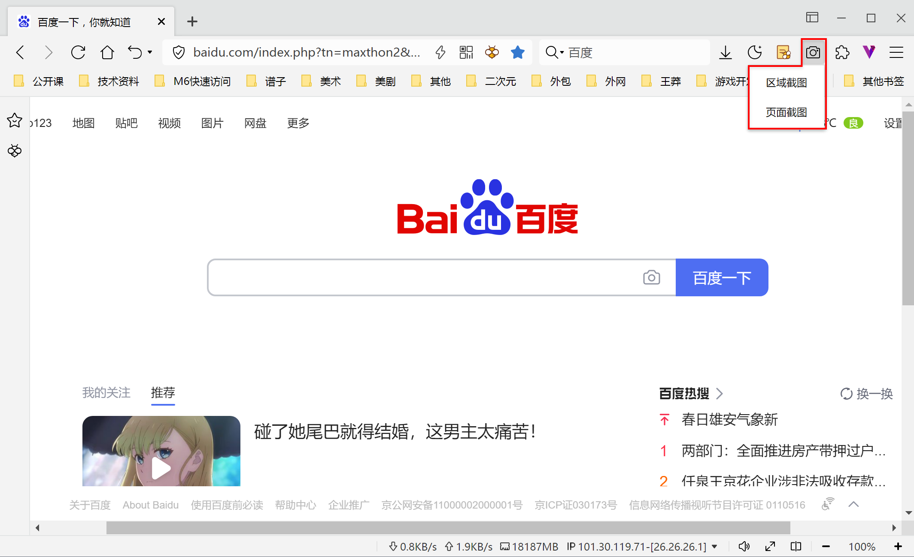
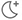
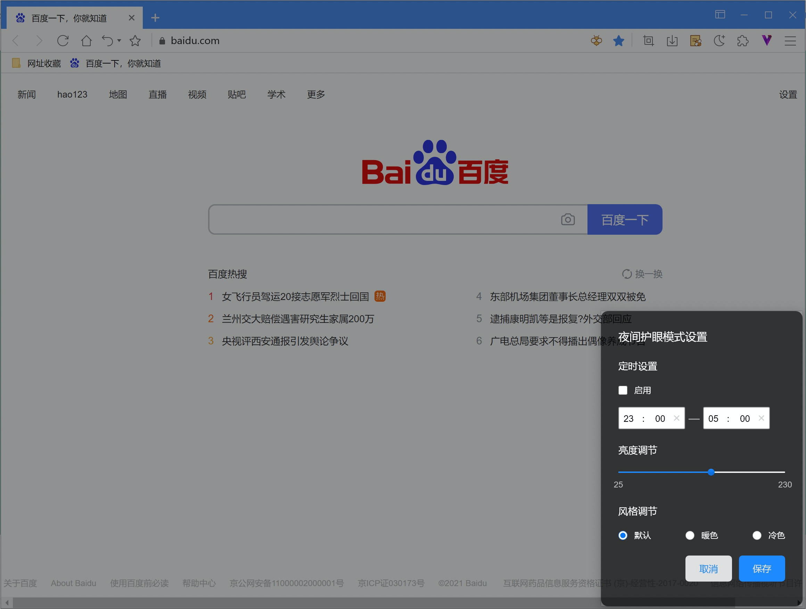
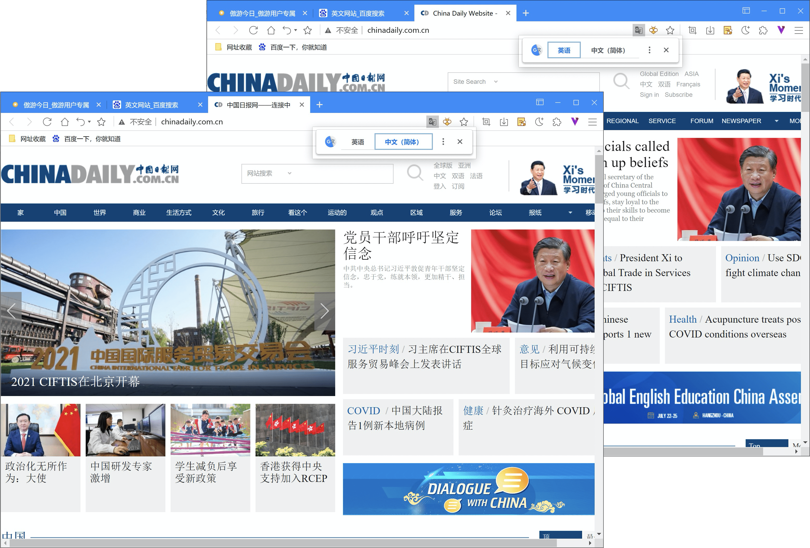
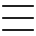
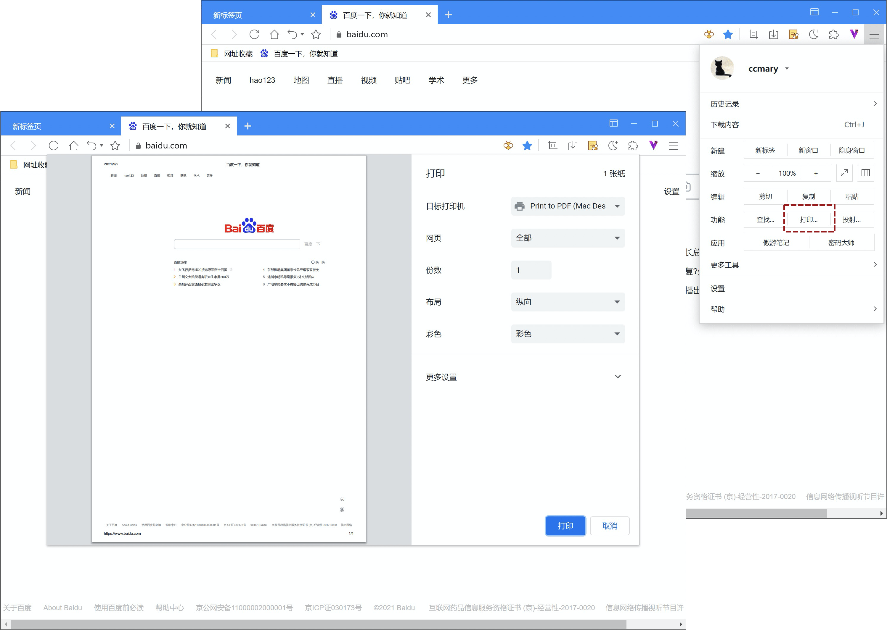
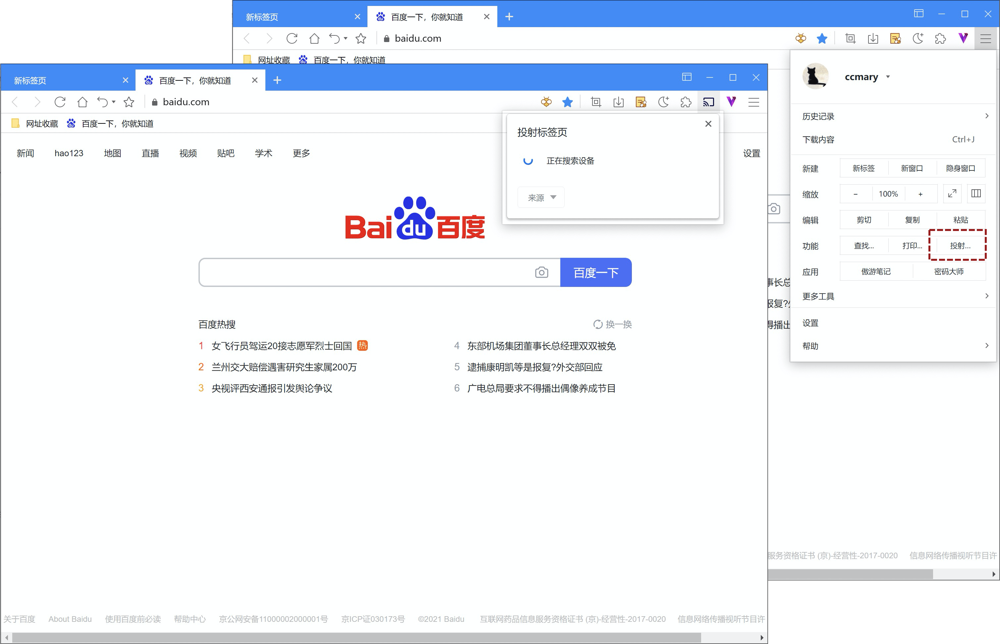

# 其他功能

## Maxthon的截图功能

在地址栏扩展区域点击截图按钮，激活截图功能。

Maxthon为您提供两种截图功能：

1. 区域截图：通过选框，框选屏幕内区域作为截图，并可对区域内进行在编辑。
2. 页面截图：该功能将当前网页保存为一张截图，相当于“将网页另存为图片”。

## 使用夜间模式浏览网页

Maxthon内置夜间模式，维护您的用眼健康。在地址栏扩展区域点击夜间模式按钮，激活夜间模式。
夜间模式会在浏览器整体添加遮罩。如果您不希望添加遮罩，仅需改变浏览器、菜单和设置页配色为暗色，可以在【设置/外观/菜单和本地页配色】中选择暗色模式。

右键点击夜间模式，可自定义护眼遮罩：

- 定时：您可以指定每天一定的时间范围内自动启用夜间模式；
- 亮度：调整护眼遮罩的亮度至您舒适的程度；
- 如果您不喜欢当前风格，还可以指定不同色系风格作为遮罩。

## -使用自动翻译网页功能

当您访问外文网站时，可点击地址栏翻译图标，在外文和中文间进行切换，实现自动页面翻译。

## 打印Maxthon中的内容

点击右上角主菜单按钮，在主菜单中选择【打印...】可打开打印调试页面，选择打印机即可。

## 将Maxthon的内容投射到电视上

点击右上角主菜单按钮，在主菜单中选择【投射...】Maxthon将自动检索可用投射设备，选中设备，点击确认即可。

## 将网页另存为PDF

在您需要另存为的网页中，右键单击，选择菜单中的【另存为PDF】。

