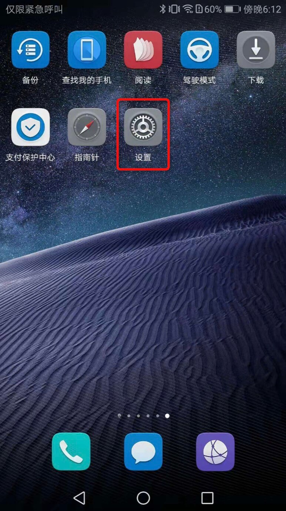
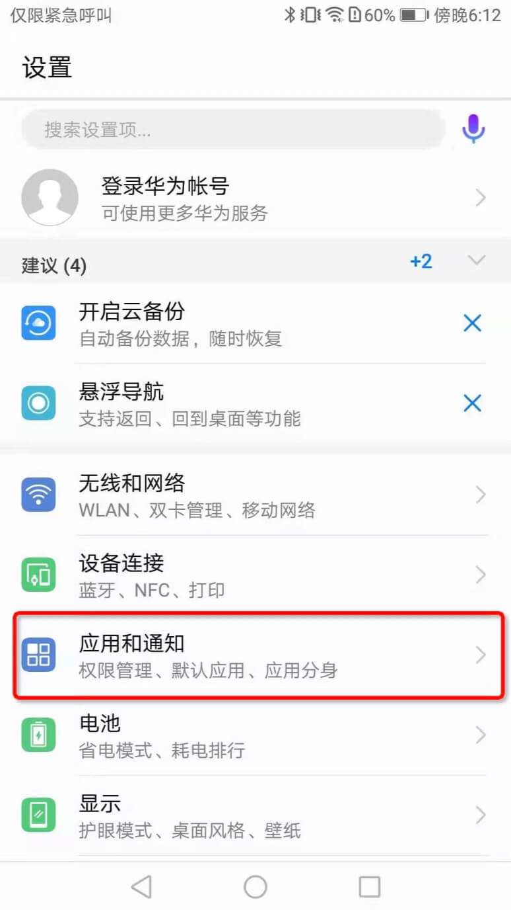
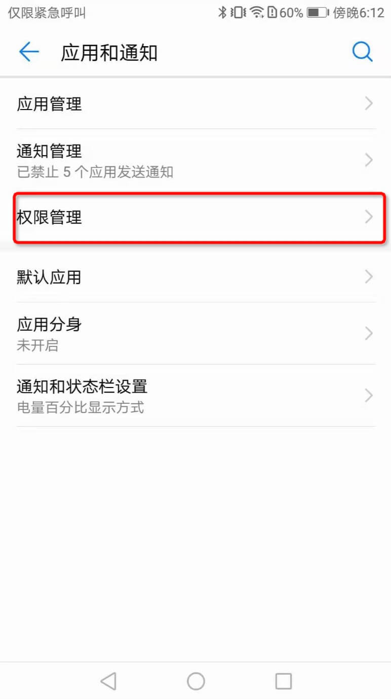
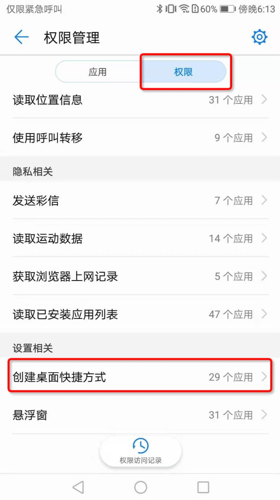

### 为什么点击添加到桌面后，桌面上找不到图标

部分用户在傲游浏览器客户端页面内点击“添加到桌面”后，并未在手机桌面上找到对应的图标，原因在于傲游浏览器内“添加到桌面”功能被系统关闭。请前往系统设置中为傲游浏览器打开“创建桌面快捷方式”开关，开关开启后，请返回傲游浏览器重新点击“添加到桌面”。

### 主要机型及其打开方式：

**华为：**

- 方式1：设置--应用和通知--权限管理--权限--创建桌面快捷方式--傲游浏览器

- 方式2：设置--应用和通知--应用管理--傲游浏览器--权限--设置单项权限--创建桌面快捷方式

- 方式3：手机管家--权限管理--权限--创建桌面快捷方式--傲游浏览器

**oppo：**

方式1：设置--安全--应用权限--权限--创建桌面快捷方式--傲游浏览器

方式2：手机管家--权限隐私--应用权限管理--权限--创建桌面快捷方式--傲游浏览器

**vivo：**

方式1：设置--更多设置--权限管理--权限--桌面快捷方式--傲游浏览器

方式2：i管家--应用管理--权限管理--桌面快捷方式--傲游浏览器

**小米：**

方式1：设置--授权管理--应用权限管理--权限管理--桌面快捷方式--傲游浏览器

方式2：安全中心--应用管理--权限--应用权限管理--权限管理--桌面快捷方式--傲游浏览器

#### 如何为傲游浏览器打开“创建桌面快捷方式”开关（以华为为例）

1. 打开“设置”

2. 进入“应用和通知”

3. 进入“权限管理”

4. 点击权限，滑动屏幕，找到“创建桌面快捷方式”

5. 进入“创建桌面快捷方式”，找到“傲游浏览器”，打开开关

6. 重新回到傲游浏览器客户端内，选择“添加到桌面”