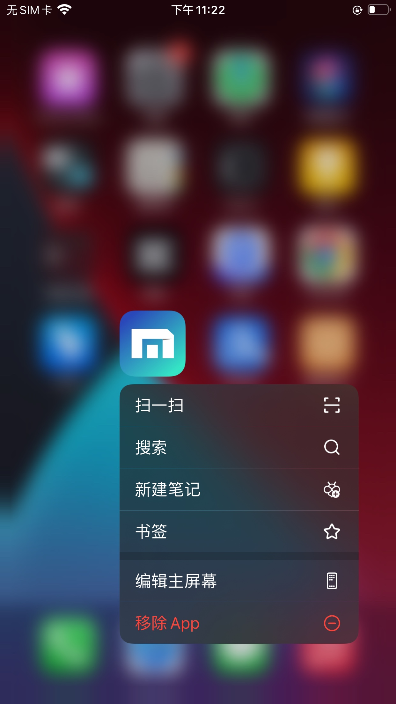
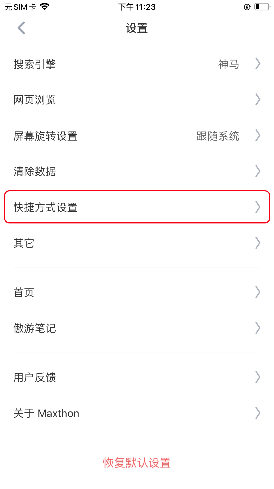

## 三维触控(3Dtouch)快捷进入

#### 如何通过3Dtouch快捷进入

长按（部分iOS系统为用力按压）桌面上的傲游浏览器图标，手指滑动到相关功能，在登录状态下即可快速进入此功能。

 

#### 定制你感兴趣的快捷功能

您可以从设置-快捷方式设置页面进入快捷方式设置项。

 

选择上方手机模型为三维触控，然后可通过增减项目调整3Dtouch的桌面菜单，最多可以设置四项。

 