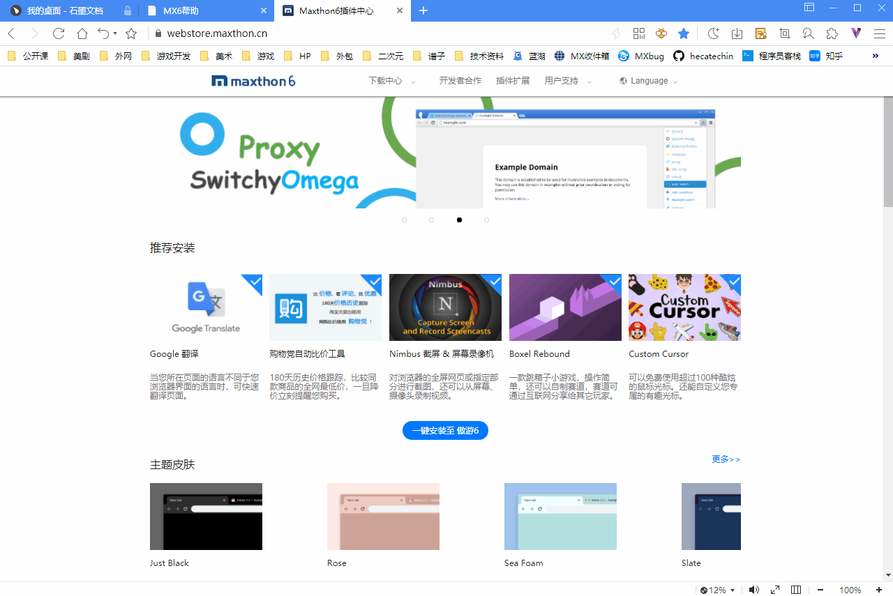
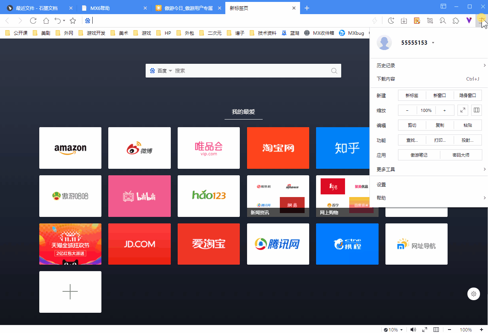
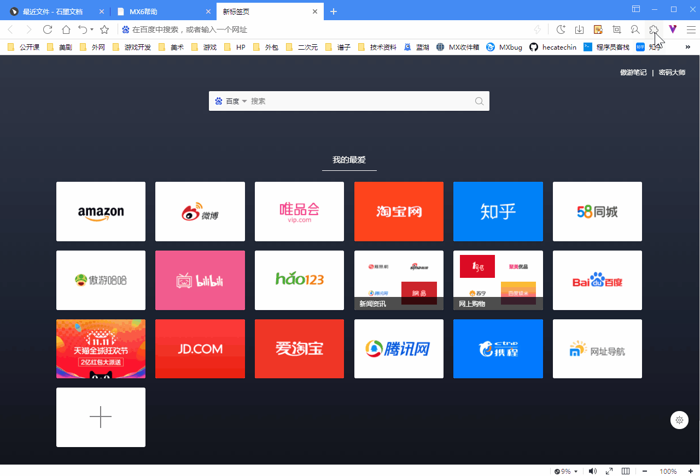
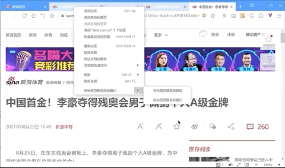
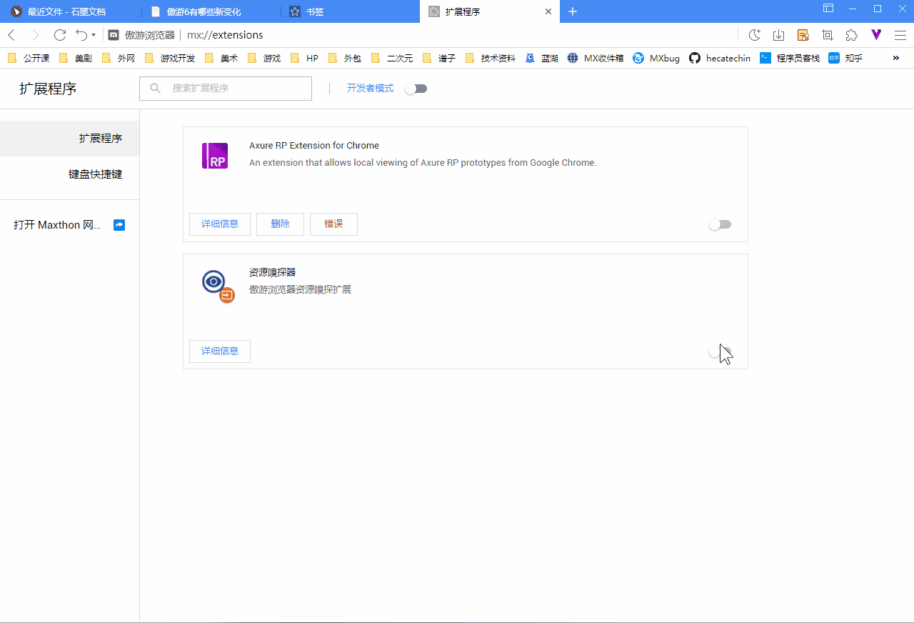

# Maxthon 有哪些新变化?
*****

**欢迎来到Maxthon！

**20 年经典，始终如一。**

全新 Maxthon 在 Maxthon 5 的基础上进行了全面升级，重新出发的 Maxthon 功能更强大，体验更流畅，玩法更多样，设计更新潮……

全新的 Maxthon 在[支持更多chromium插件](12-extend.md)的基础上，保留了Maxthon 5 的大部分特色功能：[傲游笔记](08-mxnote)、[资源嗅探器](#资源嗅探器)、[密码大师](10-password.md)、[分屏浏览](05-browse?id=网页缩放与全屏、分屏模式)等。从Maxthon 5 升级至Maxthon，您的数据将被全量导入，实现流畅自然的切换。[登录Maxthon账户](02-privacy)还能使您在不同设备之间实现数据互通。

另外，Maxthon 还引领潮流，新增了区块链玩法。您可以在[区块链身份管理工具 Vbox](11-vbox) 中管理您的加密货币钱包或者直接创建一个 BSV 公链上的 Vbox 身份。Vbox 还可绑定全球首款[区块链域名 NBdomain](11-vbox?id=-申请免费nb域名)，使用手机号即可免费注册自己的域名，不再需要每年支付域名费用。还有更多区块链小应用，您可以和您的朋友一起体验新潮的链上生活。

在Maxthon 中，部分传统功能做出了调整和更新。傲游笔记更新了[极简笔记](09-fastnote)功能，原傲游笔记中的网址收藏独立成[书签](07-bookmark)模块，并添加了管理页面。此外，菜单项、历史记录、下载管理页面也做了一些展示上的改变，更加简洁易用。

最后，Maxthon 仍在不断更新和完善中，任何您使用上的不便都是我们不断努力的动力。挑剔的用户永远是Maxthon的宝藏。如果遇到使用上的问题，可以随时[反馈](https://www.maxthon.cn/mx/bug/post/)或[联系我们](https://www.maxthon.com/contact/)，我们将会及时回复并尽最大的可能满足您的需要。

**感谢大家一如既往的支持！**

## Maxthon 新增功能

Maxthon 新增了很多特色功能，包括

### 海量 chromium 插件支持

全新的Maxthon 支持所有 chrome 插件，在开发者模式下，您还能够开发并调试您自己的插件。如果您登录傲游账户，傲游还可以同步您账号中的插件。您可以在 [**chrome 插件中心**](https://chrome.google.com/webstore/category/extensions)直接安装插件到Maxthon。中国大陆境内的用户可以在[**Maxthon插件中心**](https://webstore.maxthon.cn/)下载您所需的插件。

更多关于插件的介绍请查看[**使用拓展应用**](12-extend)

### 更强大的隐私保护

Maxthon 提供了三种进入隐身模式的方式，分别为主菜单开启隐身窗口，标签上右键进入隐身窗口，在页面链接上右键在隐身模式下打开。在隐身模式下，您的浏览数据将不会被追踪和记录，更加安全。

更多关于隐身模式介绍请查看 [**使用隐身模式无痕浏览网页**](05-browse?id=使用隐身模式无痕浏览网页)

### 区块链身份管家 Vbox 以及更多区块链应用

区块链 Vbox 是Maxthon内置的链上管家，可以管理您的电子货币钱包，右上角的 V 字图标即可关联您的电子钱包或创建新的 BSV 电子货币账户。每个身份还可以使用手机号免费注册一个 NBdomain 区块链域名。

更多关于 Vbox 的功能介绍请查看[**使用 Vbox**](11-vbox)

### 更强大的标签整理功能

标签功能全面升级，支持多选、分组管理。

更多关于标签功能的介绍请查看 [**使用标签页**](04-tab)

### 更多皮肤和自定义外观选项

与Maxthon 5 一样，Maxthon 提供各种**外观自定义选项**(mx://settings/appearance)，系统提供 3 种经典颜色的皮肤，并在[**应用商店**](https://webstore.maxthon.cn/)中，提供更多皮肤供下载使用。您还可以应用 chrome 插件中心的中皮肤。

## Maxthon 中有调整的功能

传统的Maxthon功能在 Maxthon 中得到了保留和继承。新版的 Maxthon 在一些地方做出了调整

### 资源嗅探器

资源嗅探器在部分较早版本的Maxthon中，默认处于关闭状态，如您需要使用，可以在拓展程序>管理拓展 页面开启资源嗅探器，并在拓展程序 > 键盘快捷键 中设置启用资源嗅探器的快捷按键。设置完成后，在任意界面键入快捷键，即可开启资源嗅探器。

### 密码大师

密码大师(mx://password/) 功能基本与 Maxthon 5 一致，但 Maxthon 中通用身份信息功能暂时不可用。但您在Maxthon 5 中的数据并未丢失，仍然可登录[**U+账户 uu.me**](https://www.uu.me/) 在线查看。更多关于密码大师的功能请查看[**使用密码大师**](10-password)

### 百变邮箱

百变邮箱在 Maxthon 中不再提供快捷入口，但可以在[**U+账户 uu.me**](https://www.uu.me/) 在线使用。您可以收藏 U+并继续使用百变邮箱的各种功能。
